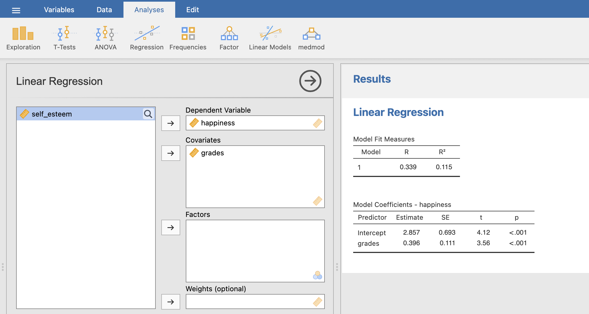
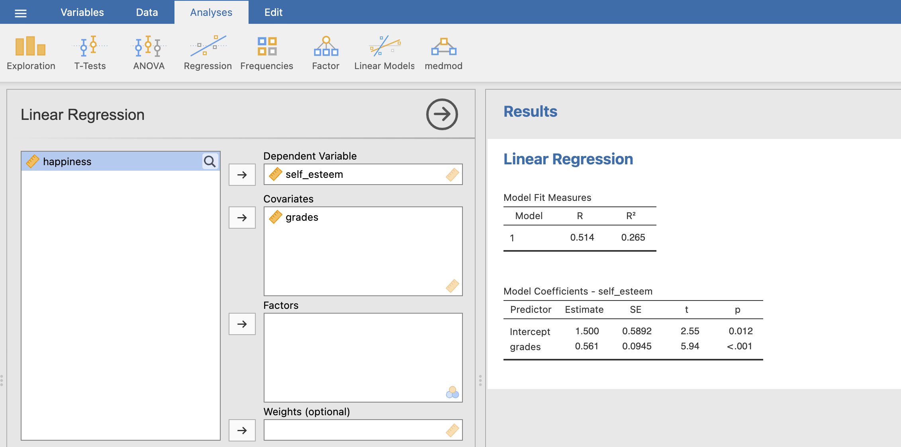
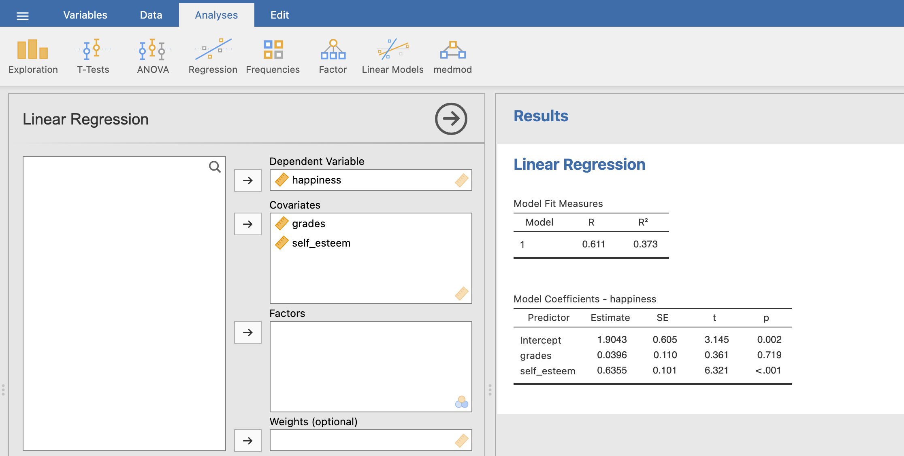
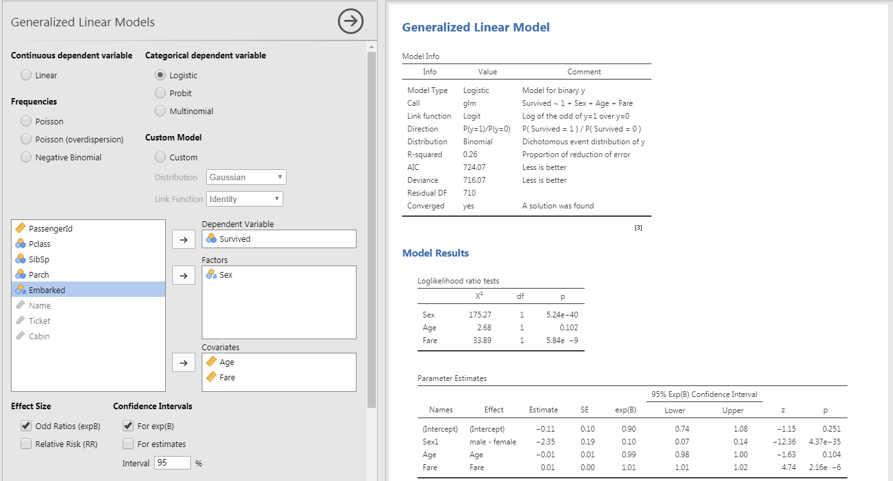
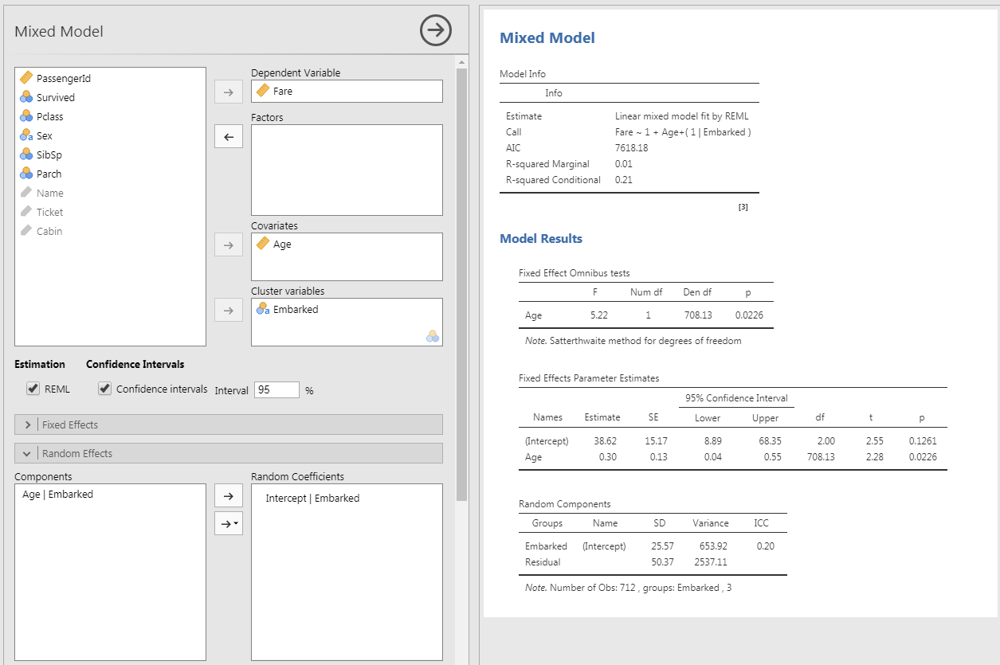

```{r setup, include = FALSE}
# libraries --------------------------------------------------------------------
library(DiagrammeR)
library(fontawesome)
library(ggrepel)
library(kableExtra)
library(knitr)
library(palmerpenguins)
library(papaja)
library(patchwork)
library(tidyverse)
# general options --------------------------------------------------------------
options(scipen = 999, htmltools.preserve.raw = FALSE)
set.seed(42)
# chunk options ----------------------------------------------------------------
opts_chunk$set(
  cache.extra = rand_seed, 
  message = FALSE, 
  warning = FALSE, 
  error = FALSE, 
  echo = FALSE,
  cache = FALSE,
  comment = "", 
  fig.align = "center", 
  fig.retina = 3
  )
```

# Many More Types of Model

```{r}
tibble(
  `Type of models` = c("1. General Linear Models", "2. Mediation Models", "3. Structural Equation Models", "4. Generalized Linear Models", "5. Linear Mixed Models"),
  `Type of Outcome Variables` = c("Continuous", "Continuous", "Continuous", "Categorical or Continuous", "Continous"),
  `Amount of Outcome Variables` = c("1", "2 (Final Outcome Variable and Mediator)", "1 or more", "1", "1"), 
  `Amount of Predictor Variables` = c("1 or More", "2 (Original Predictor and Mediator)", "1 or More", "1 or More", "1 or More"),
  `Amount of Equation Processed` = c("1", "3 (Including 2 Requirements)", "1 for each Outcome Variable", "1", "1"),
  `Inclusion of Control Variables` = c("As Predictors", "As Predictors", "As Predictors", "As Predictors", "As Random Effects")
) %>% 
  kable(align = 'lcccc') %>%
  kable_styling(font_size = 16)

```

---

class: inverse, mline, center, middle

# 1. General Linear Models

---

# General Linear Models

See everything that has been said until now

```{r out.width='70%'}
include_graphics("https://miro.medium.com/max/1400/1*guak1sQTh5sAf46NMzbQig.jpeg")
```

---

class: inverse, mline, center, middle

# 2. Mediation Models

---

# Mediation Effect

The mediation model is a path analysis which involves 3 different linear models.

Let's take the example from [University of Virginia](https://data.library.virginia.edu/introduction-to-mediation-analysis/): $self-esteem$ mediates the effect of $grades$ on $happiness$

Data analysis is also presented in the [Jamovi Advanced Mediation Model website](https://jamovi-amm.github.io/glm_example1.html) and the data can be downloaded [here](https://jamovi-amm.github.io/glm_example1.html)

```{r}
DiagrammeR::grViz("
  digraph {
    graph [rankdir = LR]
  
    node []
    'self-esteem'; 'grades'; happiness
    
    'grades' -> {happiness 'self-esteem'}
    'self-esteem' -> happiness

  }", width = 800, height = 300)
```

---

# Mediation Effect

Imagine that previous studies have suggested that higher grades predict higher happiness. This is called **Direct Effect**.

```{r out.width="50%"}
include_graphics("https://data.library.virginia.edu/files/mediation_ex1.png")
```

However, grades are not the real reason that happiness increases. Let's hypothesize that good grades boost one’s self-esteem and then high self-esteem boosts one’s happiness. This is the **Indirect Effect**.

```{r out.width="50%"}
include_graphics("https://data.library.virginia.edu/files/mediation_ex2.png")
```

Self-esteem is a mediator that explains the underlying mechanism of the relationship between grades (or $X$) and happiness (or $Y$).

A mediation analysis is comprised of **three sets of regression**: $X$ → $Y$, $X$ → $M$, and $X$ + $M$ → $Y$. They are just three regression analyses!

---

# Analyse Mediation Effects - Step 1

```{r out.width = "70%"}
include_graphics("https://data.library.virginia.edu/files/mediation_step1.png")
```

$$Y = b_{0} + b_{1}.X + e$$

Is $b_{1}$ significant? We want $X$ to affect $Y$ (Direct Effect). If there is no relationship between $X$ and $Y$, there is nothing to mediate.

---

# Analyse Mediation Effects - Step 2

```{r out.width = "70%"}
include_graphics("https://data.library.virginia.edu/files/mediation_step2.png")
```

$$M = b_{0} + b_{2}.X + e$$

Is $b_{2}$ significant? We want $X$ to affect $M$. If $X$ and $M$ have no relationship, $M$ is just a third variable that may or may not be associated with $Y$. A mediation makes sense only if $X$ affects $M$.

---

# Analyse Mediation Effects - Step 3

```{r out.width = "70%"}
include_graphics("https://data.library.virginia.edu/files/mediation_step3.png")
```

$$Y = b_{0} + b_{4}.X + b_{3}.M + e$$

Is $b_{4}$ non-significant or smaller than before? We want $M$ to affect $Y$, but $X$ to no longer affect $Y$ (or $X$ to still affect $Y$ but in a smaller magnitude).

If the effect of $X$ on $Y$ completely disappears, $M$ fully mediates between $X$ and $Y$. If the effect of X on Y still exists, but in a smaller magnitude, M partially mediates between $X$ and $Y$.

To see if this mediation effect is statistically significant (different from zero or not). To do so, a specific test to compare $b_{1}$ and $b_{4}$ is performed (called Sobel or bootstrapping).

---

# Mediation Analysis in JAMOVI

In JAMOVI it is possible to do all steps at once using the jAMM module (jamovi Advanced Mediation Models)

To do it, install the jAMM module by clicking on the cross "Modules" at top right corner > JAMOVI library.

Then follow the example described here: https://jamovi-amm.github.io/glm_example1.html

```{r out.width="70%"}
include_graphics("https://jamovi-amm.github.io/pics/logosm.png")
```

---

# Check Requirements in JAMOVI

## Is X → Y significant?

```{r out.width='100%'}

```

$p < 0.001$ i.e. lower than 0.05 so $X$ has a significant effect on $Y$.

---

# Check Requirements in JAMOVI

## Is X → M significant?

```{r out.width='100%'}

```

$p < 0.001$ i.e. lower than 0.05 so $X$ has a significant effect on $M$.

---

# Mediation Effect Test in JAMOVI

## Is $b_{4}$ non significant?

Module medmod > GLM Mediation Model

```{r out.width="70%"}

```

$p = 0.714$ for $b_{4}$ while $b_{1}$ was significant, therefore M (self-esteem) mediate the relationship between X (grades) and Y (happiness).

---

# More Advanced Mediation Models

See: https://jamovi-amm.github.io/glm_example2.html

```{r out.width="70%"}
include_graphics("https://jamovi-amm.github.io/examples/muller/moderator2.png")
```

---
class: title-slide, middle

## Live Demo

---
class: inverse, mline, center, middle

# 3. Structural Equation Models

---

# Structural Equation Model

A Structural Equation Model (SEM) is a complex path analysis between multiple variables including multiple Outcomes and using factor analysis for latent variable estimation.

```{r eval=TRUE}
DiagrammeR::grViz("
digraph rmarkdown {
  graph [rankdir = LR]
  
  node [shape = oval]
  'Perceived Ease-of-use'; 'Perceived Usefulness'; 'Intention to Use'; 'Actual Use'
  
  node [shape = box]
  PU1; PU2; PU3; PU4; PU5; PEOU1; PEOU2; PEOU3; PEOU4; BI1; BI2; AU
  
  {PU1 PU2 PU3 PU4 PU5} -> 'Perceived Usefulness' [arrowhead = none]
  {PEOU1 PEOU2 PEOU3 PEOU4} -> 'Perceived Ease-of-use' [arrowhead = none]
  {BI1 BI2} -> 'Intention to Use' [arrowhead = none]
  {AU} -> 'Actual Use' [arrowhead = none]
  
  'Perceived Usefulness' -> 'Intention to Use'
  'Perceived Ease-of-use' -> {'Perceived Usefulness' 'Intention to Use'}
  'Intention to Use' -> 'Actual Use'
  
  subgraph {
      rank = same; 'Perceived Usefulness'; 'Perceived Ease-of-use';
  }
  
  subgraph {
      rank = same; PU1; PU2; PU3; PU4; PU5; PEOU1; PEOU2; PEOU3; PEOU4; BI1; BI2;
  }

}
", height = 400)
```

---

# Structural Equation Model

**A Confirmatory Factorial Analysis is performed for each latent variable**

Example:

$Perceived\,Usefulness = \alpha_1.PU1 + \alpha_2.PU2 + \alpha_3.PU3 + \alpha_4.PU4 + \alpha_5.PU5 + e$
$Perceived\,Ease\,of\,use = \alpha_1.PEOU1 + \alpha_2.PEOU2 + \alpha_3.PEOU3 + \alpha_4.PEOU4 + e$
$Intention\,to\,Use = \alpha_1.BI1 + \alpha_2.BI2 + e$

**A Linear Regression is performed for each outcome variable**

Example:

$Perceived\,Usefulness = b_0 + b_1.Perceived\,Ease\,of\,use + e$
$Intention\,to\,Use = b_0 + b_1.Perceived\,Usefulness + b_2.Perceived\,Ease\,of\,use + e$
$Actual\,Use = b_0 + b_1.Intention\,to\,Use + e$

---

# Performing SEM

While there are several licensed software (not free, including AMOS the extension of SPSS) that can perform SEM

Only a few free software can perform SEM (JASP, R, Python) and Jamovi is not one of them

All of them are using the package "Lavaan" which provides a specific coding structure to define the SEM, see https://lavaan.ugent.be/

.pull-left[
```
   # latent variables
     ind60 =~ x1 + x2 + x3
     dem60 =~ y1 + y2 + y3 + y4
     dem65 =~ y5 + y6 + y7 + y8
   # regressions
     dem60 ~ ind60
     dem65 ~ ind60 + dem60
   # residual covariances
     y1 ~~ y5
     y2 ~~ y4 + y6
     y3 ~~ y7
     y4 ~~ y8
     y6 ~~ y8
```
]

.pull-right[
```{r out.width='100%'}
include_graphics("https://lavaan.ugent.be/tutorial/figure/sem.png")
```
]

---
class: inverse, mline, center, middle

# 4. Generalized Linear Model

---

# Generalized Linear Models

So far all the model tested had the assumption that residuals are following a normal distribution. This is the case if the outcome variable is Continuous.

However, Linear models can also be used with outcome variable that are not Continuous. In this case a **Generalized Linear Model** is used.

Three different outcome variables can be tested:
- if the outcome variable has only 2 possibilities (e.g., survive: "yes" or "no"), this is a **Logistic Regression**
- if the outcome variable has only 2 possibilities but one of theme is very rare, this is a **Poisson Regression**
- if the outcome variable has more than 2 possibilities, this is a **Multinominal Regression**

---

# Generalized Linear Models

Let's use titanic dataset. The most interesting outcome variable is the survive variable which says if the passenger has survived (coded 1) or not (coded 0).

Because this outcome variable is Categorical (even if coded with numbers), we can expect its residuals to follow a Logistic distribution.

In JAMOVI, a Generalized Linear Model with logistic distribution can be computed using the **GAMLj** Module as follow:

```{r out.width = '70%'}

```

---
class: title-slide, middle

## Live Demo

---
class: inverse, mline, center, middle

# 5. Linear Mixed Models

---

# Linear Mixed Models

Linear Mixed Models are common (Multiple) Linear Regression Model with includes control variables.

These control variables are called "Random Effects" (by opposition to predictor variables with are called "Fixed Effects").

They are included in the model in order to take into account their variability but they are not tested. **Control variables included as "Random Effects" are variables for which you suppose there are differences but you have no specific hypothesis about them.**

Examples of these "Random Effects" can be location of measurement, days of the measurement, differences between individuals ...

---

# Linear Mixed Models

Classic example: Palmer's penguins

.pull-left[

```{r}
penguins %>%
  ggplot(aes(bill_length_mm, flipper_length_mm)) +
  geom_point() +
  geom_smooth(method = "lm", se = FALSE) +
  scale_y_continuous(limits = c(170, 240)) +
  theme_bw() +
  theme(text = element_text(size = 20))
```

]

.pull-right[

```{r fig.height=7.5}
penguins %>%
  ggplot(aes(bill_length_mm, flipper_length_mm, color = species)) +
  geom_point() +
  geom_smooth(method = "lm", se = FALSE) +
  scale_y_continuous(limits = c(170, 240)) +
  theme_bw() +
  theme(
    legend.position = "bottom",
    text = element_text(size = 20)
  )
```

]

---

# Linear Mixed Models

Let's use the titanic dataset example. We want to test that Age has an effect on passengers Fare, but this effect might be different according to where the passengers have embarked.

In our linear mixed model, `Age` will be a Fixed Effect and `Embarked` the Random Effect. In JAMOVI, linear mixed model can be computed using the **GAMLj** Module as follow:

```{r out.width='70%'}

```

---
class: title-slide, middle

## Live Demo

---
class: inverse, mline, left, middle


# Thanks for your attention and don't hesitate to ask if you have any question!

[`r fa(name = "twitter")` @damien_dupre](http://twitter.com/damien_dupre)  
[`r fa(name = "github")` @damien-dupre](http://github.com/damien-dupre)  
[`r fa(name = "link")` damien-datasci-blog.netlify.app](https://damien-datasci-blog.netlify.app)  
[`r fa(name = "paper-plane")` damien.dupre@dcu.ie](mailto:damien.dupre@dcu.ie)
