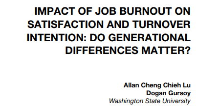
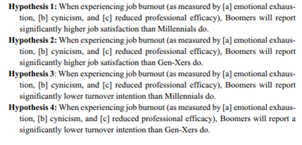
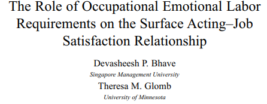
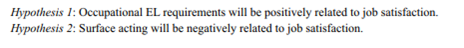
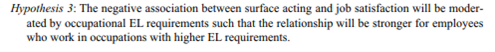

```{r setup, include = FALSE}
# libraries --------------------------------------------------------------------
library(countdown)
library(emo)
library(fontawesome)
library(nomnoml)
library(tidyverse)
library(VennDiagram)

# general options --------------------------------------------------------------
options(scipen = 999)
set.seed(123)

# chunk options ----------------------------------------------------------------
knitr::opts_chunk$set(
  cache.extra = knitr::rand_seed, 
  message = FALSE, 
  warning = FALSE, 
  error = FALSE, 
  echo = FALSE,
  cache = FALSE,
  comment = "", 
  fig.align = "center", 
  fig.retina = 3
  )

```

class: inverse, mline, center, middle

# 1. General Information

---

# Who am I?

#### Development of the DynEmo Facial Expression Database (Master)

* Dynamic and spontaneous emotions
* Assessed with self-reports and by observers

#### Analysis of Emotional User Experience of Innovative Tech. (Industrial PhD)

* Understand users' acceptance of technologies from their emotional response
* Based on multivariate self-reports

#### Evaluation of Emotions from Facial and Physiological Measures (Industrial PostDoc)

* Applications to marketing, sports and automotive industries
* Dynamic changes with trend extraction techniques (2 patents)

#### Performance Prediction using Machine Learning (Academic PostDoc)

* Application to sport analytics
* Big Data treatment (> 1 million users with activities recorded in the past 5 years)

---

# Who are you?

Please introduce yourself:

- Where do you come from?
- Which school are you in?
- What are you expecting from this lecture?

---
class: inverse, mline, center, middle

# Aims and Assignment

---

# What to Expect?

This lecture focuses on the new way to teach statistics:

1. Understanding advanced statistical models

2. Using new open source software (JAMOVI and R)

3. Apply these knowledge and skills to research papers writing

In the end, I want you to become a Data Scientist with enough knowledge and skills to:

- Challenge bad science and wrong ideas from your supervisor

- Apply to Data Science positions

---

# Details on the Assignment

Based on your research topic, I will give you some data (in January). Your task will be **to write a ready to be published research paper** that includes:

- A short introduction with a couple of references leading to your hypotheses

- An extended method section presenting the variables, your model with a graphic representation, the equation to test your hypotheses and which test you are choosing to use

- A result section that is publication top quality and additional results justifying the conditions of applications of the tests used

- A short discussion and conclusion

This paper will have **a maximum of 6 pages** and **a publication ready design** (any journal/conference final style but no draft manuscript design).

Appendices are possible, specially if they includes codes to reproduce the results. They are not included in the page count.

**The deadline is June 21st, 2023.**

---
class: title-slide, middle

## Exercise

If you haven't done it already, can you look for the quantitative academic journal paper which is the closest to your PhD. 

You need to download the pdf version of this paper and to send it to my email damien.dupre@dcu.ie . 

Notes: 

- This paper should not be one of yours if you already have published some
- This paper should include a statistical analysis (i.e., Regression analysis, ANOVA, t-test) and if possible their corresponding $p-values$

```{r}
countdown(minutes = 10, warn_when = 60)
```

---
class: inverse, mline, center, middle

# 2. The General Linear Model

---

# Essential Concepts to Master

In Academic Reports, all sections are linked:

.center[**Introduction `r ji("right_arrow")` Literature Review `r ji("right_arrow")` Method `r ji("right_arrow")` Results `r ji("right_arrow")` Discussion & Conclusion**]

--

To understand the statistics in the results section, it is essential to identify the concepts presented in each section:

```{nomnoml, fig.width=12, fig.height=3}
#stroke: black
#direction: right
#align: center
[Introduction | Variables]->[Literature Review | Hypotheses]
[Literature Review | Hypotheses]->[Method | Model & Equation]
[Method | Model & Equation]->[Results | Statistical Test]
[Results | Statistical Test]->[Discussion & Conclusion | Interpretation]
```

---

# Academic Papers' Introduction

An introduction is a section **presenting your variables and why you investigate them**.

There is little reference to previous academic research, just a description of actual facts.

It should end with your **Research Question**, a question that includes all the main variables investigated which wonders about a potential relationship between them.

For example:
- "What is the relationship between Job Satisfaction, Salary and Gender?"
- "How does sales experience influence the performance of sales managers and sales representatives?"

Important: Each variable has a **Role** and a **Type**, it is essential to learn how to identify them.

---

# Type of Variables

Variables can have different types:

- **Categorical**: If the variable's possibilities are words or sentences (character string)

  - if the possibilities cannot be ordered: Categorical Nominal (*e.g.*, $gender$ male, female, other)
  
  - if the possibilities can be ordered: Categorical Ordinal (*e.g.*, $size$ S, M, L)
  
- **Continuous**: If the variable's possibilities are numbers (*e.g.*, $age$, $temperature$, ...) 

> Warning: Variables can be converted to either Categorical and Continuous but it is always better to keep them in their correct scale.

```{r out.width='30%'}
knitr::include_graphics("img/jamovi_icons.png")
```

---

# Role of Variables

It's important to keep the two roles "variable doing the explaining" and "variable being explained" distinct.

Let's denote the:
 - **Outcome**: "variable to be explained" (also called $Y$, Dependent Variable, or DV)
 - **Predictor**: "variable doing the explaining" (also called $X$, Independent Variable, or IV)
 
--

Statistics is only about identifying relationship between Predictor and Outcome variables also called **effect**

> An effect between 2 variables means that the changes in the values of a predictor variable are related to changes in the values of an outcome variable.

> The aim of an Academic Report is to investigate if the **Variability of the Outcome Variable** is related to the variability of Predictor Variables.

---

# Predictors, Outcomes and Controls

Imagine a the variability of the Outcome Variable is a birthday cake. 

Now, imagine each predictor is a guest having a slice of the cake:

- **Case 1:** There is only one guest eating all the cake.

  - Then the predictor explains all the variability of the outcome variable. 

- **Case 2:** There is only one guest eating a slice which is not the all cake.

  - The predictor explains some of the outcome's variability. A statistical test is required to know if the predictor explains a significant part of the outcome's variability.
  
- **Case 3:** There is more than one guest, they will take their slices of the cake which can be small or big. 

   - Each predictor will explains more or less variability of the outcome. However, the more guest there is, the smaller the slices.

---

# Predictors, Outcomes and Controls

An effect between a predictor variable and an outcome variable corresponds to the following model:

```{nomnoml, fig.width=12, fig.height=3}
#stroke: black
#direction: right
#align: center

[Predictor]->[Outcome]
```

This arrow does not suggest causation but indicate correlation between $Predictor$ and $Outcome$, there is no assumption of one causing the other. **An "effect" is reciprocal and does not involves causality**.

Causality analysis is an other kind of test that involves:
- To be sure that 2 variables are correlated
- That one variable is the antecedent of the other
- That no other variable is explaining this relationship

---

# Predictors, Outcomes and Controls

A significant effect of a $Predictor$ on an $Outcome$ variable means that **a predictor is explaining enough variance of the outcome** variable to show a significant relationship.

.pull-left[

- If there is no effect between the variables, they are not sharing enough of their variability

```{r, fig.height=5}
venn.plot <- draw.pairwise.venn(
  100, 100, 10, c("Predictor", "Outcome"), ind = FALSE, cex = 5, cat.cex	= 2, cat.pos	
= c(0,0))
grid.draw(venn.plot)
```

]

.pull-right[

- If there is an effect between the variables, they are sharing a big part of their variability

```{r, fig.height=5}
venn.plot <- draw.pairwise.venn(
  100, 100, 40, c("Predictor", "Outcome"), ind = FALSE, cex = 5, cat.cex	= 2, cat.pos	
= c(0,0))
grid.draw(venn.plot)
```
]

To decide, if the part of the shared variability is big enough, a statistical test is required.

---

# Predictors, Outcomes and Controls

## Correlation not Causation

Hypothesis testing evaluates how two or more variable are related or correlated, there is no assumption of one causing the other:

* An "effect" is reciprocal and does not involves causality
* Causality analysis is an other kind of test that involves:
  1. To be sure that 2 variables are correlated
  2. That one variable is the antecedent of the other
  3. That no other variable is explaining this relationship

## Control Variables

The only difference for **control variables** is that they are not included in the model and in the hypotheses but they are in the equation.

They are used to remove an irrelevant explanation of the variable changes.

---
class: title-slide, middle

## Homework Exercise

In the research paper you have selected, **identify the variables that are used to produce statistical results (e.g. p-values).**

Indicate their Type and Role by using the following table:

|variable_name|variable_type|variable_role|
|-------------|-------------|-------------|
|var 1        |type         |role         |
|...          |...          |...          |
|var n        |type         |role         |

Send me the table by email at damien.dupre@dcu.ie **before the next lecture.**

---
class: inverse, mline, center, middle

# 4. Literature Review: Formulate your Hypotheses

---

# Hypotheses in a Nutshell

Hypotheses are:
1. Predictions supported by theory/literature
2. Affirmations designed to precisely describe the relationships between variables

> *“Hypothesis statements contain two or more variables that are measurable or potentially measurable and that specify how the variables are related”* (Kerlinger, 1986)

Hypotheses include:

- Predictor(s) / Independent Variable(s)
- Outcome / Dependent Variable (DV)
- Direction of the outcome if the predictor increases

**Warning:** Hypothesis cannot test equality between groups or modalities, they can only test differences or effects

---

# Alternative *vs.* Null Hypotheses

Every hypothesis has to state a difference (between groups or according values) also called $H_a$ (for alternative hypothesis) or $H_1$

Every alternative hypothesis has a null hypothesis counterpart (no difference between groups or according values) also called $H_0$ (pronounce H naught or H zero)

$H_a$ is viewed as a “challenger” hypothesis to the null hypothesis $H_0$.
  
> **Statistics are used to test the probability of obtaining your results if the Null Hypothesis is true. If this probability is low, then we reject the Null Hypothesis (and consider the Alternative Hypothesis as credible).**

But there is only two kind of alternative hypotheses: **Main Effect Hypotheses** and **Interaction Effect Hypotheses**

---

# Main Effect Hypothesis

Is the **predicted relationship between one $Predictor$ and one $Outcome$ variable**

The $Outcome$ needs to be Continuous (but some models can use a Categorical Outcome)

The $Predictor$ can be either Continuous or Categorical but the hypothesis formulation will change with its type

- Effect representation:

```{r eval=TRUE, fig.align="left"}
DiagrammeR::grViz("
  digraph {
    graph [rankdir = LR]
    node [shape = box]
    
    'Predictor' -> 'Outcome'
  }", height = 200)
```

- Warning: 

> The direction of the arrow does not involve causality, only correlation.

---

# Main Effect Hypothesis Templates

In the following formulation templates, **replace the variable names with yours** and *select the direction of the effect expected* ...

- #### Case 1: Predictor is Continuous 

.small[{**outcome**} {*increases/decreases/changes*} when {**predictor**} increases]

> .small[**Job satisfaction** *increases* when **salary** increases]

--

- #### Case 2: Predictor is Categorical (2 Categories)

.small[The {**outcome**} of {**predictor category 1**} is {*higher/lower/different*} than the {**outcome**} of {**predictor category 2**}]

> .small[The **Job satisfaction** of **EU employees** is *higher* than the **job satisfaction** of **Non-EU employees**]

--

- #### Case 3: Predictor is Categorical (3 or more Categories)

.small[The {**outcome**} of at least one of the {**predictor**} is {*higher/lower/different*} than the {**outcome**} of the other {**predictor**}]

> .small[The **Job satisfaction** of at least one of the **company's departments** is *higher* than the **Job satisfaction** of the other **company's departments**]

---

# Main Effect Hypothesis Examples

Variables:

- Outcome = Exam Results (continuous from 0 to 100)
- Predictor = Sleep Time (continuous from 0h to 24h)

Effect representation:

```{r eval=TRUE, fig.align="left"}
DiagrammeR::grViz("
  digraph {
    graph [rankdir = LR]
    node [shape = box]
  
    'Sleep Time' -> 'Exam Results'
  }", height = 200)
```

Main Effect Hypothesis: 

- $H_a$: **Exam results** *increase* when students’ **sleep time** increases

---

# Main Effect Hypothesis Examples

Variables:
- Outcome = Exam Results (continuous from 0 to 100)
- Predictor = Breakfast (categorical *yes* or *no*)

Effect representation:

```{r eval=TRUE, fig.align="left"}
DiagrammeR::grViz("
  digraph {
    graph [rankdir = LR]
    node [shape = box]
    
    'Breakfast' -> 'Exam Results'
  }", height = 200)
```

Main Effect Hypothesis: 

- $H_a$: **Exam results** of students **who eat breakfast** will be *higher* than **exam results** of students **who do not eat breakfast** 

---

# Main Effect Hypothesis Examples

Variables:
- Outcome = Driving Errors (continuous from 0 to Inf.)
- Predictor = Talking on the Phone while Driving (categorical *yes* or *no*)

Effect representation:

```{r eval=TRUE, fig.align="left"}
DiagrammeR::grViz("
  digraph {
    graph [rankdir = LR]
    node [shape = box]
    
    'Talking on the Phone while Driving' -> 'Driving Errors'
  }", height = 200)
```

Main Effect Hypothesis: 

- $H_a$: **Driving errors** of **motorists who do not talk on the phone while driving** will be *lower* than **driving errors** of **motorists who talk on the phone while driving**

---

# Interaction Effect Hypothesis

**It predicts the influence of a second predictor on the relationship between a first predictor and an outcome variable**

Notes:

- The second predictor is also called moderator.
- The main effect of each predictor must be hypothesised as well
- The role of first and second predictors can be inverted with the exact same statistical results

.pull-left[
Effects representation:

```{r}
DiagrammeR::grViz("
  digraph {
    graph [rankdir = LR]
  
    node [shape = box]
    'Predictor 1'; 'Predictor 2'; Outcome
    node [shape = point, width = 0, height = 0]
    ''
    
    'Predictor 2' -> ''
    'Predictor 1' -> '' [arrowhead = none]
    ''-> Outcome
    
    subgraph {
      rank = same; 'Predictor 2'; '';
    }
  }", height = 200, width = 400)
```
]

.pull-right[

Exactly the same results:
```{r}
DiagrammeR::grViz("
  digraph {
    graph [rankdir = LR]
    node [shape = box]

    'Predictor 1' -> Outcome
    'Predictor 2' -> Outcome
    'Predictor 1 X Predictor 2' -> Outcome
  }", height = 200, width = 400)
```
]

---

# Interaction Effect Hypothesis

.pull-left[
Imagine a first effect where Job Satisfaction increases when Salary increases

```{r fig.height=3.5, fig.width=5}
tribble(
  ~employee, ~salary, ~q1, ~q2, ~q3, ~q4,
  1,         45000,   1,   5,   3,   2, 
  2,         55000,   5,   4,   6,   6,
  3,         70000,   3,   1,   2,   3,
  4,         80000,   8,   5,   2,   7, 
  5,         95000,   8,   9,   6,   5,
  6,         75000,   3,   1,   2,   1,
  7,         50000,   5,   2,   7,   7, 
  8,         45000,   1,   4,   6,   9,
  9,         65000,   3,   1,   2,   3
) |> 
  rowwise() |> 
  mutate(js_score = mean(q1, q2, q3, q4)) |> 
  ggplot(aes(salary, js_score)) +
  geom_point(size = 3) +
  geom_smooth(method = "lm", se = FALSE) +
  scale_y_continuous(limits = c(0, 10)) +
  theme_bw() +
  theme(text = element_text(size = 20))
```
]

.pull-right[
This effect can change according to the values of a second predictor

```{r fig.height=4, fig.width=5}
tribble(
  ~employee, ~salary, ~q1, ~q2, ~q3, ~q4, ~origin,
  1,         45000,   1,   5,   3,   2,   "Irish",
  2,         55000,   5,   4,   6,   6,   "Irish",
  3,         70000,   3,   1,   2,   3,   "Irish",
  4,         80000,   8,   5,   2,   7,   "Irish",
  5,         95000,   8,   9,   6,   5,   "French",
  6,         75000,   3,   1,   2,   1,   "French",
  7,         50000,   5,   2,   7,   7,   "French",
  8,         45000,   1,   4,   6,   9,   "French",
  9,         65000,   3,   1,   2,   3,   "French"
) |> 
  rowwise() |> 
  mutate(js_score = mean(q1, q2, q3, q4)) |> 
  ggplot(aes(salary, js_score, color = origin)) +
  geom_point(size = 3) +
  geom_smooth(method = "lm", se = FALSE, fullrange = TRUE) +
  scale_y_continuous(limits = c(0, 10)) +
  theme_bw() +
  theme(
    text = element_text(size = 20),
    legend.position = "bottom"
    )
```

]

Here, the effect of **Salary** on **Job Satisfaction** is *higher* for **Irish employees** than it is for **French employees** because their line is steeper.

---

# Interaction Effect Hypothesis Templates

In the following formulation templates, **replace the variable names with yours** and *select the direction of the effect expected* ...

--

- #### Case 1: Predictor 2 is Continuous

.small[The effect of {**predictor 1**} on {**outcome**} is {*higher/lower/different*} when {**predictor 2**} increases]

--

- #### Case 2: Predictor 2 is Categorical (2 Categories)

.small[The effect of {**predictor 1**} on {**outcome**} is {*higher/lower/different*} for {**predictor 2 category 1**} than for {***predictor 2 category 2**}]

--

- #### Case 3: Predictor 2 is Categorical (3 or more Categories)

.small[The effect of {**predictor 1**} on {**outcome**} is {*higher/lower/different*} for at least one of {**predictor 2**}]

--

#### Notes:
1. An interaction effect hypothesis is also called moderation effect
2. By default, an interaction effect involves the test of the main effect hypotheses of all Predictors involved
3. Predictor 1 and 2 are commutable (can be inverted and produce the same hypothesis)

---

# Interaction Effect Hypothesis Examples

Variables:

- Outcome = Exam Results (continuous from 0 to 100)
- Predictor 1 = Sleep Deprivation (categorical low, medium, high)
- Predictor 2 = Gender (categorical male vs. female)

Effects representation:

```{r}
DiagrammeR::grViz("
  digraph {
    graph [rankdir = LR]
  
    node [shape = box]
    'Sleep Deprivation'; 'Exam Results'; Gender
    node [shape = point, width = 0, height = 0]
    ''
    
    Gender -> ''
    'Sleep Deprivation' -> '' [arrowhead = none]
    ''-> 'Exam Results'
    
    subgraph {
      rank = same; Gender; '';
    }
  }", height = 100)
```

Interaction Effect Hypothesis: 
- $H_a$: The effect of **sleep deprivation** on **exam results** is *higher* for **Males students** than it is for **Females students**

Note: The main effect hypotheses of the two predictors also have to be formulated

---

# Interaction Effect Hypothesis Examples

Variables:
- Outcome = Road Accidents (continuous from 0 to Inf.)
- Predictor 1 = Alcohol Consumption (continuous from 0 to Inf.)
- Predictor 2 = Driving Experience (categorical low, high)

Effects representation:

```{r fig.align="left"}
DiagrammeR::grViz("
  digraph {
    graph [rankdir = LR]
  
    node [shape = box]
    'Alcohol Consumption'; 'Road Accidents'; 'Driving Experience'
    node [shape = point, width = 0, height = 0]
    ''
    
    'Driving Experience' -> ''
    'Alcohol Consumption' -> '' [arrowhead = none]
    ''-> 'Road Accidents'
    
    subgraph {
      rank = same; 'Driving Experience' ; '';
    }
  }", height = 100)
```

Interaction Effect Hypothesis: 
- $H_a$: The effect of **alcohol consumption** on **road accidents** is *lower* for **experienced drivers** than it is for **inexperienced drivers**

Note: The main effect hypotheses of the two predictors also have to be formulated

---

# Example of Hypotheses in Research Papers

```{r out.width = "50%"}

```

```{r out.width = "50%"}

```

---

# Example of Hypotheses in Research Papers

```{r out.width = "50%"}

```

```{r out.width = "50%"}

```

```{r out.width = "50%"}

```

---

# The Hypothesis Checklist

When formulating an hypothesis:

- Is your hypothesis a prediction and not a question?
- Does your hypothesis include both Predictor and Outcome variables?
- Are these variables included in your dataset?

Note about hypotheses in academic papers:

- Don't trust research papers, most of them have incorrect formulations.
- Use the template shown previously.

---

# Special Case: Mediation Hypothesis

Remember the birthday cake metaphor: it symbolise the variability of the outcome variable to be explained by the predictors.

Now imagine one guest take a slice, but the birthday person arrives and take the slice from the guest to eat it.

**A mediation is when a Predictor called mediator, explains part of the variability of the outcome already explained by a first predictor.** It is usually used to highlight the influence of psychological features. 

Effect representation:

```{r eval=TRUE}
DiagrammeR::grViz("
  digraph {
    graph [rankdir = LR]
  
    node [shape = box]
    'Predictor 1'; 'Predictor 2'; Outcome
    
    'Predictor 1' -> {'Predictor 2' Outcome}
    'Predictor 2' -> Outcome

  }", height = 200)
```

---

# Special Case: Mediation Hypothesis

Formulation structure:

.center[The effect of {**predictor 1**} on {**outcome**} is explained by the {**predictor 2**}]

Warning: A mediation effect involves 3 requirements:
1. Predictor 1 needs to have a main effect on the Outcome
2. Predictor 1 needs to have a main effect on the Predictor 2
3. The main effect of Predictor 1 on the Outcome needs to disappear when Predictor 2 is taken into account

> Example: 
- The effect of **employee's age** on **job satisfaction** is explained by their **salary**

> Here, the requirements are:
1. Employee's age needs to have a main effect on job satisfaction
2. Employee's age needs to have a main effect on their salary
3. The main effect of Employee's age on the job satisfaction needs to disappear when salary is taken into account

---

# Mediation Effect Hypothesis Example

Variables:
- Outcome = Happiness (continuous from 0 to 7)
- Predictor 1 = Exam Results (continuous from 0 to 100)
- Predictor 2 = Self-Esteem (continuous from 0 to 7)

```{r eval=TRUE, fig.align="left"}
DiagrammeR::grViz("
  digraph {
    graph [rankdir = LR]
  
    node [shape = box]
    'Self-Esteem'; 'Exam Results'; Happiness
    
    'Exam Results' -> {Happiness 'Self-Esteem'}
    'Self-Esteem' -> Happiness

  }", height = 200)
```

Mediation Effect Hypothesis: 

- $H_a$: The effect of **grades** on **happiness** is explained by **self-esteem**

---
class: title-slide, middle

## Exercise: Find the variables in these hypotheses

In the following hypotheses, find the outcome variable and the predictor(s):

1. Overweight adults who value longevity are more likely than other overweight adults to lose their excess weight

2. Larger animals of the same species expend more energy than smaller animals of the same type.

3. Rainbow trout suffer more lice when water levels are low than other trout.

4. Professors who use a student-centered teaching method will have a greater positive rapport with their graduate students than professors who use a teacher-centered teaching method.

```{r}
countdown(minutes = 5, warn_when = 60)
```

---

# Solution

Hypothesis 1:
- Outcome = Excess weight
- Predictor = The valuation of longevity (yes *vs* no)

Hypothesis 2:
- Outcome = Energy expended
- Predictor = Animal size (larger *vs* smaller)

Hypothesis 3:
- Outcome = Suffering lice
- Predictor = Trout type (rainbow *vs* other)

Hypothesis 3:
- Outcome = Rapport with graduate students
- Predictor = Teaching method (student-centered *vs* teacher-centered)

---
class: title-slide, middle

## Exercise: Make your own Hypothesis

|Outcome|Predictor 1|Predictor 2|Hypothesis Type|
|--|---|---|---|
|Work motivation|Gender(Female/Male)||Main Effect|
|Work motivation|Gender(Female/Male)|Origin(French/Irish)|Interaction Effect|
|Work motivation|Gender(Female/Male)|Origin(French/Irish/Italians)|Interaction Effect|
|Job Satisfaction|Stress(from 0 to 10)||Main Effect|
|Job Satisfaction|Stress(from 0 to 10)|Age(Millennials/Baby boomers)|Interaction Effect|
|Job Satisfaction|Stress(from 0 to 10)|Age(in year)|Interaction Effect|

```{r}
countdown(minutes = 5, warn_when = 60)
```

---

# Solution

- 1. The **work motivation** of **female employees** is *higher* than the **work motivation** of **male employees**

- 2. The effect of **gender** on **work motivation** is *higher* for **Irish employees** than it is for **French employees**

- 3. The effect of **employee origin** on **work motivation** is *higher* for **female employees** than it is for **male employees**

- 4. **Job satisfaction** *decreases* when **stress** increases

- 5. The effect of **stress** on **job satisfaction** is *higher* for **Millennials** than it is for **Baby boomers**

- 6. The effect of **stress** on **job satisfaction** *increases* when **employee's age** increases

---
class: title-slide, middle

## Homework Exercise

In the research paper that you have selected, **formulate the tested hypotheses using the templates seen in the slide of the lecture and the variables that you have previously determined**

Send me your hypotheses by email at damien.dupre@dcu.ie **before the next lecture.**

---
class: inverse, mline, left, middle


# Thanks for your attention and don't hesitate if you have any questions!

[`r fa(name = "twitter")` @damien_dupre](http://twitter.com/damien_dupre)  
[`r fa(name = "github")` @damien-dupre](http://github.com/damien-dupre)  
[`r fa(name = "link")` damien-datasci-blog.netlify.app](https://damien-datasci-blog.netlify.app)  
[`r fa(name = "paper-plane")` damien.dupre@dcu.ie](mailto:damien.dupre@dcu.ie)