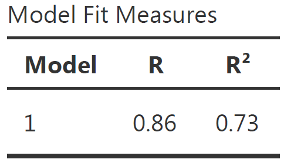
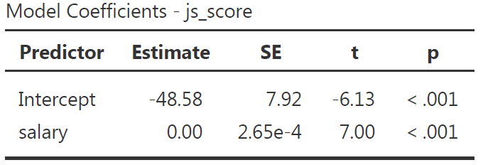

```{r setup, include = FALSE}
# libraries --------------------------------------------------------------------
library(anicon)
library(broom)
library(countdown)
library(emo)
library(fontawesome)
library(ggrepel)
library(kableExtra)
library(knitr)
library(nomnoml)
library(papaja)
library(patchwork)
library(tidyverse)
library(tweetrmd)
library(VennDiagram)

# general options --------------------------------------------------------------
options(scipen = 999)
set.seed(123)

# chunk options ----------------------------------------------------------------
knitr::opts_chunk$set(
  cache.extra = knitr::rand_seed, 
  message = FALSE, 
  warning = FALSE, 
  error = FALSE, 
  echo = FALSE,
  cache = FALSE,
  comment = "", 
  fig.align = "center", 
  fig.retina = 3
  )

# data -------------------------------------------------------------------------
organisation_beta <- read_csv(here::here("data/organisation_beta.csv")) 

# analyses ---------------------------------------------------------------------
m_js_high <- mean(organisation_beta$js_score[organisation_beta$salary_c == "high"])
m_js_low <- mean(organisation_beta$js_score[organisation_beta$salary_c == "low"])
lm_1 <- lm(js_score ~ salary, data = organisation_beta) |> apa_print()
lm_2 <- lm(js_score ~ salary*perf, data = organisation_beta) |> apa_print()
lm_c <- lm(js_score ~ salary_c, data = organisation_beta) |> apa_print()
lm_c2 <- lm(js_score ~ salary_c, data = organisation_beta) |> apa_print()
lm_c3 <- lm(js_score ~ location, data = organisation_beta) |> aov() |> apa_print()
```

class: inverse, mline, center, middle

# 1. General Information

---

# Who am I?

#### Development of the DynEmo Facial Expression Database (Master)

* Dynamic and spontaneous emotions
* Assessed with self-reports and by observers

#### Analysis of Emotional User Experience of Innovative Tech. (Industrial PhD)

* Understand users' acceptance of technologies from their emotional response
* Based on multivariate self-reports

#### Evaluation of Emotions from Facial and Physiological Measures (Industrial PostDoc)

* Applications to marketing, sports and automotive industries
* Dynamic changes with trend extraction techniques (2 patents)

#### Performance Prediction using Machine Learning (Academic PostDoc)

* Application to sport analytics
* Big Data treatment (> 1 million users with activities recorded in the past 5 years)

---
class: title-slide, middle

## Who are you?

Please introduce yourself:

- What is you first name?
- Which school are you in?
- What is your PhD about (in few words)?

---
class: inverse, mline, center, middle

# Aims and Assignment

---

# What to Expect?

This lecture focuses on the new way to teach statistics:

1. Understanding advanced statistical models

2. Using new open source software (JAMOVI and R)

3. Apply these knowledge and skills to research papers writing

In the end, I want you to become a Data Scientist with enough knowledge and skills to:

- Challenge bad science and wrong ideas from your supervisor

- Apply to Data Science positions

---

# Details on the Assignment

Based on your research topic, I will give you some data (in January). Your task will be **to write a ready to be published research paper** that includes:

- A short introduction with a couple of references leading to your hypotheses

- An extended method section presenting the variables, your model with a graphic representation, the equation to test your hypotheses and which test you are choosing to use

- A result section that is publication top quality and additional results justifying the conditions of applications of the tests used

- A short discussion and conclusion

This paper will have **a maximum of 6 pages** and **a publication ready design** (any journal/conference final style but no draft manuscript design).

Appendices are possible, specially if they includes codes to reproduce the results. They are not included in the page count.

**The deadline is June 21st, 2023.**

---
class: title-slide, middle

## Exercise

If you haven't done it already, can you __look for the quantitative academic journal paper which is the closest to your PhD__. 

You need to download the pdf version of this paper and to __send it to my email damien.dupre@dcu.ie__.

`r faa("exclamation-triangle", animate="flash", speed="slow", color="red")` Notes: 

- This paper should not be one of yours if you already have published some
- This paper should include a statistical analysis (i.e., Regression analysis, ANOVA, t-test) and if possible their corresponding $p-values$

---
class: inverse, mline, center, middle

# 2. Essential Concepts to Master

---

# Essential Concepts to Master

In Academic Reports, all sections are linked:

.center[**Introduction `r ji("right_arrow")` Literature Review `r ji("right_arrow")` Method `r ji("right_arrow")` Results `r ji("right_arrow")` Discussion & Conclusion**]

--

To understand the statistics in the results section, it is essential to identify the concepts presented in each section:

```{nomnoml, fig.width=12, fig.height=3}
#stroke: black
#direction: right
#align: center
[Introduction | Variables]->[Literature Review | Hypotheses]
[Literature Review | Hypotheses]->[Method | Model & Equation]
[Method | Model & Equation]->[Results | Statistical Test]
[Results | Statistical Test]->[Discussion & Conclusion | Interpretation]
```

---
class: title-slide, middle

## Variables Role and Type

---

# Academic Papers' Introduction

An introduction is a section **presenting your variables and why you investigate them**.

There is little reference to previous academic research, just a description of actual facts.

It should end with your **Research Question**, a question that includes all the main variables investigated which wonders about a potential relationship between them.

For example:
- "What is the relationship between Job Satisfaction, Salary and Gender?"
- "How does sales experience influence the performance of sales managers and sales representatives?"

`r faa("exclamation-triangle", animate="flash", speed="slow", color="red")` **Warning**: 
Each variable has a **Role** and a **Type**, it is essential to learn how to identify them.

---

# Type of Variables

Variables can have different types:

- **Categorical**: If the variable's possibilities are words or sentences (character string)

  - if the possibilities cannot be ordered: Categorical Nominal (*e.g.*, $gender$ male, female, other)
  
  - if the possibilities can be ordered: Categorical Ordinal (*e.g.*, $size$ S, M, L)
  
- **Continuous**: If the variable's possibilities are numbers (*e.g.*, $age$, $temperature$, ...) 

`r faa("exclamation-triangle", animate="flash", speed="slow", color="red")` **Warning**: Variables can be converted to either Categorical and Continuous but it is always better to keep them in their correct scale.

```{r out.width='30%'}

```

---

# Role of Variables

It's important to keep the two roles "variable doing the explaining" and "variable being explained" distinct.

Let's denote the:
 - **Outcome**: "variable to be explained" (also called $Y$, Dependent Variable, or DV)
 - **Predictor**: "variable doing the explaining" (also called $X$, Independent Variable, or IV)
 
--

Statistics is only about identifying relationship between Predictor and Outcome variables also called **effect**

> An effect between 2 variables means that the changes in the values of a predictor variable are related to changes in the values of an outcome variable.

> The aim of an Academic Report is to investigate if the **Variability of the Outcome Variable** is related to the variability of Predictor Variables.

---

# Predictors, Outcomes and Controls

An effect between a predictor variable and an outcome variable corresponds to the following model:

```{nomnoml, fig.width=12, fig.height=3}
#stroke: black
#direction: right
#align: center

[Predictor]->[Outcome]
```

This arrow does not suggest causation but indicate correlation between $Predictor$ and $Outcome$, there is no assumption of one causing the other. **An "effect" is reciprocal and does not involves causality**.

Causality analysis is an other kind of test that involves:
- To be sure that 2 variables are correlated
- That one variable is the antecedent of the other
- That no other variable is explaining this relationship

---

# Predictors, Outcomes and Controls

A significant effect of a $Predictor$ on an $Outcome$ variable means that **a predictor is explaining enough variance of the outcome** variable to show a significant relationship.

.pull-left[

- If there is no effect between the variables, they are not sharing enough of their variability

```{r, fig.height=5}
venn.plot <- draw.pairwise.venn(
  100, 100, 10, c("Predictor", "Outcome"), ind = FALSE, cex = 5, cat.cex	= 2, cat.pos	
= c(0,0))
grid.draw(venn.plot)
```

]

.pull-right[

- If there is an effect between the variables, they are sharing a big part of their variability

```{r, fig.height=5}
venn.plot <- draw.pairwise.venn(
  100, 100, 40, c("Predictor", "Outcome"), ind = FALSE, cex = 5, cat.cex	= 2, cat.pos	
= c(0,0))
grid.draw(venn.plot)
```
]

To decide, if the part of the shared variability is big enough, a statistical test is required.

---
class: title-slide, middle

## Formulating Hypotheses

---

# Hypotheses in a Nutshell

Hypotheses are:
1. Predictions supported by theory/literature
2. Affirmations designed to precisely describe the relationships between variables

> *“Hypothesis statements contain two or more variables that are measurable or potentially measurable and that specify how the variables are related”* (Kerlinger, 1986)

Hypotheses include:

- Predictor(s) / Independent Variable(s)
- Outcome / Dependent Variable (DV)
- Direction of the outcome if the predictor increases

`r faa("exclamation-triangle", animate="flash", speed="slow", color="red")` **Warning:** Hypothesis cannot test equality between groups or modalities, they can only test differences or effects

---

# Alternative *vs.* Null Hypotheses

Every hypothesis has to state a difference (between groups or according values) also called $H_a$ (for alternative hypothesis) or $H_1$

Every alternative hypothesis has a null hypothesis counterpart (no difference between groups or according values) also called $H_0$ (pronounce H naught or H zero)

--

$H_a$ is viewed as a “challenger” hypothesis to the null hypothesis $H_0$.
  
> **Statistics are used to test the probability of obtaining your results if the Null Hypothesis is true. If this probability is low, then we reject the Null Hypothesis (and consider the Alternative Hypothesis as credible).**

But there is only two kind of alternative hypotheses: **Main Effect Hypotheses** and **Interaction Effect Hypotheses**

---

# Main Effect Hypothesis

Is the **predicted relationship between one $Predictor$ and one $Outcome$ variable**

The $Outcome$ needs to be Continuous (but some models can use a Categorical Outcome)

The $Predictor$ can be either Continuous or Categorical but the hypothesis formulation will change with its type

- Effect representation:

```{r eval=TRUE, fig.align="left"}
DiagrammeR::grViz("
  digraph {
    graph [rankdir = LR]
    node [shape = box]
    
    'Predictor' -> 'Outcome'
  }", height = 200)
```

`r faa("exclamation-triangle", animate="flash", speed="slow", color="red")` **Warning**: The direction of the arrow does not involve causality, only correlation.

---

# Main Effect Hypothesis Templates

In the following formulation templates, **replace the variable names with yours** and *select the direction of the effect expected* ...

- #### Case 1: Predictor is Continuous 

.small[{**outcome**} {*increases/decreases/changes*} when {**predictor**} increases]

> .small[**Job satisfaction** *increases* when **salary** increases]

--

- #### Case 2: Predictor is Categorical (2 Categories)

.small[The {**outcome**} of {**predictor category 1**} is {*higher/lower/different*} than the {**outcome**} of {**predictor category 2**}]

> .small[The **Job satisfaction** of **EU employees** is *higher* than the **job satisfaction** of **Non-EU employees**]

--

- #### Case 3: Predictor is Categorical (3 or more Categories)

.small[The {**outcome**} of at least one of the {**predictor**} is {*higher/lower/different*} than the {**outcome**} of the other {**predictor**}]

> .small[The **Job satisfaction** of at least one of the **company's departments** is *higher* than the **Job satisfaction** of the other **company's departments**]

---

# Interaction Effect Hypothesis

**It predicts the influence of a second predictor on the relationship between a first predictor and an outcome variable**

Notes:

- The second predictor is also called moderator.
- The main effect of each predictor must be hypothesised as well
- The role of first and second predictors can be inverted with the exact same statistical results

.pull-left[
Effects representation:

```{r}
DiagrammeR::grViz("
  digraph {
    graph [rankdir = LR]
  
    node [shape = box]
    'Predictor 1'; 'Predictor 2'; Outcome
    node [shape = point, width = 0, height = 0]
    ''
    
    'Predictor 2' -> ''
    'Predictor 1' -> '' [arrowhead = none]
    ''-> Outcome
    
    subgraph {
      rank = same; 'Predictor 2'; '';
    }
  }", height = 200, width = 400)
```
]

.pull-right[

Exactly the same results:
```{r}
DiagrammeR::grViz("
  digraph {
    graph [rankdir = LR]
    node [shape = box]

    'Predictor 1' -> Outcome
    'Predictor 2' -> Outcome
    'Predictor 1 X Predictor 2' -> Outcome
  }", height = 200, width = 400)
```
]

---

# Interaction Effect Hypothesis Templates

In the following formulation templates, **replace the variable names with yours** and *select the direction of the effect expected* ...

--

- #### Case 1: Predictor 2 is Continuous

.small[The effect of {**predictor 1**} on {**outcome**} is {*higher/lower/different*} when {**predictor 2**} increases]

--

- #### Case 2: Predictor 2 is Categorical (2 Categories)

.small[The effect of {**predictor 1**} on {**outcome**} is {*higher/lower/different*} for {**predictor 2 category 1**} than for {***predictor 2 category 2**}]

--

- #### Case 3: Predictor 2 is Categorical (3 or more Categories)

.small[The effect of {**predictor 1**} on {**outcome**} is {*higher/lower/different*} for at least one of {**predictor 2**}]

--

`r faa("exclamation-triangle", animate="flash", speed="slow", color="red")` **Warning**:
1. An interaction effect hypothesis is also called moderation effect
2. By default, an interaction effect involves the test of the main effect hypotheses of all Predictors involved
3. Predictor 1 and 2 are commutable (can be inverted and produce the same hypothesis)

---
class: title-slide, middle

## Model Representation

---

# Model Representation

Models are an overview of the predicted relationship between variables stated in the hypotheses

You must follow these rules:
- Rule 1: All the arrows correspond to an hypothesis to be tested
- Rule 2: All the tested hypotheses have to be represented with an arrow
- Rule 3: Hypotheses using the same Outcome variable should be included in the same model
- Rule 4: Only one Outcome variable is included in each model (except for SEM model)

---

# Model Representation

.pull-left[
.center[**A simple arrow is a main effect**]

```{r eval=TRUE}
DiagrammeR::grViz("
digraph rmarkdown {
  graph [rankdir = LR]
  
  node [shape = box]
  Predictor; Outcome
        
  Predictor -> Outcome [label= b1]
}
", width = 400, height = 200)
```

]

.pull-right[

.center[**A crossing arrow is an interaction effect**]

```{r}
DiagrammeR::grViz("
  digraph {
    graph [rankdir = LR]
  
    node [shape = box]
    'Predictor 1'; Outcome; 'Predictor 2'
    node [shape = point, width = 0, height = 0]
    ''
    
    'Predictor 2' -> '' [label= b2]
    'Predictor 1' -> '' [arrowhead = none] [label= b1]
    ''-> Outcome [label= b3]
    
    subgraph {
      rank = same; 'Predictor 2'; '';
    }
  }", height = 200, width = 400)
```

.center[Note: By default, an interaction effect involves the test of the main effect hypotheses of all Predictors involved]

]

---

# Structure of Models

Distinguish square and circles
- **squares** are actual **measures/items**
- **circles** are **latent variables** related to measures/items

Example:
- $Salary$ is directly measured (in $, €, or £) so it's a square.
- $Job\,Satisfaction$ is a latent variable with several questions so it's a circle.

Items used for latent variables can be omitted in a model, variables are the most important.

We can distinguish 2 types of relationship in a model:
- Main effect relationship
- Interaction effect relationship

---

# Main Effect Relationship

.pull-left[
.center[Relationship between one Predictor and one Outcome variable]

```{r eval=TRUE, fig.align="left"}
DiagrammeR::grViz("
  digraph {
    graph [rankdir = LR]
    node [shape = box]
    
    Predictor -> Outcome
  }", height = 200, width = 400)
```

This model tests one hypothesis:
- 1 main effect

]
.pull-right[
.center[Relationship between two Predictors and one Outcome variable]

```{r eval=TRUE}
DiagrammeR::grViz("
  digraph {
    graph [rankdir = LR]
    node [shape = box]
    
    'Predictor 1' -> Outcome
    'Predictor 2' -> Outcome
  }", height = 200, width = 400)
```

This model tests two hypotheses:
- 2 main effects
]

---

# Interaction Effect Relationship

An interaction means that **the effect of a Predictor 1 on the Outcome variable will be different according the possibilities of a Predictor 2** (also called Moderation).

.pull-left[
classic representation:
```{r}
DiagrammeR::grViz("
  digraph {
    graph [rankdir = LR]
  
    node [shape = box]
    'Predictor 1'; 'Predictor 2'; Outcome
    node [shape = point, width = 0, height = 0]
    ''
    
    'Predictor 2' -> ''
    'Predictor 1' -> '' [arrowhead = none]
    ''-> Outcome
    
    subgraph {
      rank = same; 'Predictor 2'; '';
    }
  }", height = 200, width = 400)
```
]

.pull-right[
is the same as:
```{r}
DiagrammeR::grViz("
  digraph {
    graph [rankdir = LR]
    node [shape = box]

    
    'Predictor 1' -> Outcome
    'Predictor 2' -> Outcome
    'Predictor 1 X Predictor 2' -> Outcome
  }", height = 200, width = 400)
```
]

This model tests three hypotheses:
- 2 main effects
- 1 interaction effect

---
class: title-slide, middle

## Equation Corresponding to a Model

---

# A Basic Equation

```{r}
df <- 
  data.frame(
    Observation = letters[1:11],
    Outcome = 10:0, 
    Predictor = 10:0
  ) 
```

Let's imagine the perfect scenario: **your predictor Predictor variable explains perfectly the outcome variable**.

The corresponding equation is: $Outcome = Predictor$

.pull-left[
```{r}
df |> 
  kable(align = "ccc") |>
  kable_styling(bootstrap_options = "striped", font_size = 14)
```
]

.pull-right[
```{r fig.height=7}
df |> 
  ggplot(aes(Predictor, Outcome, label = Observation)) +
  geom_point(color = "black", size = 5) +
  geom_smooth(method = "lm") +
  scale_x_continuous(limits = c(0,10)) +
  scale_y_continuous(limits = c(0,10)) +
  theme_bw() +
  theme(text = element_text(size = 20))
```
]

---

# A Basic Equation

In the equation $Outcome = Predictor$, **three coefficients are hidden** because they are unused:
- the **intercept coefficient** $b_{0}$ (i.e., the value of the Outcome when the Predictor = 0) which is 0 in our case
- the **estimate coefficient** $b_{1}$  (i.e., how much the Outcome increases when the Predictor increases by 1) which is 1 in our case
- the **error coefficient** $e$ (i.e., how far from the prediction line the values of the Outcome are) which is 0 in our case

So in general, the relation between a predictor and an outcome can be written as:
$$Outcome = b_{0} + b_{1}\,Predictor + e$$

which is in our case:

$$Outcome = 0 + 1 * Predictor + 0$$

---

# A Basic Equation

The equation $Outcome = b_{0} + b_{1}\,Predictor + e$ is the same as the good old $y = ax + b$ (here ordered as $y = b + ax$) where $b_{0}$ is $b$ and $b_{1}$ is $a$.

It is very important to know that under **EVERY** statistical test, a similar equation is used (t-test, ANOVA, Chi-square are all linear regressions).

```{r fig.width=5.5, fig.height=5.5, fig.align='center'}
plot0 <- data.frame(Predictor = 0:10, Outcome = 0:10) |>
  ggplot(aes(Predictor, Outcome)) +
  geom_point(color = "black", size = 5) +
  geom_smooth(method = "lm") +
  geom_hline(yintercept = 0, color = 'black', size = 0.5, linetype = 'dotted') +
  annotate("text", x = 5, y = 0.2, label = "Intercept b\u2080") +
  annotate('segment', x = 5, xend = 6, y = 5, yend = 5, color = 'red') +
  annotate('segment', x = 6, xend = 6, y = 5, yend = 6, color = 'red') +
  annotate("text", x = 7.5, y = 5.5, label = "Estimate b\u2081") +
  scale_x_continuous(breaks = seq(0:10)) +
  scale_y_continuous(breaks = seq(0:10)) +
  theme_bw()

plotly::ggplotly(plot0)
```

---

# Relationship between Variables

Relationship between a $Predictor$ and an $Outcome$ variable (stated in a main effect hypothesis or in an interaction effect hypothesis) is analysed in terms of:

.center[**"How many units of the Outcome variable increases/decreases/changes when the Predictor increases by 1 unit?"**]

For example:
> How much Job Satisfaction increases when the Salary increases by €1?

The value of how much of the Outcome variable changes:
- Is called the **Estimate** (also called Unstandardised Estimate)
- Uses the letter $b$ in equations (e.g., $b_1$, $b_2$, $b_3$, ...)

For example:
> If Job Satisfaction increases by 0.1 on a scale from 0 to 5 when the Salary increases by €1, then *b* associated to Salary is 0.1

---

# Notes on the Equations

#### 1. Greek or Latin alphabet?

$$Y = \beta_{0} + \beta_{1}\,X_{1} + \epsilon \; vs. \; Y = b_{0} + b_{1}\,X_{1} + e$$

#### 2. Subscript $i$ or not?

$$Y = b_{0} + b_{1}\,X_{1} + e \; vs. \; Y_{i} = b_{0} + b_{1}\,X_{1_{i}} + e_{i}$$

#### 3. Which sign between estimates and predictors?

$$Y = b_{0} + b_{1}.X_{1} + b_{2}*X_{2} + b_{3}\,X_{3} + e$$

#### 4. Hat on $Y$ or not? Capital letter or not?

.center[ $$\hat{Y}\; or\; \hat{y}\; vs.\; Y\; or\; y$$ ]

---
class: inverse, mline, center, middle

# 3. The General Linear Model

---

# The General Linear Model

Now time has come to test these hypotheses by using our equation(s)! 

```{r out.width="50%"}
tweetrmd::tweet_screenshot(
  tweetrmd::tweet_url("kylehamilton", "1349225426669817856"),
  maxwidth = 300,
  hide_media = FALSE,
  theme = "dark"
  )
```

---

# Vocabulary

"Linear Model", "Linear Regression", "Multiple Regression" or simply "Regression" are all referring to the same model: **The General Linear Model**.

It contains:

- Only one Outcome/Dependent Variable
- One or more Predictor/Independent Variables of any type (categorical or continuous)
- Made of Main and/or Interaction Effects

$$Y = b_{0} + b_{1}\,Predictor\,1 + b_{2}\,Predictor\,2+ ... + b_{n}\,Predictor\,n + e$$

A Linear Regression is used **to test all the hypotheses at once** and to calculate the predictors' estimate.

Specific tests are available for certain type of hypothesis such as T-test or ANOVA but as they are special cases of Linear Regressions, their importance is limited (see [Jonas Kristoffer Lindeløv's blog post: Common statistical tests are linear models](https://lindeloev.github.io/tests-as-linear/)).

---

# General Linear Model Everywhere

.pull-left[
Most of the common statistical models (t-test, correlation, ANOVA; chi-square, etc.) are **special cases of linear models**.

This beautiful simplicity means that there is less to learn. In particular, it all comes down to $y = ax + b$ which most students know from secondary school. 

Unfortunately, **stats intro courses are usually taught as if each test is an independent tool**, needlessly making life more complicated for students and teachers alike.

Here, only **one test is taught to rule them all**: the General Linear Model (GLM).
]

.pull-right[
```{r out.width = "100%"}
include_graphics("https://psyteachr.github.io/msc-data-skills/images/memes/glm_meme.png")
```
]

---

# Applied Example

### Imagine the following case study...

> The CEO of Organisation Beta has problems with the well-being of employees and wants to investigate the relationship between **Job Satisfaction (js_score)**, **salary** and **performance (perf)**.

--

### Therefore the CEO formulate 3 hypotheses:

- $H_{a1}$: $js\_score$ increases when $salary$ increases 
- $H_{a2}$: $js\_score$ increases when $perf$ increases
- $H_{a3}$: The effect of $salary$ on $js\_score$ increases when $perf$ increases

--

### The corresponding model is:

$$js\_score = b_{0} + b_{1}\,salary + b_{2}\,perf + b_{3}\,salary*perf +  e$$

---

# Where the Regression Line comes from?

Draw all the possible lines on the frame. The best line, also called best fit, is the one which has the lowest amount or error. 

.pull-left[
```{r fig.width=5, fig.height=5}
  tibble(
    salary = rnorm(200, mean = 5, sd = 5),
    js_score = -1 + 0.02 * salary + rnorm(200, mean = 2, sd = 0.1),
    b0 = rnorm(200, 0, 1),
    b1 = rnorm(200, 0.02, 0.1)
  ) |> 
  ggplot(aes(salary, js_score)) + 
  geom_abline(aes(intercept = b0, slope = b1), alpha = 1/4) +
  geom_point() +
  theme(
    axis.text.x = element_blank(), 
    axis.text.y = element_blank(),
    text = element_text(size = 20)
  )
```
]
.pull-right[
There are 200 models on this plot, but a lot are really bad! We need to find the good models by making precise our intuition that a good model is "close" to the data. 

Therefore, we need a way to quantify the distance between the data and a model. Then we can fit the model by finding the value of $b_0$ and $b_1$ that generate the model with the smallest distance from this data.
]

---

# Best Model, Lowest Error

For each point this specific prediction error is called **Residual** $e_i$ where $i$ is a specific observation (e.g., employee here).

The error of the model is the sum of the prediction error for each point (distance between actual value and predicted value).

.pull-left[
```{r fig.width=5, fig.height=5}
linear_model_1 <- lm(js_score ~ salary, organisation_beta)

organisation_beta$predicted <- predict(linear_model_1)   # Save the predicted values
organisation_beta$residuals <- residuals(linear_model_1) # Save the residual values

plot_error <- organisation_beta |> 
  ggplot(aes(salary, js_score, label = residuals)) +
  geom_segment(aes(xend = salary, yend = predicted), color = "red") +
  geom_point() +
  geom_smooth(method = "lm", se = FALSE) +
  theme_bw() +
  theme(text = element_text(size = 20))

plotly::ggplotly(plot_error)
```
]
.pull-right[

The line which obtains the lowest error, has the smallest residuals. This line is chosen by the linear regression.

One common way to do this in statistics to use the "Mean-Square Error" (aka $MSE$) or the "Root-Mean-Square Error" (aka $RMSE$). We compute the difference between actual and predicted values, square them, sum them and divide them by $n$ observations (and the take the square root of them for the $RMSE$). 

]

---

# The (Root-)Mean-Square Error

```{r fig.width=12, fig.height=5}
plot_residual <- organisation_beta |> 
  ggplot(aes(salary, js_score)) +
  geom_segment(aes(xend = salary, yend = predicted), colour = "red") +
  geom_point() +
  geom_smooth(method = "lm", se = FALSE) +
  scale_y_continuous(limits = c(0, 10)) +
  theme_bw() +
  theme(text = element_text(size = 20))

distance_residual <- organisation_beta |> 
  ggplot(aes(salary, residuals, label = round(residuals, 2))) +
  geom_hline(aes(yintercept = 0), linetype = "dashed") +
  geom_col(colour = "red", fill = "red") +
  geom_text(
    aes(y = residuals, vjust = ifelse(residuals >= 0, 0, 1)),
    position = position_dodge(width = 0.9),
    size = 5
  ) +
  scale_y_continuous(limits = c(-2.5, 2.5)) +
  theme_bw() +
  theme(text = element_text(size = 20))

plot_residual / distance_residual
```

$$MSE = \frac{\sum_{i=1}^{N}(y\,predicted_{i} - y\,actual_{i})^{2}}{N}\;RMSE = \sqrt{\frac{\sum_{i=1}^{N}(y\,predicted_{i} - y\,actual_{i})^{2}}{N}}$$

These calculations has lots of appealing mathematical properties, which we are not going to talk about here. You will just have to take my word for it!

---

# Analysis of the Estimate

Once the best line is found, each estimate of the tested equation is calculated by a software (i.e., $b_0, b_1, ..., b_n$).

- $b_0$ is the intercept and has no interest for hypothesis testing
- $b_1, ..., b_n$ are predictors' effect estimate and each of them is used to test an hypothesis

The predictors' effect estimate $b_1, ..., b_n$ are **the value of the slope of the best line between each predictor** and the outcome. 

It indicates **how many units of the outcome variable increases/decreases/changes when the predictor increases by 1 unit**

Technically, $b$ is a weight or multiplier applied to the Predictor's values to obtain the Outcome's expected values

---

# Analysis of the Estimate

- If $b_1, ..., b_n = 0$, then:
  - The regression line is horizontal (no slope)
  - When the Predictor increases by 1 unit, the Outcome variable does not change
  - **The null alternative hypothesis is not rejected**

--

- If $b_1, ..., b_n > 0$, then:
  - The regression line is positive (slope up)
  - When the Predictor increases by 1 unit, the Outcome variable increases by $b$
  - **The null alternative hypothesis is rejected and the alternative hypothesis considered as plausible**

--

- If $b_1, ..., b_n < 0$, then:
  - The regression line is negative (slope down)
  - When the Predictor increases by 1 unit, the Outcome variable decreases by $b$
  - **The null alternative hypothesis is rejected and the alternative hypothesis considered as plausible**

---

# Significance of Effect's Estimate

The statistical significance of an effect estimate depends on the **strength of the relationship** and on the **sample size**:

- An estimate of $b_1 = 0.02$ can be very small but still significantly different from $b_1 = 0$
- Whereas an estimate of $b_1 = 0.35$ can be stronger but in fact not significantly different from $b_1 = 0$

--

The significance is the probability to obtain your results with your sample in the null hypothesis scenario:

- Also called $p$-value
- Is between 0% and 100% which corresponds to a value between 0.0 and 1.0

**If the $p$-value is lower to 5% or 0.05, then the probability to obtain your results in the null hypothesis scenario is low enough to say that the null hypothesis scenario is rejected and there must be a link between the variables.**

--

Remember that the $p$-value is the probability of the data given the null hypothesis: $P(data|H_0)$.

---

# Estimating Regression's Coefficients

The output of any software is two tables:
- Model Fit Measure Table
- Model Coefficients Table

The **Model Fit Measure** table tests the prediction **accuracy of your overall model** (all predictors taken into account).

The **Model Coefficients** table provide an estimate to each predictor $b_1, ..., b_n$ (as well as the intercept $b_0$). the value of the estimate is statistically tested with a $p$-value to see if it is statistically different from 0 (null hypothesis). Therefore, this table is **used to test each hypotheses** separately.

---
class: title-slide, middle

## Hypothesis with Continuous Predictor

---

# Main Effect Example

.pull-left[
### Variables:
- Outcome = $js\_score$ (from 0 to 10)
- Predictor = $salary$ (from 0 to Inf.)

### Hypothesis:

- $H_a$: $js\_score$ increases when $salary$ increases (i.e., $b_1>0$)
- $H_0$: $js\_score$ stay the same when $salary$ increases (i.e., $b_1=0$)

### Equation:

$$js\_score = b_{0} + b_{1}\,salary + e$$
]

.pull-right[
```{r}
organisation_beta |> 
  dplyr::select(employee, salary, js_score) |> 
  kable(format = "html")
```
]

---

# Main Effect Example

.pull-left[
```{r fig.height=10}
organisation_beta |> 
  ggplot(aes(x = salary, y = js_score, label = employee)) +
  geom_point(color = "red", size = 5) +
  geom_text_repel(point.padding = 0.5, size = 14) +
  scale_y_continuous(limits = c(0, 10)) +
  theme_bw() +
  theme(text = element_text(size = 20))
```
]
.pull-right[
```{r fig.height=10}
organisation_beta |> 
  ggplot(aes(x = salary, y = js_score, label = employee)) +
  geom_point(color = "black", size = 5) +
  geom_smooth(method = "lm", formula = "y ~ x", size = 2, fullrange = TRUE, se = FALSE) +
  geom_hline(yintercept = mean(organisation_beta$js_score), color = "red", size = 2) +
  scale_y_continuous(limits = c(0, 10)) +
  theme_bw() +
  theme(text = element_text(size = 20)) +
  annotate(
    "text", 
    x = 29000, 
    y = 7.5, 
    label = "H[0]:b[1] == 0", 
    color = "red", 
    size = 6,
    parse = TRUE
  ) +
  annotate(
    "text", 
    x = 30500, 
    y = 10, 
    label = "H[1]:b[1] > 0", 
    color = "blue", 
    size = 6,
    parse = TRUE
  )
```
]
  
---

# Model Fit Measure Table

The **Model Fit Measure** table tests the prediction **accuracy of your overall model** (all predictors taken into account).

$Model_{a}: js\_score = b_{0} + b_{1}\;salary + e\;vs.\; Model_{0}: js\_score = b_{0} + e$

```{r out.width = "25%"}

```

--

Default Columns:

- The **Model** column indicate the reference of the model in case you want to compare multiple models
- $R$ is the correlation between the outcome variable and all predictors taken into account (i.e., the closer to 1 or -1 the better, however in social science models with more that 0.2 or less than -0.2 are already excellent)
- $R^2$ is the % of variance from the outcome explained by the model (e.g., $R^2 = 0.73$ means the model explains 73% of the variance of the outcome variable). $R^2$ is also called **Coefficient of Determination**

---

# Model Coefficients Table

The **Model Coefficients** table provide an estimate to each predictor $b_1, ..., b_n$ (as well as the intercept $b_0$). the value of the estimate is statistically tested with a $p$-value to see if it is statistically different from 0 (null hypothesis).

```{r}

```

--

Default Columns:

- **Predictor** is the list of variables associated to parameters in your model (main and interaction) which includes the intercept
- **Estimate** is the non-standardized relationship estimate of the best prediction line (expressed in the unit of the variable)
- **SE** is the Standard Error and indicate how spread are the values around the estimate
- $t$ is the value of the statistical test comparing the estimate obtained with this sample with an estimate of 0 (i.e., $H_0$)
- $p$ is the p-value, i.e the probability to obtain our prediction with our sample in the null hypothesis scenario 

---
class: title-slide, middle

## Hypothesis with Continuous Predictor

---

# Categorical Predictor with 2 Categories

An hypothesis of differences between two groups is easily tested with a Linear Regression:

- If $\mu_{1} \neq \mu_{2}$, the slope of the line between these averages is not null (i.e., $b_{1} \neq 0$)
- If $\mu_{1} = \mu_{2}$, the slope of the line between these averages is null (i.e., $b_{1} = 0$ )

### Explanation

.pull-left[
**Comparing the difference between two averages is the same as comparing the slope of the line crossing these two averages**
- If two averages are **not equal**, then **the slope of the line crossing these two averages is not 0**
- If two averages are **equal**, then the **slope of the line crossing these two averages is 0**
]

.pull-right[
```{r fig.width=4, fig.height=4}
organisation_beta |> 
  ggplot(aes(x = salary_c, y = js_score)) + 
  geom_jitter(width = 0.1) +
  geom_segment(x = 1, xend = 2, y = m_js_high, yend = m_js_low, lwd = 2, color = "red") +
  geom_hline(yintercept = (m_js_high + m_js_low)/2, linetype = "dashed") +
  stat_summary(fun = mean, geom = "errorbar", aes(ymax = ..y.., ymin = ..y..), lwd = 2, color = "blue") +
  theme(
    legend.position = "none",
    text = element_text(size = 20)
  ) +
  labs(caption = "high coded 1 and low coded 2 (default)")
```
]

---
class: title-slide, middle

## Hypotheses with Categorical Predictor having 3+ Categories

---

# ANOVA Test for Overall Effects

Beside Linear Regression and $t$-test, researchers are using ANOVA a lot. ANOVA, stands for Analysis of Variance and is also a sub category of Linear Regression Models.

ANOVA is used to calculate the overall effect of categorical variable having more that 2 categories as $t$-test cannot cope. In the case of testing 1 categorical variable, a "one-way" ANOVA is performed.

**How ANOVA is working?**

### In real words
- $H_a$: at least one group is different from the others
- $H_0$: all the groups are the same

### In mathematical terms
- $H_a$: it is **not true** that $\mu_{1} = \mu_{2} = \mu_{3}$
- $H_0$: it is **true** that $\mu_{1} = \mu_{2} = \mu_{3}$

---

# ANOVA Test for Overall Effects

I won't go too much in the details but to check if at least one group is different from the others, the distance of each value to the overall mean (Between−group variation) is compared to the distance of each value to their group mean (Within−group variation).

**If the Between−group variation is the same as the Within−group variation, all the groups are the same.**

```{r out.width = '100%'}
include_graphics("img/one_way_anova_basics.png")
```

---
class: title-slide, middle

## Assumptions of General Linear Regression Models

---

# 4 Assumptions

Statistical tests are widely used to test hypotheses, exactly how we just did but all statistical tests have requirements to meet before being applied.

The General Linear Model has 4 requirements:

## 1. **L**inearity (of the effects)

## 2. **I**ndependence (of observations)

## 3. **N**ormality (of the residuals)

## 4. **E**qual Variance (of the residuals) 

While the assumption of a Linear Model are never perfectly met in reality, we must check if there are reasonable enough assumption that we can work with them.

---
class: title-slide, middle

## Exercise

In the coming days, I will send you simulated data using the variables presented in your reference paper.

I will also send you hypotheses using these variables.

Your task will be to test these hypotheses using the General Linear Model and to report their results exactly like in a research paper.

Every student will present their results at the beginning of the next lecture.

---
class: inverse, mline, left, middle


# Thanks for your attention and don't hesitate if you have any questions!

[`r fa(name = "twitter")` @damien_dupre](http://twitter.com/damien_dupre)  
[`r fa(name = "github")` @damien-dupre](http://github.com/damien-dupre)  
[`r fa(name = "link")` damien-datasci-blog.netlify.app](https://damien-datasci-blog.netlify.app)  
[`r fa(name = "paper-plane")` damien.dupre@dcu.ie](mailto:damien.dupre@dcu.ie)