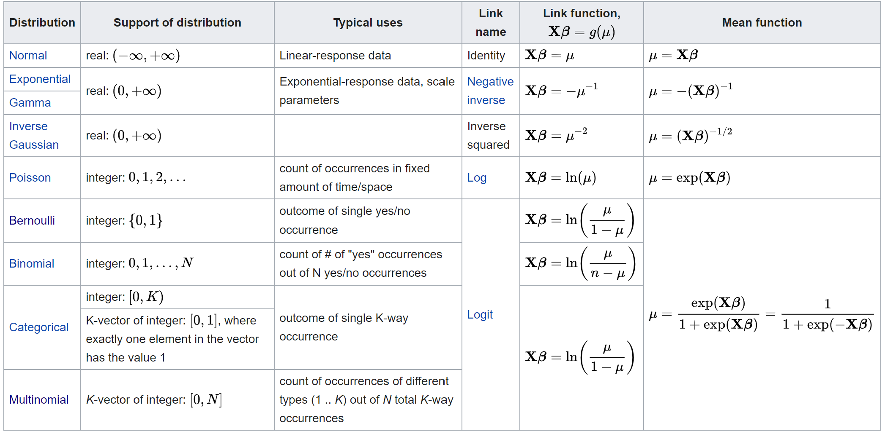

```{r setup, include = FALSE}
# libraries --------------------------------------------------------------------
library(anicon)
library(countdown)
library(emo)
library(fontawesome)
library(ggrepel)
library(kableExtra)
library(knitr)
library(patchwork)
library(tidyverse)

# general options --------------------------------------------------------------
options(scipen = 999)
set.seed(123)

# chunk options ----------------------------------------------------------------
opts_chunk$set(
  cache.extra = rand_seed, 
  message = FALSE, 
  warning = FALSE, 
  error = FALSE, 
  echo = FALSE,
  cache = FALSE,
  comment = "", 
  fig.align = "center", 
  fig.retina = 3
  )

# data -------------------------------------------------------------------------
organisation_beta <- read_csv(here::here("data/organisation_beta.csv")) |> 
  # mutate(department = if_else(salary > 30000, 1, 0)) |> 
  # mutate(department = c(0,0,0,1,0,1,0,0,1,0,1,0,1,1,1,1,0,0,0,0)) |>
  mutate(department = c(0,1,1,1,0,1,0,0,1,0,1,0,1,0,0,0,0,0,0,0)) 
titanic <- read_csv(here::here("data/titanic.csv")) 

# reference --------------------------------------------------------------------
# https://github.com/OpenIntroStat/ims
# https://github.com/pingapang/book

```

# General Linear Models 

So far, we have seen the equation of General Linear Models as follow:

$$Y = b_{0} + b_{1}\,X_{1} + e$$

As mentioned previously, it is more rigorous practice to include the subscripts as follow:

$$Y_{i} = b_{0} + b_{1}\,X_{1_{i}} + e_{i}$$

where $i$ is an observation number between 1 and N (your sample size)

The residual of the $i^{th}$ observation $(x_i, y_i)$ is the difference of the observed response $(y_i)$ and
the response we would predict based on the model fit $(\hat{y}_{i})$:

$$e_{i} = y_{i} - \hat{y}_{i}$$

We typically identify $\hat{y}_{i}$ by plugging $x_i$ into the model.

---

# General Linear Models

.pull-left[
For instance, to test the main effect hypothesis of $salary$ on $js\_score$, the model including subscript will look like:

$$js\_score_{i} = b_{0} + b_{1}\,salary_{i} + e_{i}$$

where $i$ is an employee (observation unit) between 1 and 20 (our sample size)

```{r fig.height=5}
organisation_beta |> 
  ggplot(aes(x = salary, y = js_score, label = employee)) +
  geom_point(color = "red", size = 5) +
  geom_text_repel(point.padding = 0.5, size = 12) +
  scale_y_continuous(limits = c(0, 10)) +
  theme_bw() +
  theme(text = element_text(size = 20))
```

]

.pull-right[
```{r}
organisation_beta |> 
  select(employee, salary, js_score) |> 
  kable("html") |> 
  kable_styling(font_size = 10)
```
]

---

# General Linear Models

Let's replace $e_i$ in the equation for some of the $i$ employees.

```{r fig.width=12, fig.height=5}
linear_model_1 <- lm(js_score ~ salary, organisation_beta)

organisation_beta$predicted <- predict(linear_model_1)   # Save the predicted values
organisation_beta$residuals <- residuals(linear_model_1) # Save the residual values

plot_residual <- organisation_beta |> 
  ggplot(aes(salary, js_score)) +
  geom_segment(aes(xend = salary, yend = predicted), colour = "red") +
  geom_point() +
  geom_smooth(method = "lm", se = FALSE) +
  scale_y_continuous(limits = c(0, 10)) +
  theme_bw() +
  theme(text = element_text(size = 20))

distance_residual <- organisation_beta |> 
  ggplot(aes(salary, residuals, label = round(residuals, 2))) +
  geom_hline(aes(yintercept = 0), linetype = "dashed") +
  geom_col(colour = "red", fill = "red") +
  geom_text(
    aes(y = residuals, vjust = ifelse(residuals >= 0, 0, 1)),
    position = position_dodge(width = 0.9),
    size = 5
  ) +
  scale_y_continuous(limits = c(-2.5, 2.5)) +
  theme_bw() +
  theme(text = element_text(size = 20))

plot_residual / distance_residual
```

The estimates $b_{0}$ and $b_{1}$ will stay the same but the error $e_{i}$ will change for each employee.

$$js\_score_{1} = -48.58 + 0.001\times salary_{1} + 0.17$$
$$js\_score_{2} = -48.58 + 0.001\times salary_{2} + 0.42$$

and so on...

---

# General Linear Models

Beside the subscripts there is something I have deliberately hidden to you: how the distribution of the residuals $e_{i}$ is expected to be.

The real full writing of a General Linear Model is the following:

$$Y_{i} = b_{0} + b_{1}\,X_{1_{i}} + e_{i}$$

$$e_{i} \sim \mathcal{N}(0, \sigma_{i})$$

This last line is scary but actually very simple, it claims one of the assumptions of the General Linear Models: Normality of the residuals.

It means that the error $e_{i}$ is assumed to be normally distributed with mean 0 and some standard deviation $\sigma_{i}$.

For example, with $\sigma_{i}=2$, if we arrange all the $e_{i}$ errors by size, it should follow this trend:

```{r, fig.width=12, fig.height=2}
residual <- seq(-6, 6, 0.1)
density <- dnorm(residual, 0, 2)
data <- data.frame(residual, density)
data %>% 
  ggplot(aes(x = residual, y = density)) + 
  geom_line() +
  geom_vline(xintercept = -2, col = 'blue') +
  geom_vline(xintercept = 2, col = 'blue') +
  geom_label(aes(x = 5, 
                 y = dnorm(2, 0, 2)), 
             col = 'black', 
             label = 'Inflexion point', 
             show.legend = F) +
  geom_segment(aes(x = 3.5, 
                   xend = 2.1, 
                   y = dnorm(2, 0, 2), 
                   yend = dnorm(2, 0, 2)), 
               size = 1,
               arrow = arrow(length = unit(0.1, "cm"))) +
  geom_label(aes(x = -5, y = dnorm(2, 0, 2)), 
             col = 'black', 
             label = 'Inflexion point', 
             show.legend = F) +
  geom_segment(aes(x = -3.5, 
                   xend = -2.1, 
                   y = dnorm(2, 0, 2), 
                   yend = dnorm(2, 0, 2)), 
               size = 1,
               arrow = arrow(length = unit(0.1, "cm"))) + 
  scale_x_continuous(breaks = seq(-6, 6, 1)) +
  theme_bw() +
  theme(text = element_text(size = 20))
```

---

# General Linear Models

In our case involving $salary$ and $js\_score$, in the figure showing the residual error of every observation, the order is given by the $X$ variable.

```{r, fig.width=12, fig.height=3}
distance_residual
```

But if we sort them from the lowest to the highest and count them by section (i.e., plot an histogram), we should see that most of the residual error are around 0.

```{r, fig.width=12, fig.height=2.5}
ggplot(organisation_beta, aes(residuals)) + 
  geom_histogram(binwidth = 0.5, color = "black", fill = "grey") +
  theme_bw() +
  theme(text = element_text(size = 20))
```

---

# Ecologically-Relevant Distributions

Gaussian distribution is rarely adequate in the real life; GLMs offer ecologically meaningful alternatives

- **Poisson** &mdash; counts; integers, non-negative, variance increases with mean

- **Binomial** &mdash; observed proportions from a total; integers, non-negative, bounded at 0 and 1, variance largest at $\pi = 0.5$

- **Binomial** &mdash; presence absence data; discrete values, 0 and 1, models probability of success

- **Gamma** &mdash; concentrations; non-negative (strictly positive with log link) real values, variance increases with mean, many zero values and some high values

---

# Generalized Linear Models

So far all the model tested had the assumption that residuals are following a normal distribution. This is the case if the outcome variable is Continuous.

However, Linear models can also be used with outcome variable that are not Continuous. In this case a **Generalized Linear Model** is used.

Three different outcome variables can be tested:
- if the outcome variable has only 2 possibilities (e.g., survive: "yes" or "no"), this is a **Logistic Regression**
- if the outcome variable has only 2 possibilities but one of theme is very rare, this is a **Poisson Regression**
- if the outcome variable has more than 2 possibilities, this is a **Multinominal Regression**

---

class: inverse, mline, center, middle

# 1. The Logistic Regression

---

# Limitations of the GLM

One of the requirement for the GLM is to have a continuous outcome. What happens if the outcome is not continuous?

Suppose that we are trying to predict the department of each employee based on their salary. In this simplified example, there are three possible departments: Marketing, Sales, and HR. We could consider encoding these values in an outcome variable, $Y$, as follows:

$$Y = \begin{cases}
1 & if\, \color{orange}{Marketing}\\
2 & if\, \color{orange}{Sales}\\
3 & if\, \color{orange}{HR}
\end{cases}$$

Using this coding, a linear regression model can be used to predict $Y$ with salary as a predictor. Unfortunately, this coding implies an ordering on the outcomes, putting $Sales$ in between $Marketing$ and $HR$, and insisting that the difference between $Marketing$ and $Sales$ is the same as the difference between $Sales$ and $HR$. In practice there is no particular reason that this needs to be the case. For instance, one could choose an equally reasonable coding:

$$Y = \begin{cases}
1 & if\, \color{orange}{Sales}\\
2 & if\, \color{orange}{Marketing}\\
3 & if\, \color{orange}{HR}
\end{cases}$$

---

# Limitations of the GLM

Using a coding for categorical variable imply a totally different relationship among the conditions for each combination of coding. Each of these coding would produce fundamentally different linear models that would ultimately lead to different sets of predictions on test observations.

If the variable was Categorical Ordinal (e.g., Shirt size: S, M, L), then a 1, 2, 3 coding would be reasonable. Unfortunately, in general there is no natural way to convert a qualitative response variable with more than two levels into a quantitative response that is ready for linear regression.

```{r out.width='50%'}
include_graphics("http://www.alexanderdemos.org/RegressionClass/OLS.png")
```

---
class: title-slide, middle

## Logistic Regression: Theory

---

# Case with a Binary Outcome

For a binary (two categories) outcome variable, the situation is better. For binary instance, perhaps there are only two possibilities employee department: $Marketing$ and $Sales$. We could then potentially recode this variable in a dummy variable as follows:

$$Y = \begin{cases}
0 & if\, \color{orange}{Marketing}\\
1 & if\, \color{orange}{Sales}
\end{cases}$$

Then consider the hypothesis that salary predicts/explains the employee department (i.e., the effect of salary on employee department), where the outcome variable department has two categories, $Marketing$ or $Sales$.

For a binary outcome variable with a 0/1 coding as above, a General Linear Model is not completely unreasonable at the first sight:

```{r, fig.width=12, fig.height=2.5}
ggplot(organisation_beta, aes(salary, department)) + 
  geom_point() +
  geom_smooth(method = "lm", se = FALSE) +
  scale_y_continuous(limits = c(0,1)) +
  theme_bw() +
  theme(text = element_text(size = 20))
```

---

Now, let's have a closer look at how good the General Linear Model approach is to predict $Department = Sales$ using $salary$:

```{r, fig.width=12, fig.height=2.5}
ggplot(organisation_beta, aes(salary, department)) + 
  geom_point() +
  geom_smooth(method = "lm", se = FALSE, fullrange = TRUE) +
  scale_y_continuous("Probability of Department", limits = c(-0.5,1)) +
  scale_x_continuous(limits = c(28000,32000)) +
  theme_bw() +
  theme(text = element_text(size = 20))
```

Here we see the problem with this approach: for salaries below $29,000 we predict a negative probability of department; if we were to predict for very large salaries, we would get values bigger than 1. These predictions are not sensible, since of course the true probability of department, regardless of salary, must fall between 0 and 1. 

This problem is not unique to these data. Any time a straight line is fit to a binary response that is coded as 0 or 1, in principle we can always predict $p(Y) < 0$ for some values of $Y$ and $p(Y) > 1$ for others (unless the range of $Y$ is limited). 

---

# Case with a Binary Outcome

Now let's have a look at the distribution of the residuals:

```{r fig.width=12, fig.height=5}
linear_model_1 <- lm(department ~ salary, organisation_beta)

organisation_beta$predicted <- predict(linear_model_1)   # Save the predicted values
organisation_beta$residuals <- residuals(linear_model_1) # Save the residual values

distance_residual <- organisation_beta |> 
  ggplot(aes(salary, residuals, label = round(residuals, 2))) +
  geom_hline(aes(yintercept = 0), linetype = "dashed") +
  geom_col(colour = "red", fill = "red") +
  scale_y_continuous(limits = c(-1, 1)) +
  theme_bw() +
  theme(text = element_text(size = 20))

distribution_residual <- ggplot(organisation_beta, aes(residuals)) + 
  geom_histogram(binwidth = 0.1, color = "black", fill = "grey") +
  theme_bw() +
  theme(text = element_text(size = 20))

distance_residual + distribution_residual
```

When the outcome variable has only 2 possible values, a linear model will never work because the residuals can never have a distribution that is even remotely looking normal.

When we have an outcome variable that is categorical, so not continuous, we generally use logistic regression. 

---

# Logistic Regression

Logistic regression is a generalized linear model where the outcome is a two-level categorical variable. The outcome variable ...
 - ... is denoted by $Y_i$, where the index $i$ is used to represent observation $i$.
 - ... takes the value 1 with probability $p_i$ and the value 0 with probability $1 - p_i$.

In the organisation beta, $Y_i$ will be used to represent whether an employee $i$ is part of the Sales Department $(Y_i=1)$ or part of the Marketing Department $(Y_i=0)$.

The predictor variables are represented as follows: $X1_{i}$ is the value of variable 1 for observation $i$, $X2_{i}$ is the value of variable 2 for observation $i$, and so on.

$$transformation(p_i) = b_0 + b_1 X1_{i} + b_2 X2_{i} + \cdots + b_k Xk_{i} + e_i \nonumber \\ Y \sim Bern(p_{i})$$

---
class: inverse

# Logistic Regression

We want to choose a **transformation** in the equation that makes practical and mathematical sense.

For example, we want a transformation that makes the range of possibilities on the left hand side of the equation equal to the range of possibilities for the right hand side; if there was no transformation for this equation, the left hand side could only take values between 0 and 1, but the right hand side could take values outside of this range.

A common transformation for $p_i$ is the **logit transformation**, which may be written as

$$logit(p_i) = \log_{e}\left( \frac{p_i}{1-p_i} \right)$$

We can rewrite the equation relating $Y_i$ to its predictors using the logit transformation of $p_i$:

$$\log_{e}\left( \frac{p_i}{1-p_i} \right) = b_0 + b_1 x_{1,i} + b_2 x_{2,i} + \cdots + b_k x_{k,i} + e_i$$

---

# First step

$$Odds =\frac{p_{i}}{1-p_{i}}$$

```{r}
logit<-data.frame(LogOdds=seq(-2.5,2.5, by=.1), Pred=seq(-2.5,2.5, by=.1))
logit$Odds=exp(logit$LogOdds)
logit$Probabilities=logit$Odds/(1+logit$Odds)

ggplot(data = logit, aes(x=Pred, y=Odds))+geom_point(size=2)+theme_bw()+ylim(0,13)+theme(axis.title=element_text(size=14), axis.text =element_text(size=12))
```

---

# Second step

$$logOdds =log(\frac{p_{i}}{1-p_{i}})$$

```{r}
ggplot(data = logit, aes(x=Pred, y=LogOdds))+geom_point(size=2)+theme_bw()+ylim(-4,4)+theme(axis.title=element_text(size=14), axis.text =element_text(size=12))
```

---

# What is the model doing?


---
class: inverse

# Logistic Regression

To convert from values on the logistic regression scale to the probability scale, we need to back transform and then solve for $p_i$:

$$\begin{aligned}
\log_{e}\left( \frac{p_i}{1-p_i} \right) &= b_0 + b_1 x_{1,i} + \cdots + b_k x_{k,i} \\
\frac{p_i}{1-p_i} &= e^{b_0 + b_1 x_{1,i} + \cdots + b_k x_{k,i}} \\
p_i &= \left( 1 - p_i \right) e^{b_0 + b_1 x_{1,i} + \cdots + b_k x_{k,i}} \\
p_i &= e^{b_0 + b_1 x_{1,i}  + \cdots + b_k x_{k,i}} - p_i \times e^{b_0 + b_1 x_{1,i} + \cdots + b_k x_{k,i}} \\
p_i + p_i \text{ } e^{b_0 + b_1 x_{1,i} + \cdots + b_k x_{k,i}} &= e^{b_0 + b_1 x_{1,i} + \cdots + b_k x_{k,i}} \\
p_i(1 + e^{b_0 + b_1 x_{1,i} + \cdots + b_k x_{k,i}}) &= e^{b_0 + b_1 x_{1,i} + \cdots + b_k x_{k,i}} \\
p_i &= \frac{e^{b_0 + b_1 x_{1,i}  + \cdots + b_k x_{k,i}}}{1 + e^{b_0 + b_1 x_{1,i} + \cdots + b_k x_{k,i}}}
\end{aligned}$$

As with most applied data problems, we substitute the point estimates for the parameters (the $b_i$) so that we can make use of this formula.

---

# Logistic Regression

Rather than modelling this outcome $Y$ directly, logistic regression models the probability that $Y$ belongs to a particular category.

For the department variable, logistic regression models the probability of belonging to a specific department. For example the probability of belonging to a specific department given the employee salary can be written as:

$$Pr(Department = Sales | Salary)$$

The values of $Pr(Department = Sales | Salary)$, which we abbreviate $p(Sales)$, will range between 0 and 1. Then for any given value of salary, a prediction can be made for the department $Sales$.

---
class: inverse

# Logistic Regression

In logistic regression, we use the logistic function, model p(X) using a function that gives outputs between 0 and 1 for all values of X:

$$p(\texttt{Sales}) = \textrm{logistic}(b_0 + b_1 \texttt{Salary}_{Sales} + e_{Sales}) = \frac{\textrm{exp}(b_0 + b_1 \texttt{Salary}_{Sales} + e_{Sales}))}{1+\textrm{exp}(b_0+ b_1 \texttt{Salary}_{Sales} + e_{Sales}))} \nonumber \\ Department \sim Bern(p_{Sales})$$

or, more scary version:

$$p(\texttt{Sales}) = \textrm{logistic}(\beta_0 + \beta_1 \texttt{Salary}_{Sales}) = \frac{\mathrm{e}^{\beta_0 + \beta_1 \texttt{Salary}_{Sales}}}{1+\mathrm{e}^{\beta_0+ \beta_1 \texttt{Salary}_{Sales}}} \nonumber \\ Department \sim Bern(p_{Sales})$$

---

# Logistic Regression

The Figure here below illustrates the fit of the logistic regression model to our data:
- for low $salary$ we now predict the probability of being part of the $Marketing$ department but never at a perfect certitude level, i.e., zero.
- for high $salary$ we predict that the probability of being part of the $Sales$ department is close to, but never above one. 

```{r, fig.width=12, fig.height=2.5}
organisation_beta |> 
  ggplot(aes(x = salary, y = department)) + 
  geom_point() +
  stat_smooth(formula = "y ~ x", method = "glm", method.args = list(family = "binomial"), se = FALSE, fullrange = TRUE) +
  scale_y_continuous("Probability of Department", limits = c(0,1)) +
  scale_x_continuous("Salary", limits = c(28000,32000)) +
  theme_bw() +
  theme(text = element_text(size = 20))
```

The logistic function will always produce an S-shaped curve of this form, and so regardless of the value of $X$, we will obtain a sensible prediction. We also see that the logistic model is better able to capture the range of probabilities than is the linear regression model.

---

# More Generalised Linear Models

Logistic regression is one specific form of a generalised linear model. Here we have applied a generalised linear model with a so-called logit link function: instead of modelling dependent variable $Y$ directly, we have modelled the logit of the probabilities of obtaining a $Y$-value of 1. 

There are many other link functions possible. One of them we will see in the chapter on generalised linear models for count data. 

But first, let’s see how logistic regression can be performed in Jamovi and in R, and how we should interpret the output.

---
class: title-slide, middle

## Logistic Regression with Jamovi

---

# Logistic Regression with Jamovi


1. You need one categorical nominal ordinal dependent variable (nominal or ordinal), and at least one continuous explanatory variable

2. In the “Analyses” tab, click the “Regression” button and from the menu that appears, in th e“Logistic Regression” section, select “2 Outcomes (Binomial)”

3. Drag and drop your outcome variable to Dependent Variable and your predictor to Covariates if continuous or Factors if categorical.

4. The result is shown in a Model Fit Measure table and in a Model Coefficient table

```{r out.width='50%'}
include_graphics("https://docs.jamovi.org/_images/jg_select_regression_logistic.jpg")
```

---

# Logistic Regression with Jamovi

The result from a Logistic Regression analysis looks very much like that of the ordinary linear model. 

An important difference is that the statistics shown are no longer $t$-statistics, but $z$-statistics. This is because with logistic models, the ratio $b_1/SE$ does not have a $t$-distribution. 

- In ordinary linear models, the ratio $b_1/SE$ has a $t$-distribution because in linear models, the variance of the residuals, $\sigma^2_e$, has to be estimated (as it is unknown). If the residual variance were known, $b_1/SE$ would have a standard normal distribution. 

- In logistic models, there is no $\sigma^2_e$ that needs to be estimated (it is by default 1), so the ratio $b_1/SE$ has a standard normal distribution. One could therefore calculate a $z$-statistic $z=b_1/SE$ and see whether that value is smaller than 1.96 or larger than 1.96 which correspond to a $p$-value of 0.05.

---

# Logistic Regression with Jamovi

The interpretation of the slope parameters is very similar to other linear models. Note that we have the following equation for the logistic model:

$$\textrm{logit}(p_{\texttt{Sales}}) = b_0 + b_1 \texttt{salary} \nonumber \\
\texttt{Department} \sim Bern(p_{\texttt{Sales}})$$

If we fill in the values from the R output, we get

$$\textrm{logit}(p_{\texttt{Sales}}) = -70.7 + 0.002 \times \texttt{salary} \nonumber \\
\texttt{Department} \sim Bern(p_{\texttt{Sales}})$$

We can interpret these results by making some predictions. Imagine an employee with a yearly income of €25,000. Then the predicted logodds equals $-70.7 + 0.002 \times 25000= -20.7$. When we transform this back to a probability, we get $\textrm{exp}(-20.7)/(1+ \textrm{exp}(-20.7)) = 0.000000001$. 

So this model predicts that for people with a yearly income of €25,000, less than 0.001% of them are part of the Sales department.

---
class: title-slide, middle

## Logistic Regression with R

---

# Logistic Regression with R

The function that we use in R is the `glm()` function, which stands for Generalised Linear Model. We can use the following code:

```{r, echo=TRUE, eval=FALSE}
model_analysed <- glm(
  formula = department ~ salary, 
  data = organisation_beta, 
  family = binomial(link = logit)
  )
```

`department` is our outcome variable, `salary` is our predictor variable, and these variables are stored in the data frame called `organisation_beta`. But further we have to specify that we want to use the Bernoulli distribution and a logit link function. So `link = logit`. 

Actually, the code can be a little bit shorter, because the logit link function is the default option with the binomial distribution:

```{r, echo=TRUE, eval=FALSE}
model_analysed <- glm(department ~ salary, organisation_beta, family = binomial)
```

or

```{r, echo=TRUE}
model_analysed <- glm(department ~ salary, organisation_beta, family = "binomial")
```

---

# Logistic Regression with R

Below, we see the parameter estimates from this generalised linear model:

```{r, echo=TRUE}
summary(model_analysed)
```

---

# Logistic Regression with R

Below, we see the output of the `report()` function:

```{r, echo=TRUE, results='asis'}
library(report)

report(model_analysed)
```

---
class: title-slide, middle

## Exercise: Logistic Regression with the Titanic Data

In 1912, the ship Titanic sank after the collision with an iceberg. There were 2201 people on board that ship. Some of these were male, others were female. Some were passengers, others were crew, and some survived, and some did not. For the passengers there were three groups: those travelling first class, second class and third class. There were also children on board. 

Let's use titanic dataset. The most interesting outcome variable is the survive variable which says if the passenger has survived (coded 1) or not (coded 0). Because this outcome variable is Categorical (even if coded with numbers), we can expect its residuals to follow a Logistic distribution.

Test the **main effect hypotheses of Gender and Age** as well as the **interaction effect hypothesis of Gender and Age** on the **probability to Survive**. 

```{r}
countdown(minutes = 10, warn_when = 60)
```

---

class: inverse, mline, center, middle

# 2. The Poisson Regression

---

# More Different Distributions

Count data are inherently discrete, and often when using linear models, we see non-normal distributions of residuals. Let's count how many of the 20 employees measured have their salaries in intervals of €1,000.

```{r}
organisation_beta_poisson <- organisation_beta |> 
  mutate(salary_bracket = cut(salary, seq(28000, 32000, by = 1000), dig.lab = 5)) |> 
  count(salary_bracket, name = "Count") |> 
  mutate(salary_center = seq(28500, 31500, by = 1000)) |> 
  select(salary_bracket, salary_center, Count)

organisation_beta_poisson |> 
  kable("html") |> 
  kable_styling(font_size = 20)
```

If we want to use the variable $Salary$ to predict/explains how many employees are within each intervals, then a General Linear Model might not be the right approach again.

The outcome variable here is $Count$. Similar to logistic regression, perhaps we can find a distribution other than the normal distribution that is more suitable for this kind of outcome variable? For dichotomous data (1/0) we found the Bernoulli distribution very useful. For count data like this variable $Count$, the traditional distribution is the Poisson distribution.

---
class: title-slide, middle

## Poisson Regression: Theory

---

# Poisson Regression

The normal distribution has two parameters, the mean and the variance. The Bernoulli distribution has only 1 parameter (the probability), and the Poisson distribution has also only 1 parameter, lambda or $\lambda$. $\lambda$ is a parameter that indicates tendency. 

The Poisson distribution has many values centred around the tendency parameter (therefore we call it a tendency parameter)! We see only discrete values, and no values below 0. If we take the mean of the distribution, we will find a value of $\lambda$. If we would compute the variance of the distribution we would also find $\lambda$!

A Poisson model could be suitable for our data: a linear equation could predict the parameter $\lambda$ and then the actual data show a Poisson distribution.

$$\lambda = b_0 + b_1 X \\
Y \sim Poisson(\lambda)$$

However, because of the additivity assumption, the equation $b_0 + b_1 X$ leads to negative values. A negative value for $\lambda$ is not logical, because we then have a tendency to observe data like -2 and -4 in our data, which is contrary to having count data, which consists of non-negative integers. A Poisson distribution always shows integers of at least 0, so one or way or another we have to make sure that we always have a $\lambda$ of at least 0.

---

# Poisson Regression

Remember that we saw the reverse problem with logistic regression: there we wanted to have negative values for our dependent variable logodds ratio, so therefore we used the logarithm. Here we want to have positive values for our dependent variable, so we can use the inverse of the logarithm function: the exponential. Then we have the following model:

$$\lambda = exp(b_0 + b_1 X)= e^{b_0+b_1X} \\
Y \sim Poisson(\lambda)$$

This is a generalized linear model, now with a Poisson distribution and an exponential link function which makes any value positive.

Let's analyse the assignment data with this generalized linear model. Our dependent variable is the $Count$ of employee being in a certain interval (a number between 0 and 20), and the predictor variable is $Salary$. We expect that the mean $Salary$ is associated with a higher number of employee. When we run the analysis, the result is as follows:

$$\lambda = exp(b_0 + b_1 \times Salary) \\
Count \sim Poisson(\lambda)$$

---
class: title-slide, middle

## Poisson Regression with JAMOVI

---

# Poisson Regression

In JAMOVI, a Generalized Linear Model with Poisson distribution can be computed using the **GAMLj** Module as follow:

```{r out.width = '100%'}

```

---
class: title-slide, middle

## Poisson Regression with R

---

# Poisson Regression with R

The function that we use in R is the `glm()` function, which stands for Generalised Linear Model. We can use the following code:

```{r, echo=TRUE}
model_analysed <- glm(
  formula = Count ~ salary_center, 
  data = organisation_beta_poisson, 
  family = poisson
  )
```

`Count` is our outcome variable, `salary_center` is our predictor variable, and these variables are stored in the data frame called `organisation_beta_poisson`.

---

# Poisson Regression with R

Below, we see the parameter estimates from this generalised linear model:

```{r, echo=TRUE}
summary(model_analysed)
```

---

# Poisson Regression with R

Below, we see the output of the `report()` function:

```{r, echo=TRUE, results='asis'}
library(report)

report(model_analysed)
```


---
class: title-slide, middle

## Exercise: Poisson Regression with the Titanic Data

In the previous subsection we looked at a count variable and we wanted to predict it from the employee salary. Let's look at an example where we want to predict a count variable using two categorical predictors from the titanic dataset.

If we focus on only the adults, suppose we want to know whether there is a **relationship between the sex and the counts of people that survived the disaster**.

```{r}
countdown(minutes = 10, warn_when = 60)
```

---

# Poisson Regression Example

Let's analyse this data, we assign the value sex=1 to Females and sex=2 to Males. Our dependent variable is "Counts of adult survivors on the Titanic", and the predictor variable is sex.

```{r}
titanic_count <- titanic |> 
  filter(Survived == 1) |> 
  count(Sex, name = "Count") 

titanic_count |> 
  kable() |> 
  kable_styling(font_size = 10)
```

Let’s do a Poisson regression.

```{r, echo=TRUE}
model <- glm(Count ~ Sex, family = poisson, data = titanic_count)
```

Here is the Model Coefficient table:

```{r}
broom::tidy(model) |> 
  mutate(p.value = format.pval(round(p.value, 3), eps = 0.001)) |> 
  kable(digits = 2)
```

---

# Poisson Regression Example

From the output we see that the expected count for females is $exp(5.95)=383.7$ and the expected count for males is $exp(5.95 - 1.26)=108.8$. These expected counts are close to the observed counts of males and females. 

From the z-statistic, we see that the difference in counts between males and females is significant, $z =-11.6, p<0.001$.

Note that a hypothesis test is a bit odd here: there is no clear population that we want to generalize the results to: there was only one Titanic disaster. Also, here we have data on the entire population of those people on board the Titanic, there is no random sample here.

The difference in these counts is very small. But does this tell us that women were as likely to survive as men? Note that we have only looked at those who survived. How about the people that perished: were there more men that died than women? 

---

# Poisson Regression Example

Then we see a different story: on the whole there were many more men than women, and a relatively small proportion of the men survived. In our sample of the data, most of the men perished: 734 perished and only 109 survived. Of the women, most of them survived: 81 perished and 385 survived, yielding a survival rate of 74%. Does this tell us that women are much more likely than men to survive collisions with icebergs?

```{r}
titanic_count <- titanic |> 
  count(Sex, Survived, name = "Count") 

titanic_count |> 
  kable() |> 
  kable_styling(font_size = 10)
```

Let’s first run a multiple Poisson regression analysis including the effects of both $sex$ and $survival$. We first need to restructure the data a bit, so that we have both variables $sex$ and $survived$.

```{r, echo=TRUE}
model <- glm(Count ~ Sex + Survived, family = poisson, data = titanic_count)
```

---

# Poisson Regression Example

Here is the Model Coefficient table:

```{r}
broom::tidy(model) |> 
  mutate(p.value = format.pval(round(p.value, 3), eps = 0.001)) |> 
  kable(digits = 2)
```

$sex$ is treated as a factor, since it is a string variable, and $survival$ as a numeric variable (since survived is coded as a dummy).

From the parameter values in the output, we can calculate the predicted numbers of male $(sex = Male)$ and female $(sex = Female)$ that survived and perished. The reference group consists of individuals that perished $(survived = 0)$ and are female:
- For perished females we have $exp(5.67)=290.03$, 
- for female survivors we have $exp(5.67-0.5)=175.91$, 
- for male survivors we have $exp(5.67-0.5+0.592)=317.98$ and 
- for male non-survivors we have $exp(5.67+0.592)=524.26$.

---

# Poisson Regression Example

The pattern that is observed is clearly different from the one that is predicted from the generalized linear model. The linear model predicts that there are fewer survivors than non-survivors, irrespective of sex, but we observed that in females, there are more survivors than non-survivors. It seems that sex is a moderator of the effect of survival on counts.

```{r, fig.width=12, fig.height=4}
data <- rbind(titanic_count, titanic_count)
data$predicted <- as.factor(rep(c("predicted", "observed"), each = 4))
data$Count[1:4] <- predict(model, data[1:4, 1:2], type = "response")
data %>%
  ggplot(aes(x = Sex, y = Count, fill = factor(Survived))) +
  geom_bar(stat = "identity", position = "dodge") +
  scale_fill_discrete("Survived") +
  facet_wrap(~predicted) +
  theme_bw() +
  theme(text = element_text(size = 20))
```

---

# Poisson Regression Example

In order to test this moderation effect, we run a new generalised linear model for counts including an interaction effect of sex by survived. This is done in R by adding sex:survived:

```{r, echo=TRUE}
model <- glm(
  Count ~ Sex + Survived + Sex:Survived, 
  family = poisson, 
  data = titanic_count
  )
```

Here is the Model Coefficient table:

```{r}
broom::tidy(model) |> 
  mutate(p.value = format.pval(round(p.value, 3), eps = 0.001)) |> 
  kable(digits = 2)
```

---

# Poisson Regression Example

When we plot the predicted counts from this new model with an interaction effect, we see that they are exactly equal to the counts that are actually observed in the data.

```{r, fig.width=12, fig.height=4}
data <- rbind(titanic_count, titanic_count)
data$predicted <- as.factor(rep(c("predicted", "observed"), each = 4))
data$Count[1:4] <- predict(model, data[1:4, 1:2], type = "response")
data %>%
  ggplot(aes(x = Sex, y = Count, fill = factor(Survived))) +
  geom_bar(stat = "identity", position = "dodge") +
  scale_fill_discrete("Survived") +
  facet_wrap(~predicted) +
  theme_bw() +
  theme(text = element_text(size = 20))
```

From the output we see that the interaction effect is significant, $z=−21.7,p<.001$. If we regard this data set as a random sample of all ships that sink after collision with an iceberg, we may conclude that in such situations, sex is a significant moderator of the difference in the numbers of survivors and non-survivors. One could also say: the proportion of people that survive a disaster like this is different in females than it is in males.

---
class: title-slide, middle

## Homework Exercise

In the random data that you received, **use the categorical variable with two categories as outcome** and **select 2 continuous variables as predictors**. **Test their main effects and their interaction effect** on the categorical variable with a logistic regression.

---

# Generalized linear models



---
class: inverse, mline, left, middle


# Thanks for your attention and don't hesitate if you have any questions!

[`r fa(name = "twitter")` @damien_dupre](http://twitter.com/damien_dupre)  
[`r fa(name = "github")` @damien-dupre](http://github.com/damien-dupre)  
[`r fa(name = "link")` damien-datasci-blog.netlify.app](https://damien-datasci-blog.netlify.app)  
[`r fa(name = "paper-plane")` damien.dupre@dcu.ie](mailto:damien.dupre@dcu.ie)