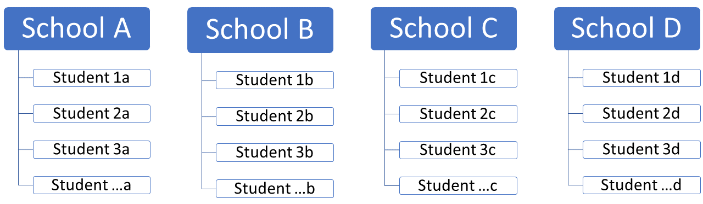
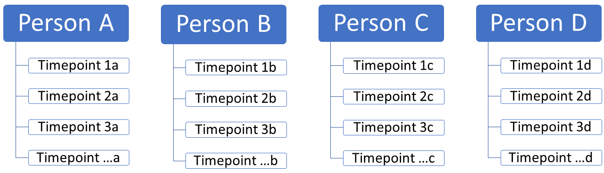
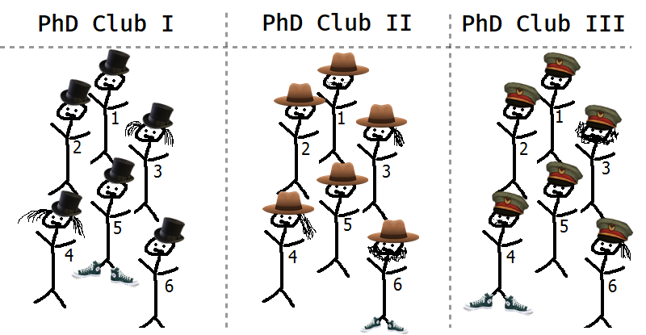

```{r setup, include = FALSE}
# libraries --------------------------------------------------------------------
library(broom.mixed)
library(anicon)
library(countdown)
library(emo)
library(equatiomatic)
library(fontawesome)
library(ggrepel)
library(glue)
library(janitor)
library(kableExtra)
library(knitr)
library(lme4)
library(patchwork)
library(tidyverse)

# general options --------------------------------------------------------------
options(scipen = 999)
set.seed(99)

# chunk options ----------------------------------------------------------------
opts_chunk$set(
  cache.extra = rand_seed, 
  message = FALSE, 
  warning = FALSE, 
  error = FALSE, 
  echo = FALSE,
  cache = FALSE,
  comment = "", 
  fig.align = "center", 
  fig.retina = 3
  )

# functions --------------------------------------------------------------------
sim_ris <- function(m = 30, n = 10, mu = c(4.8, 3), sigma = c(1.3, 0.7, 0.7)) {
  x <- rep(seq(from = 0, to = 10, length = n), times = m)
  subject <- rep(1:m, each = n)
  b0 <- stats::rnorm(m, mean = mu[1L], sd = sigma[1L])
  b1 <- stats::rnorm(m, mean = mu[2L], sd = sigma[2L])
  y <- stats::rnorm(m * n, mean = b0[subject] + b1[subject] * x, sd = sigma[3L])
  data.frame(x, y, subject)
}

# data -------------------------------------------------------------------------
simpson_data <- 
  bayestestR::simulate_simpson(
    n = 100, 
    groups = 10, 
    r = -0.5
  ) |> 
  rename(x = V1, y = V2)

example_data <- 
  sim_ris(
    m = 4, 
    n = 50, 
    mu = c(1, 5), 
    sigma = c(5, 4, 10)
  ) |>
  rename(js_score = y, salary = x) |> 
  mutate(department = case_when(
    subject == 1 ~ "Marketing",
    subject == 2 ~ "Sales",
    subject == 3 ~ "HR",
    subject == 4 ~ "R&D"
  ))

y_mean <- mean(example_data$js_score, na.rm = T)

fit <- lm(js_score ~ 1, data = example_data)
fit2 <- lm(js_score ~ salary, data = example_data)

null_model <- lmer(js_score ~ (1|department), data = example_data)

pred_model <- lmer(js_score ~ salary + (1|department), data = example_data)

pred_model_slope <- lmer(js_score ~ salary + (salary|department), data = example_data)

pos <- position_jitter(width = 0.15, height = 0, seed = 2)

fix_null <- tidy(null_model) |> 
  filter(effect == "fixed")
# ------------------------------------------------------------------------------

random_intercepts <- coef(null_model)$department |> 
  clean_names() |> 
  rownames_to_column("department")

augmented_intercepts <- augment(null_model) |> 
  left_join(random_intercepts)

# ------------------------------------------------------------------------------
random_intercepts_pred <- coef(pred_model)$department |> 
  clean_names() |> 
  rownames_to_column("department") |> 
  rename(slope = salary)

random_intercepts_pred_slope <- coef(pred_model_slope)$department |> 
  rownames_to_column("department")

augmented_random_slopes <- augment(pred_model_slope) |> 
  left_join(random_intercepts_pred_slope)

augmented_slopes <- augment(pred_model) |> 
  left_join(random_intercepts_pred) 

fixed_and_random <- augmented_random_slopes |> 
  arrange(salary) |> 
  distinct(department, .keep_all = T) |> 
  left_join(
    augmented_slopes |> 
      arrange(salary) |> 
      distinct(department, .keep_all = T) |>
      select(.fitted2 = .fitted, x2 = salary, y2 = js_score, .fixed2 = .fixed, department)
  )

# reference --------------------------------------------------------------------
# https://github.com/OpenIntroStat/ims
# https://github.com/pingapang/book

```

# Independence of Observations

So far, all predictors were treated as **fixed** effects: we have estimated a parameter for each predictors and tested its significance to conclude about its corresponding hypothesis

We assumed many things to process linear/logistic regressions, one of them being that observations are independent from each other.

This means that the **probability** of one observation taking one value is independent from the value other observations have taken.

What happens when the assumptions of independence is violated?

--

We treat the variable relating observations as a **random** effect in a Linear Mixed Model

---

# Fixed vs random effects

(Linear) Mixed (Effects) Models, Hierarchical (Linear) Regression, Multilevel Models, Variance Component Models, ... all refer to the same thing

Linear Mixed Models are the answer to the problem of dealing with control variables. They process **fixed effect variables** and **random effect variables**.

--

There is no consensual definition, but Gelman (2005) lists a handful, of which:

> When a sample exhausts the population, the corresponding variable is fixed; when the sample is a small (i.e., negligible) part of the population the corresponding variable is random [Green and Tukey (1960)].

> Effects are fixed if they are interesting in themselves or random if there is interest in the underlying population (e.g., Searle, Casella and McCulloch [(1992), Section 1.4])

- A mixed effects model *mixes* both fixed effects and random effects

$$Outcome = Intercept + \color{red}{Slope} \times \color{blue}{FE} + \color{green}{u} \times \color{purple}{RE} + Error$$

---

# Why Mixed Models?

These models are made of 2 type of effects and therefore are mixed:

- **Fixed effects**: Effects that are of interest in the study
  - Can think of these as effects whose interpretations would be included in a write up of the study
  - They are effects assumed to be constant, i.e. they **do not vary**.

- **Random effects**: Effects we're not interested in studying but whose variability we want to understand 
  - Can think of these as effects whose interpretations would not necessarily be included in a write up of the study 
  - They are assumed to vary by some context, i.e. they **do vary**

---

# Why Multilevel/Hierachical Models?

**Explicitly model multilevel structure** if your data have:

- different average levels of your dependent and independent variables
- different effects varying by group
  
--

Needed for **correct inference**:

- Nested data violate key assumptions of OLS of Independent observations and Independent error terms

    
--

Answer **unique research questions**:

- Estimate group-level predictors and cross-level interactions

---

# A Quick Example

.pull-left[
You might be used to your data looking like this: An independent variable $x$ and a dependent variable $y$

```{r, fig.height=6}
simpson_data   |> 
  ggplot(aes(x = x, y = y))  +
  geom_point() +
  geom_smooth(method = "lm", se = F) +
  ggpubr::stat_cor(label.x = 10, label.y.npc = "bottom") +
  theme_bw() +
  theme(text = element_text(size = 20))
```

From this data we may conclude that $x$ is **positively** correlated with $y$.
]

--

.pull-right[
However, if we introduce *groupings* of the data, a different picture emerges.

<br>
```{r, fig.height=6}
simpson_data  |> 
  ggplot(aes(x = x, y = y))  +
  geom_point(aes(color = Group)) +
  geom_smooth(aes(color = Group), method = "lm", se = F) +
  geom_smooth(method = "lm", se = F, color = "black") +
  ggpubr::stat_cor(aes(color = Group), label.x = 10, label.y.npc = "bottom") +
  theme_bw() +
  theme(
    text = element_text(size = 20),
    legend.position = "none"
  )
```

In each of the groupings we find a **negative** correlation between $x$ and $y$.
]

---

# A Quick Example

<center>
This phenomenon illustrates the Simpson's Paradox

```{r}
include_graphics("https://c.tenor.com/z-7D_CXyUAoAAAAC/scared-simpsons.gif")
```

</center>

--

<left>
Note that it has nothing to do with the Simpsons

> "**Simpson’s Paradox** is a statistical phenomenon where an association between two variables in a population ***emerges***, ***disappears*** or ***reverses*** when the population is divided into subpopulations." *Stanford Encyclopedia of Philosophy 2021*

Simpson's paradox teaches us that we have to be mindful of *structures* within our data.

---

# Data Structure

.pull-left[

We might have students **nested** in schools



Students on the **first level**, schools on the **second level**
]

--

.pull-right[

Or timepoints **nested** in people



Timepoints on the **first level**, people on the **second level**
]

--

We can also easily imagine a **three-level data structure**:timepoints nested in people nested in schools

--

More generally, any kind of control variable for which the results could be different but which hasn't been the purpose of any hypothesis, is potentially a linear mixed model.

---

# Data Structure

There are two types of variance important to consider in our modeling:

- **within-group variance** (i.e. differences *within a group*)

- **between-group variance** (i.e. differences *between groups*)

```{r out.width='60%'}

```

Data points within a group are often more similar than between groups.

This typically implies that the model includes **random intercepts**, and/or **random slopes**

Instead of trying to define random effects, let's try to understand what they do

---

# Example

Imagine we have a dependent variable $Job\,Satisfaction$. It is distributed like this:

```{r}
fortify(fit) |> 
  ggplot(aes("Example", js_score)) +
  geom_jitter(position = pos) +
  geom_line(aes("Example", .fitted), inherit.aes = FALSE) +
  scale_x_discrete("", breaks = NULL) +
  theme_bw() +
  theme(text = element_text(size = 20))
```

---

# Example - Fixed Intercept

.pull-left[
The null hypothesis estimates a linear regression with no predictors and plot the intercept (i.e, the predicted outcome doesn't change)

<br>
```{r}
fortify(fit) |> 
  ggplot(aes("Example", js_score)) +
  geom_jitter(position = pos) +
  geom_line(aes("Example", .fitted), inherit.aes = FALSE) +
  geom_hline(yintercept = y_mean) +
  annotate("text", y = y_mean, x = 1.4, label = glue("avg. = {round(y_mean, 2)}"), vjust = -0.5) +
  scale_x_discrete("", breaks = NULL) +
  theme_bw() +
  theme(text = element_text(size = 20))
```
]

--

.pull-right[
Red lines indicates the error term for each observation.

$$js\_score_i = b_0 + \color{red}{e_i}$$

$$\color{red}{e_i} \sim \mathcal{N}(0, \sigma_{i})$$

```{r}
fortify(fit) |> 
  ggplot(aes("Example", js_score)) +
  geom_jitter(position = pos) +
  geom_line(aes("Example", .fitted), inherit.aes = FALSE) +
  geom_hline(yintercept = y_mean) +
  geom_segment(aes(xend = "Example", yend = .fitted, x = "Example"), position = pos, color = "red", alpha = 0.2) +
  annotate("text", y = y_mean, x = 1.4, label = glue("avg. = {round(y_mean, 2)}"), vjust = -0.5) +  
  scale_x_discrete("", breaks = NULL) +
  theme_bw() +
  theme(text = element_text(size = 20))
```
]

---

# Example - Fixed Slope

We now add the $salary$ predictor:

$$js\_score_i = b_0 + b_1\,salary + \color{red}{e_i}$$

$$\color{red}{e_i} \sim \mathcal{N}(0, \sigma_{i})$$

```{r fig.height=6}
fortify(fit2) |> 
  ggplot(aes(salary, js_score, xend = salary, yend = js_score)) +
  geom_point() +
  geom_line(aes(salary, .fitted), inherit.aes = FALSE) +
  geom_segment(aes(y = .fitted), color = "red", alpha = 0.2) +
  theme_bw() +
  theme(
    text = element_text(size = 20),
    axis.text.x = element_blank()
  )
```

<!-- --- -->
<!-- class: split-three -->

<!-- .column[.content[ -->
<!-- Imagine we have a dependent variable $Job\,Satisfaction$. It is distributed like this: -->
<!-- ```{r} -->
<!-- fortify(fit) |>  -->
<!--   ggplot(aes("Example", js_score)) + -->
<!--   geom_jitter(position = pos) + -->
<!--   geom_line(aes("Example", .fitted), inherit.aes = FALSE) + -->
<!--   scale_x_discrete("", breaks = NULL) + -->
<!--   theme_bw() + -->
<!--   theme(text = element_text(size = 20)) -->
<!-- ``` -->
<!-- ]] -->
<!-- .column[.content[ -->

<!-- ]] -->
<!-- .column[.content[ -->

<!-- ]] -->

---
class: inverse, middle, center

# Enter the M U L T I L E V E L


---

# Example - Group Variable

Now, we have the same dataset as before but this time we introduce a multilevel data structure, i.e. our data points are **nested** in *four different departments*.

```{r}
augment(null_model) |>
  left_join(random_intercepts) |>
  ggplot(aes("Example", js_score, color = department)) +
  geom_jitter(position = pos) +
  scale_x_discrete("", breaks = NULL) +
  theme_bw() +
  theme(
    text = element_text(size = 20)
  )
```

---
class: title-slide, middle

## Linear Mixed Model with <br> Random Intercept

---

# Example - Random Intercept

.pull-left[
In a multilevel context, the **null model** estimates a **random intercept** for each group, without any predictors.
]

.pull-right[
```{r fig.height=10}
augment(null_model) |>
  left_join(random_intercepts) |>
  ggplot(aes("Example", js_score, color = department)) +
  geom_jitter(position = pos) +
  geom_hline(aes(yintercept = intercept, color = department)) +
  scale_x_discrete("", breaks = NULL) +
  theme_bw() +
  theme(
    text = element_text(size = 20),
    legend.position = "none"
  )
```
]

---

# Example - Random Intercept

.pull-left[
The null model introduces an error term relating to each intercept.

This shows the **within-group** variation.
]

.pull-right[
```{r fig.height=10}
augment(null_model) |>
  left_join(random_intercepts) |>
  ggplot(aes("Example", js_score, color = department)) +
  geom_jitter(position = pos) +
  geom_hline(aes(yintercept = intercept, color = department)) +
  geom_segment(aes(xend = "Example", yend = .fitted, x = "Example"), position = pos) +
  scale_x_discrete("", breaks = NULL) +
  theme_bw() +
  theme(
    text = element_text(size = 20),
    legend.position = "none"
  )
```
]

---

# Example - Random Intercept

.pull-left[
We've also introduced an error term for each group intercept, i.e. differences between the grand mean and other group-specific intercepts.

This shows the **between-group** variation.
]

.pull-right[
```{r fig.height=10}
augmented_intercepts |>
  ggplot(aes("Example", js_score, color = department)) +
  geom_jitter(position = pos) +
  geom_hline(yintercept = fix_null$estimate) +
  annotate("text", y = fix_null$estimate, x = 1.3, label = glue("avg. = {round(fix_null$estimate, 2)}"), vjust = -0.5) +
  geom_hline(aes(yintercept = intercept, color = department))  +
  geom_segment(
    data = augmented_intercepts |> distinct(intercept, .keep_all = T),
    aes(y = fix_null$estimate, xend = "Example", yend = intercept, x = "Example", color = department),
    position = position_jitter(height = 0, width = 0.25, seed = 3), inherit.aes = F, size = 1.2, arrow = arrow(length = unit(0.1, "inches"))) +
  scale_x_discrete("", breaks = NULL) +
  theme_bw() +
  theme(
    text = element_text(size = 20),
    legend.position = "none"
  )
```
]

---

# Example - Random Intercept

.pull-left[
We now introduce a dependent variable $salary$ to our multilevel model but keep it fixed, i.e. it is the same across all groups.

The line shows the group-adjusted slope.
]

.pull-right[
```{r fig.height=10}
augment(pred_model) |>
  left_join(random_intercepts_pred) |>
  ggplot(aes(salary, js_score)) +
  geom_point(aes(color = department)) +
  geom_line(aes(x = salary, y = .fixed), inherit.aes = FALSE) +
  theme_bw() +
  theme(
    text = element_text(size = 20),
    legend.position = "none",
    axis.text.x = element_blank()
  )
```
]

---

# Example - Random Intercept

.pull-left[
The slope is held constant across all of our groups.
]

.pull-right[
```{r fig.height=10}
augment(pred_model) |>
  left_join(random_intercepts_pred) |>
  ggplot(aes(salary, js_score)) +
  geom_point(aes(color = department)) +
  geom_line(aes(x = salary, y = .fitted, color = department), inherit.aes = FALSE) +
  theme_bw() +
  theme(
    text = element_text(size = 20),
    legend.position = "none",
    axis.text.x = element_blank()
  )
```
]

---

# Example - Random Intercept

.pull-left[
Again, in a multilevel model, error terms for individual data points are estimated by group.

This shows the **within-group** variation.
]

.pull-right[
```{r fig.height=10}
augment(pred_model) |>
  left_join(random_intercepts_pred) |>
  ggplot(aes(salary, js_score)) +
  geom_point(aes(color = department)) +
  geom_line(aes(x = salary, y = .fitted, color = department), inherit.aes = FALSE) +
  geom_segment(aes(xend = salary, yend = .fitted, x = salary, color = department)) +
  theme_bw() +
  theme(
    text = element_text(size = 20),
    legend.position = "none",
    axis.text.x = element_blank()
  )
```
]

---

# Example - Random Intercept

.pull-left[
And similar as before, we have an error term for the random intercept.

This shows the **between-group** variation.
]

.pull-right[
```{r fig.height=10}
augmented_slopes |>
  ggplot(aes(salary, js_score)) +
  geom_point(aes(color = department)) +
  geom_line(aes(x = salary, y = .fixed), inherit.aes = FALSE, color = "blue", size = 1.5) +
  geom_line(aes(x = salary, y = .fitted, color = department), inherit.aes = FALSE) +
  geom_segment(
    data = augmented_slopes |> distinct(intercept, .keep_all = T),
    aes(y = .fitted, xend = salary, yend = .fixed, x = salary, color = department), size = 1.2,
    position = position_jitter(height = 0, width = 0.5, seed = 3), inherit.aes = F, arrow = arrow(length = unit(0.1, "inches"))) +
  theme_bw() +
  theme(
    text = element_text(size = 20),
    legend.position = "none",
    axis.text.x = element_blank()
  )
```
]

---
background-image: url(https://pbs.twimg.com/media/FG5TTtAWQAcdkGT?format=jpg&name=large)
background-position: 90% 90%
background-size: 500px

# What did we do?

- We are taking into account the idiosyncratic differences associated with each department

- By giving each department its own intercept, we are informing the model that employees from different department has a different starting point salary (i.e., when `salary` = 0)

---
class: inverse

# How does it work? 

Consider the following model for a single department $j$. This shows that the department.-specific effect, i.e. the deviation in $\mathrm{salary}$ just for that department being who they are, can be seen as an additional source of variance.

$$\mathrm{js\_score}_{ij} = b_0 + u_j + b_1\, \mathrm{salary}_{ij} + e_{ij}$$

We would (usually) assume the following for the department effects.

$$u_j \overset{iid}{\sim} \mathcal{N}(0, \sigma_u^2) \hspace{1cm} e_{ij} \overset{iid}{\sim} \mathcal{N}(0, \sigma_e^2)$$

So the department effects are random, and specifically they are normally distributed with mean of zero and some estimated standard deviation $\sigma_u^2$. 

* $b_0$: average job satisfaction for all employees when their salary is 0
* $b_0 + u_j$: average job satisfaction for employees of a specific department $j$ when their salary is 0
* $b_1$: increase in job satisfaction for every €1 added to their salary

In this context, salary is said to be a *fixed effect* only, and there is no random component. This definitely does not have to be the case though, as we'll see later.

---
class: title-slide, middle

## Linear Mixed Model with <br> Random Intercept and Random Slope

---

# Example - Random Slope

.pull-left[

In the random-intercept, fixed slope model, all slopes are held constant, i.e. in each group **we assume the same effect of $salary$ on $job\,satisfaction$**.

*Is this really a reasonable assumption?*

Instead we may introduce **random slopes** and let the slope vary by group.

We can see that it some groups the relationship is *differs in strength* or even becomes *negative* when allowing the slopes to vary.

]

.pull-right[
```{r fig.height=10}
augment(pred_model_slope) |>
  left_join(random_intercepts_pred_slope) |> 
  ggplot(aes(salary, js_score)) +
  geom_point(aes(color = department)) +
  geom_line(aes(x = salary, y = .fitted, color = department), inherit.aes = FALSE) +
  theme_bw() +
  theme(
    text = element_text(size = 20),
    legend.position = "none",
    axis.text.x = element_blank()
  )
```
]

---

# Example - Random Slope

.pull-left[
That is because in addition to all previous error terms, we are also adding an error term for each slope.

The dotted lines are fixed slopes. The arrows show the added error term for each random slope.
]

.pull-right[
```{r fig.height=10}
augmented_random_slopes |>
  ggplot(aes(salary, js_score)) +
  geom_point(aes(color = department)) +
  geom_line(aes(x = salary, y = .fitted, color = department), inherit.aes = FALSE) +
  geom_line(data = augmented_slopes, aes(x = salary, y = .fitted, color = department), inherit.aes = FALSE, linetype = "dashed", size = 0.5) +
  geom_segment(data = fixed_and_random,
               aes(y =  .fitted2, xend = salary, yend = .fitted, x = salary, color = department),
               size = 0.8,
               inherit.aes = F, arrow = arrow(length = unit(0.1, "inches"))) +
  theme_bw() +
  theme(
    text = element_text(size = 20),
    legend.position = "none",
    axis.text.x = element_blank()
  )
```
]

---

# What did we do?

- The model now allows the random intercepts to vary for each department for the effect `salary`

- This means we included a random slope for each department

- By adding a random slope for the effect `salary` we take into account the fact that `js_score` change for each department at a different rate

- Under the hood, the model uses this information to calculate the best fit line for all of the data

- This method is called partial pooling and represents one of the most important (and least understood) aspects of mixed effects modelling

---
class:inverse

# How does it work? 

The model now includes a variable slope $v_i$ according to employee's department such as:

$$js\_score_{ij} = b0 + u_j + (b_1 + v_j)\,salary_{ij} + e_{ij}$$

* $b_0$: average job satisfaction for all employees when their salary is 0
* $b_0 + u_j$: average job satisfaction for employees of a specific department $j$ when their salary is 0
* $b_1$: average increase in job satisfaction for every $1 added to their salary
* $b_1 + v_j$: average increase in job satisfaction for every €1 added to their salary according to their department $j$

With this new variable parameter comes some specifications:

$$e_{ij} \overset{iid}{\sim} \mathcal{N}(0, \sigma_e^2) \hspace{1cm} \begin{bmatrix} u_j \\ v_j \end{bmatrix} \overset{iid}{\sim} \mathcal{N} \left( \begin{bmatrix} 0 \\ 0 \end{bmatrix}, \begin{bmatrix} \sigma_u^2 & \rho_{uv}\sigma_u \sigma_v \\ \rho_{uv}\sigma_u \sigma_v & \sigma_v^2 \end{bmatrix} \right)$$

This just says that both $u_j$ and $v_j$ come from a normal distribution:
 * the variance of $u_j$ is $\sigma_u^2$
 * the variance of $v_j$ is $\sigma_v^2$
 * the correlation between $u_i$ and $v_i$ is $\rho_{uv}$

---
class: title-slide, middle

## Linear Mixed Model with Jamovi

---

# Linear Mixed Model with Jamovi

In JAMOVI, a Linear Mixed Models can be analysed using the **GAMLj** Module as follow:

```{r out.width = '100%'}

```

---

# Linear Mixed Model with Jamovi

In the option "Random Effects", you can chose either `intercept|department` (random intercept only model) or `salary|department` (random intercept plus random slop model).

```{r out.width = '100%'}

```

---
class: title-slide, middle

## Linear Mixed Model with R

---

# Linear Mixed Model with R

For that, we will be using the `{lme4}` package in R.

```{r eval=FALSE}
library(lme4)
```

- The `{lmerTest}` package provides additional functionalities for testing.

- `lmer()` function fits linear mixed effect regression

- Random effects are specified using the notation `(1 | factor)`.

---
class: title-slide, middle

## Linear Mixed Model <br> with Random Intercept Only

---

# Random Intercept Only with R

1. We use the function `lmer()` from the `{lme4}` package
2. We specify the outcome variable `js_score` and the fixed effect variable `salary`
3. We specify the *random* part of our equation within the brackets.
  + The first part in the brackets refers to the random slope. `1` just says: hold the slope constant, i.e. no random slope
  + The second part in the brackets (`departement`) specifies the random intercepts, i.e. by which group we want the data to vary

```{r echo=TRUE}
mixed_model <- 
  lmer(
    formula = js_score ~ salary + (1|department), 
    data = example_data
  )
```

for department $j = 1, … ,J$, this model corresponds to the following equation:

```{r eval=FALSE}
extract_eq(mixed_model, intercept = "beta")
```

$$\mathrm{js\_score}_{ij} = b_0 + u_j + b_1\, \mathrm{salary}_{ij} + e_{ij}$$

We would (usually) assume the following for the department effects.

$$u_j \overset{iid}{\sim} \mathcal{N}(0, \sigma_u^2) \hspace{1cm} e_{ij} \overset{iid}{\sim} \mathcal{N}(0, \sigma_e^2)$$

---

# Random Intercept Only with R

.pull-left[
```{r echo=TRUE}
summary(mixed_model)
```
]

.pull-right[
There are three parts in this output
1. Some meta info about your model
2. Group-Level statistics (random effects)
3. Fixed effects
]

---

# Random Intercept Only with R

## 1. Meta Info

- Formula and data used for estimation.

- This also states whether we are using Maximum Likelihood (ML) or Restricted Maximum Likelihood (REML) estimation. In our case, it is the latter.

- It also states the REML value at convergence (if it converges), value is not particularly important.

- Finally, we can also see some distribution metrics for the residuals of the metrics (also typically less important).

---

# Random Intercept Only with R

## 2. Group-Level statistics

- This part states the random effects and its distribution.

- We are interested in the variance of the **random effect**, $\sigma_u^2$.

- Measurements from the same individuals are correlated. The intra-class correlation (ICC) between measurements $Y_{ij}$ and $Y_{ik}$ from subject $i$ at times $j\neq k$ is

$$\rho = \frac{\sigma^2_u}{\sigma^2_u + \sigma^2_e}.$$

---

# Random Intercept Only with R

This is interpreted in the following way:

1. Under `(Intercept)` we find the variance for the random intercept (per department), i.e. **between-group variance**. The variance on the second level (department-level) is 296.0.

2. Under `Residual` we find the variance on level 1 (here: employees), i.e. **within-group variance**. The variance on the first level is 217.7

This is in units of the *dependent variables*.

$$Variance_{Total} = 513.7$$

We can now calculate the Intra-Class Coefficient (ICC):

$$ICC = \frac{Variance_{L2}}{ Variance_{Total}}\,= \frac{296.0_{L2}}{513.7} = 0.57$$

> 57% of the variance of job satisfaction is between departments. Typically, we say 10% of the variance should be on the second level to justify multilevel model.

---

# Random Intercept Only with R

## 3. Fixed effects

- This part tells us about the fixed effects.

- The estimate for the intercept $b_0$ tells us that the grand mean of income (across all department) is *4.8209* and the estimate slope $b_1$ for $salary$ is *4.5412*.

---

# Random Intercept Only with R

.pull-left[
```{r}
summary_random <- summary(mixed_model)
summary_random$coefficients %>%
  as.data.frame() %>%
  kable(digits = 2, col.names = c("Coefficient", "SE", "t"), format = "html", align = "c")
```
]

.pull-right[
Where are my ***p*-values**? I want *p*-values!

Computing *p*-values in LMM is not straightforward. It's difficult to come map estimates into **probability distributions**.
]

--

Several alternatives:

#### 1. Assume estimated coefficients follow a **normal distribution**: map standardised coefficients onto the normal distribution (*Mean* = 0, *SD* = 1) to get their probability.

#### 2. Assume estimated coefficients follow a ***t*** or a ***F* distribution*** with *approximated* degrees of freedom:

* *t* distribution: **Satterthwaite**'s approximation to degrees of freedom
* $\chi^2$ distribution: **Wald**'s $\chi^2$ test
* *F* distribution: **Kenward-Roger** ANOVA

#### 3. Shift to **Bayesian** statistical inference

---

# Random Intercept Only with R

```{r echo=TRUE}
library(car)

mixed_model_pvalue <- Anova(mixed_model, type = "III", test.statistic = "F")

mixed_model_pvalue |> 
  kable()
```

---

# Random Intercept Only with R

```{r echo=TRUE, results='asis'}
library(report)

report(mixed_model)
```

---
class: title-slide, middle

## Exercise: Linear Mixed Model - Random Intercept Only

Using Jamovi or R, analyse a linear mixed model with the random data that has been sent to you:
- Use a continuous variable of your choice as Outcome
- Use a continuous variable of your choice as Predictor
- Use the categorical variable with more than 2 categories as random effect

For now, only calculate the random intercept model

```{r}
countdown(minutes = 10, warn_when = 60)
```

---
class: title-slide, middle

## Linear Mixed Model <br> with Random Intercept and Random Slope

---

# Random Intercept and Slope with R

1. We use the function `lmer` from the `lme4` package.
2. We specify the outcome variable `js_score` and the fixed effect variable `salary`
3. We specify the *random* part of our equation within the brackets.
  + The first part in the brackets refers to the random slope. `salary` says: move the slope for each group on the salary scale
  + The second part in the brackets (`departement`) specifies the random intercepts, i.e. by which group we want the data to vary.

```{r echo=TRUE}
mixed_model <- 
  lmer(
    formula = js_score ~ salary + (salary|department), 
    data = example_data
  )
```

---

# Random Intercept and Slope with R

```{r echo=TRUE}
summary(mixed_model)
```

---

# Random Intercept and Slope with R

```{r echo=TRUE, results='asis'}
library(report)

report(mixed_model)
```

---

# When our model fails to converge

Sometimes, our model can't figure out **what parameters are most likely** given the data.

This can be because **different values** of the same coefficient are **equally likely**.

How to avoid this:

* The **larger** the data, the easier to converge.
* The larger values of the coefficients the more difficult to converge. Consider:
- Changing units of measurement: use **seconds** instead of milliseconds (Barr, 2008).
- **Standardising** your predictors.
* Don't get too fancy with your model: the more **parsimonious**, the better (less parameters to estimate).

---
class: title-slide, middle

## Exercise: Linear Mixed Model - Random Intercept and Slope

Using Jamovi or R, analyse a linear mixed model with the random data that has been sent to you:
- Use a continuous variable of your choice as Outcome
- Use a continuous variable of your choice as Predictor
- Use the categorical variable with more than 2 categories as random effect

Calculate the random intercept and random slope model.

```{r}
countdown(minutes = 10, warn_when = 60)
```

---
class: title-slide, middle

## Conclusion

---

# Summary of Mixed Model

Mixed models allow for us to take into account observed structure in the data.

If this were all it was used for, we would have more accurate inference relative to what would be had if we ignored that structure.

However, we get much more! We better understand the sources of variability in the target variable.  We also get group specific estimates of the parameters in the model, allowing us to understand exactly how the groups differ from one another.

Furthermore, this in turn allows for group specific prediction, and thus much more accurate prediction, assuming there is appreciable variance due to the clustering. 

In short, there is much to be gained by mixed models, even in the simplest of settings.

---

# Summary of Mixed Model

- We have spent the previous lecture building up our knowledge 
of the linear model so that we would be prepared to understand 
mixed effects models

- They are the most suitable to take into account the control variables

--

- What about GLMs?
  - Fit mixed effects models for count data and binary outcomes using `glmer()`
  - All you have to do is specify the distribution

```{r eval=FALSE, echo=TRUE}
glmer(
  formula = response ~ fixed_effect + (fixed_effect|participant), 
  family = binomial, #binomial(link = "logit")
  data = my_data
  )
```

```{r eval=FALSE, echo=TRUE}
glmer(
  formula = counts ~ fixed_effect + (fixed_effect|participant),
  family = poisson, #poisson(link = "log")
  data = my_data
  )
```

---
class: title-slide, middle

## Exercise: Generalized Linear Mixed Model (GLMM)

Using Jamovi or R, analyse a generalised linear mixed model with the titanic data:
- Use the `Survive` variable as Outcome
- Use the `Age` and `Fare` variables of your choice as Predictor, include their interaction
- Use the `Sex` variable as random effect

```{r}
countdown(minutes = 10, warn_when = 60)
```

---
class: inverse, mline, left, middle


# Thanks for your attention and don't hesitate if you have any questions!

- [`r fa(name = "twitter")` @damien_dupre](http://twitter.com/damien_dupre)
- [`r fa(name = "github")` @damien-dupre](http://github.com/damien-dupre)
- [`r fa(name = "link")` damien-datasci-blog.netlify.app](https://damien-datasci-blog.netlify.app)
- [`r fa(name = "paper-plane")` damien.dupre@dcu.ie](mailto:damien.dupre@dcu.ie)