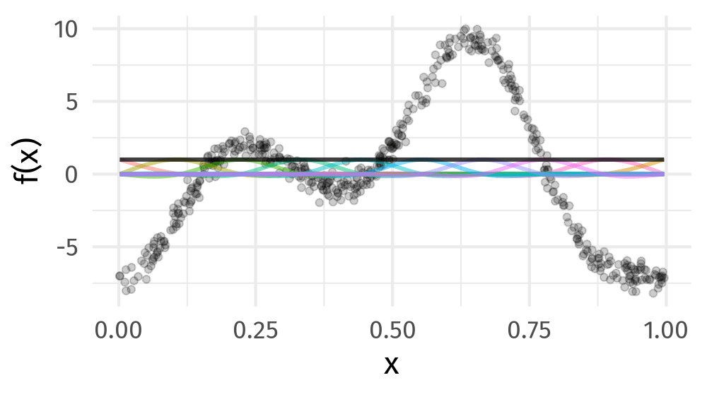

```{r setup, include = FALSE}
# libraries --------------------------------------------------------------------
library(anicon)
library(countdown)
library(cowplot)
library(emo)
library(fontawesome)
library(gganimate)
library(gratia)
library(here)
library(janitor)
library(kableExtra)
library(knitr)
library(mgcv)
library(tidyverse)
library(transformr)
library(viridis)

# general options --------------------------------------------------------------
options(scipen = 999)
set.seed(99)
# anim_width <- 1000
# anim_height <- anim_width / 1.77777777
# anim_dev <- 'png'
# anim_res <- 200

# chunk options ----------------------------------------------------------------
opts_chunk$set(
  cache.extra = rand_seed, 
  message = FALSE, 
  warning = FALSE, 
  error = FALSE, 
  echo = FALSE,
  cache = FALSE,
  comment = "", 
  fig.align = "center", 
  fig.retina = 3
  )
# data -------------------------------------------------------------------------
gtemp <- 
  read_table(
    "https://bit.ly/hadcrutv4", 
    col_types = 'nnnnnnnnnnnn', 
    col_names = FALSE
  ) %>%
  select(num_range('X', 1:2)) %>% 
  setNames(nm = c('Year', 'Temperature'))
```

# References

- Slides created by Gavin Simpson: https://fromthebottomoftheheap.net/slides/gam-intro-webinar-2020/gam-intro.html
- He has a great webinar: https://www.youtube.com/watch?v=sgw4cu8hrZM
- Interactive course: https://noamross.github.io/gams-in-r-course/

---

class: inverse, mline, center, middle

# Not Everything is Linear

---

# HadCRUT4 time series

```{r fig.width=12, fig.height=6}
gtemp_plt <- ggplot(gtemp, aes(x = Year, y = Temperature)) +
  geom_line() + 
  geom_point() +
  labs(
    x = 'Year', 
    y = expression(Temeprature ~ degree*C),
    subtitle = "Hadley Centre NH temperature record ensemble"
  ) +
  theme_bw() +
  theme(text = element_text(size = 20))
gtemp_plt
```

### How would you model the trend in these data?

---

# Linear Models

$$y_i = b_0 + b_1 x_{1i} + b_2 x_{2i} + \cdots + b_j x_{ji} + e_i$$

$$e_i \sim \mathcal{N}(0, \sigma^2)$$

Assumptions:

1. Linear effects are good approximation of the true effects
2. Distribution of residuals is $e_i \sim \mathcal{N}(0, \sigma^2)$
3. Implies all observations have the same *variance*
4. Residuals $e_i$ are *independent*

An **additive** model address the first of these

---
class: inverse, mline, center, middle

# GAMs offer a solution

---

# Fitted GAM

- Generalized Additive Models (GAMs) are a flexible and powerful class of regression models that can capture non-linear relationships between the response variable and the predictors.

- GAMs take each predictor variable in the model and separate it into sections (delimited by 'knots'), and then fit polynomial functions to each section separately, with the constraint that there are no kinks at the knots (second derivatives of the separate functions are equal at the knots).  

- Since the model fit is based on deviance/likelihood, fitted models are directly comparable with GLMs using likelihood techniques (like AIC) or classical tests based on model deviance (Chi-squared or F tests, depending on the error structure).  

- Even better, all the error and link structures of GLMs are available in GAMs (including poisson and binomial), as are the standard suite of lm or glm attributes (resid, fitted, summary, coef, etc.).

---

# Fitted GAM

```{r fig.width=12, fig.height=6}
library('mgcv')
m <- gam(Temperature ~ s(Year), data = gtemp, method = 'REML')
newd <- as_tibble(with(gtemp, data.frame(Year = seq(min(Year), max(Year), length = 300))))
pred <- as_tibble(as.data.frame(predict(m, newdata = newd, se.fit = TRUE,
                                        unconditional = TRUE)))
pred <- bind_cols(newd, pred) %>%
    mutate(upr = fit + 2 * se.fit, lwr = fit - 2*se.fit)

ggplot(gtemp, aes(x = Year, y = Temperature)) +
  geom_point() +
  # geom_ribbon(
  #   data = pred,
  #   mapping = aes(ymin = lwr, ymax = upr, x = Year), alpha = 0.4, inherit.aes = FALSE,
  #   fill = "#fdb338") +
  # geom_line(
  #   data = pred,
  #   mapping = aes(y = fit, x = Year), inherit.aes = FALSE, size = 1, colour = "#025196"
  # ) +
  geom_smooth(method = "gam") +
  labs(
    x = 'Year', 
    y = expression(Temeprature ~ degree*C),
    subtitle = "Hadley Centre NH temperature record ensemble"
  ) +
  theme_bw() +
  theme(text = element_text(size = 20))
```

---

# Generalized Additive Models

<br />


.references[Source: [GAMs in R by Noam Ross](https://noamross.github.io/gams-in-r-course/)]

???

GAMs are an intermediate-complexity model

* can learn from data without needing to be informed by the user
* remain interpretable because we can visualize the fitted features

---

# How is a GAM different?

In LM we model the mean of data as a sum of linear terms:

$$y_i = \beta_0 +\sum_j \color{red}{ \beta_j x_{ji}} +\epsilon_i$$

A GAM is a sum of _smooth functions_ or _smooths_

$$y_i = \beta_0 + \sum_j \color{red}{s_j(x_{ji})} + \epsilon_i$$

where $\epsilon_i \sim N(0, \sigma^2)$, $y_i \sim \text{Normal}$ (for now)

Call the above equation the **linear predictor** in both cases

---

# Fitting a GAM in R

GAM needs the package `mgcv`:

```{r eval=FALSE, echo=TRUE}
install.packages("mgcv")
library(mgcv)
```

GAM can be calculated with the function `gam()` with requires by default a formula and a data arguments. Method and family are usually important to specify as well.

```r
model <- gam(y ~ s(x1) + s(x2) + te(x3, x4), # formuala describing model
             data = my_data_frame,           # your data
             method = 'REML',                # or 'ML'
             family = gaussian)              # or something more exotic
```

`s()` terms are smooths of one or more variables

`te()` terms are the smooth equivalent of *main effects + interactions*

---
class: inverse
background-image: url('./img/rob-potter-398564.jpg')
background-size: contain

# What magic is this?

.footnote[
<a style="background-color:black;color:white;text-decoration:none;padding:4px 6px;font-family:-apple-system, BlinkMacSystemFont, &quot;San Francisco&quot;, &quot;Helvetica Neue&quot;, Helvetica, Ubuntu, Roboto, Noto, &quot;Segoe UI&quot;, Arial, sans-serif;font-size:12px;font-weight:bold;line-height:1.2;display:inline-block;border-radius:3px;" href="https://unsplash.com/@robpotter?utm_medium=referral&amp;utm_campaign=photographer-credit&amp;utm_content=creditBadge" target="_blank" rel="noopener noreferrer" title="Download free do whatever you want high-resolution photos from Rob Potter"><span style="display:inline-block;padding:2px 3px;"><svg xmlns="http://www.w3.org/2000/svg" style="height:12px;width:auto;position:relative;vertical-align:middle;top:-1px;fill:white;" viewBox="0 0 32 32"><title></title><path d="M20.8 18.1c0 2.7-2.2 4.8-4.8 4.8s-4.8-2.1-4.8-4.8c0-2.7 2.2-4.8 4.8-4.8 2.7.1 4.8 2.2 4.8 4.8zm11.2-7.4v14.9c0 2.3-1.9 4.3-4.3 4.3h-23.4c-2.4 0-4.3-1.9-4.3-4.3v-15c0-2.3 1.9-4.3 4.3-4.3h3.7l.8-2.3c.4-1.1 1.7-2 2.9-2h8.6c1.2 0 2.5.9 2.9 2l.8 2.4h3.7c2.4 0 4.3 1.9 4.3 4.3zm-8.6 7.5c0-4.1-3.3-7.5-7.5-7.5-4.1 0-7.5 3.4-7.5 7.5s3.3 7.5 7.5 7.5c4.2-.1 7.5-3.4 7.5-7.5z"></path></svg></span><span style="display:inline-block;padding:2px 3px;">Rob Potter</span></a>
]

---
class: inverse
background-image: url('img/wiggly-things.png')
background-size: contain

???

---

```{r results=FALSE}
f <- function(x) {
    x^11 * (10 * (1 - x))^6 + ((10 * (10 * x)^3) * (1 - x)^10)
}

draw_beta <- function(n, k, mu = 1, sigma = 1) {
    rmvn(n = n, mu = rep(mu, k), V = diag(rep(sigma, k)))
}

weight_basis <- function(bf, x, n = 1, k, ...) {
    beta <- draw_beta(n = n, k = k, ...)
    out <- sweep(bf, 2L, beta, '*')
    colnames(out) <- paste0('f', seq_along(beta))
    out <- as_tibble(out)
    out <- add_column(out, x = x)
    out <- pivot_longer(out, -x, names_to = 'bf', values_to = 'y')
    out
}

random_bases <- function(bf, x, draws = 10, k, ...) {
    out <- rerun(draws, weight_basis(bf, x = x, k = k, ...))
    out <- bind_rows(out)
    out <- add_column(out, draw = rep(seq_len(draws), each = length(x) * k),
                      .before = 1L)
    class(out) <- c("random_bases", class(out))
    out
}

plot.random_bases <- function(x, facet = FALSE) {
    plt <- ggplot(x, aes(x = x, y = y, colour = bf)) +
        geom_line(lwd = 1, alpha = 0.75) +
        guides(colour = FALSE)
    if (facet) {
        plt + facet_wrap(~ draw)
    }
    plt
}

normalize <- function(x) {
    rx <- range(x)
    z <- (x - rx[1]) / (rx[2] - rx[1])
    z
}

set.seed(1)
N <- 500
data <- tibble(x     = runif(N),
               ytrue = f(x),
               ycent = ytrue - mean(ytrue),
               yobs  = ycent + rnorm(N, sd = 0.5))

k <- 10
knots <- with(data, list(x = seq(min(x), max(x), length = k)))
sm <- smoothCon(s(x, k = k, bs = "cr"), data = data, knots = knots)[[1]]$X
colnames(sm) <- levs <- paste0("f", seq_len(k))
basis <- pivot_longer(cbind(sm, data), -(x:yobs), names_to = 'bf')
basis

set.seed(2)
bfuns <- random_bases(sm, data$x, draws = 20, k = k)

smooth <- bfuns %>%
    group_by(draw, x) %>%
    summarise(spline = sum(y)) %>%
    ungroup()

# p1 <- ggplot(smooth) +
#     geom_line(data = smooth, aes(x = x, y = spline), lwd = 1.5) +
#     labs(y = 'f(x)', x = 'x') +
#     theme_minimal(base_size = 16)
# 
# smooth_funs <- animate(
#     p1 + transition_states(draw, transition_length = 4, state_length = 2) +
#     ease_aes('cubic-in-out'),
#     nframes = 200, height = anim_height, width = anim_width, res = anim_res, dev = anim_dev)
# 
# anim_save('img/spline-anim.gif', smooth_funs)
```

# Wiggly things

```{r}

```

???

GAMs use splines to represent the non-linear relationships between covariates, here `x`, and the response variable on the `y` axis.

---

# Basis expansions

In the polynomial models we used a polynomial basis expansion of $\boldsymbol{x}$

* $\boldsymbol{x}^0 = \boldsymbol{1}$ &mdash; the model constant term
* $\boldsymbol{x}^1 = \boldsymbol{x}$ &mdash; linear term
* $\boldsymbol{x}^2$
* $\boldsymbol{x}^3$
* &hellip;

---

# Splines

Splines are *functions* composed of simpler functions

Simpler functions are *basis functions* & the set of basis functions is a *basis*

When we model using splines, each basis function $b_k$ has a coefficient $\beta_k$

Resultant spline is a the sum of these weighted basis functions, evaluated at the values of $x$

$$s(x) = \sum_{k = 1}^K \beta_k b_k(x)$$

---

# Splines formed from basis functions

```{r basis-functions, fig.height=6, fig.width = 1.777777*6, echo = FALSE}
ggplot(basis,
       aes(x = x, y = value, colour = bf)) +
    geom_line(lwd = 2, alpha = 0.5) +
    guides(colour = FALSE) +
    labs(x = 'x', y = 'b(x)') +
    theme_minimal(base_size = 20)
```

???

Splines are built up from basis functions

Here I'm showing a cubic regression spline basis with 10 knots/functions

We weight each basis function to get a spline. Here all the basis functions have the same weight so they would fit a horizontal line

---

# Weight basis functions &#8680; spline

```{r basis-function-animation, results = 'hide', echo = FALSE}
# bfun_plt <- plot(bfuns) +
#     geom_line(data = smooth, aes(x = x, y = spline),
#               inherit.aes = FALSE, lwd = 1.5) +
#     labs(x = 'x', y = 'f(x)') +
#     theme_minimal(base_size = 14)
# 
# bfun_anim <- animate(
#     bfun_plt + transition_states(draw, transition_length = 4, state_length = 2) + 
#     ease_aes('cubic-in-out'),
#     nframes = 200, height = anim_height, width = anim_width, res = anim_res, dev = anim_dev)
# 
# anim_save('img/basis-fun-anim.gif', bfun_anim)
```

.center[]

???

But if we choose different weights we get more wiggly spline

Each of the splines I showed you earlier are all generated from the same basis functions but using different weights

---

# How do GAMs learn from data?

```{r example-data-figure, fig.height=6, fig.width = 1.777777*6, echo = FALSE}
data_plt <- ggplot(data, aes(x = x, y = ycent)) +
    geom_line(col = 'goldenrod', lwd = 2) +
    geom_point(aes(y = yobs), alpha = 0.2, size = 3) +
    labs(x = 'x', y = 'f(x)') +
    theme_minimal(base_size = 20)
data_plt
```

???

How does this help us learn from data?

Here I'm showing a simulated data set, where the data are drawn from the orange functions, with noise. We want to learn the orange function from the data

---

# Maximise penalised log-likelihood &#8680; &beta;

```{r basis-functions-anim, results = "hide", echo = FALSE}
sm2 <- smoothCon(s(x, k = k, bs = "cr"), data = data, knots = knots)[[1]]$X
beta <- coef(lm(ycent ~ sm2 - 1, data = data))
wtbasis <- sweep(sm2, 2L, beta, FUN = "*")
colnames(wtbasis) <- colnames(sm2) <- paste0("F", seq_len(k))
## create stacked unweighted and weighted basis
basis <- as_tibble(rbind(sm2, wtbasis)) %>%
    add_column(x = rep(data$x, times = 2),
               type = rep(c('unweighted', 'weighted'), each = nrow(sm2)),
               .before = 1L)
##data <- cbind(data, fitted = rowSums(scbasis))
wtbasis <- as_tibble(rbind(sm2, wtbasis)) %>%
    add_column(x      = rep(data$x, times = 2),
               fitted = rowSums(.),
               type   = rep(c('unweighted', 'weighted'), each = nrow(sm2))) %>%
    pivot_longer(-(x:type), names_to = 'bf')
basis <- pivot_longer(basis, -(x:type), names_to = 'bf')

# p3 <- ggplot(data, aes(x = x, y = ycent)) +
#     geom_point(aes(y = yobs), alpha = 0.2) +
#     geom_line(data = basis,
#               mapping = aes(x = x, y = value, colour = bf),
#               lwd = 1, alpha = 0.5) +
#     geom_line(data = wtbasis,
#               mapping = aes(x = x, y = fitted), lwd = 1, colour = 'black', alpha = 0.75) +
#     guides(colour = FALSE) +
#     labs(y = 'f(x)', x = 'x') +
#     theme_minimal(base_size = 16, base_family = 'Fira Sans')
# 
# crs_fit <- animate(p3 + transition_states(type, transition_length = 4, state_length = 2) + 
#                    ease_aes('cubic-in-out'),
#                    nframes = 100, height = anim_height, width = anim_width, res = anim_res,
#                    dev = anim_dev)
# 
# anim_save('./img/gam-crs-animation.gif', crs_fit)
```

.center[]

???

Fitting a GAM involves finding the weights for the basis functions that produce a spline that fits the data best, subject to some constraints

---
class:inverse
 
# Wiggliness

$$\int_{\mathbb{R}} [f^{\prime\prime}]^2 dx = \boldsymbol{\beta}^{\mathsf{T}}\mathbf{S}\boldsymbol{\beta} = \large{W}$$

(Wiggliness is 100% the right mathy word)

We penalize wiggliness to avoid overfitting

--

$W$ measures **wiggliness**

(log) likelihood measures closeness to the data

We use a **smoothing parameter** $\lambda$ to define the trade-off, to find
the spline coefficients $B_k$ that maximize the **penalized** log-likelihood

$$\mathcal{L}_p = \log(\text{Likelihood})  - \lambda W$$

---
class:inverse

# HadCRUT4 time series

```{r}
K <- 40
lambda <- c(10000, 1, 0.01, 0.00001)
N <- 300
newd <- with(gtemp, data.frame(Year = seq(min(Year), max(Year), length = N)))
fits <- lapply(lambda, function(lambda) gam(Temperature ~ s(Year, k = K, sp = lambda), data = gtemp))
pred <- vapply(fits, predict, numeric(N), newdata = newd)
op <- options(scipen = 100)
colnames(pred) <- lambda
newd <- cbind(newd, pred)
lambdaDat <- gather(newd, Lambda, Fitted, -Year)
lambdaDat <- transform(lambdaDat, Lambda = factor(paste("lambda ==", as.character(Lambda)),
                                                  levels = paste("lambda ==", as.character(lambda))))

gtemp_plt + geom_line(data = lambdaDat, mapping = aes(x = Year, y = Fitted, group = Lambda),
                      size = 1, colour = "#e66101") +
    facet_wrap( ~ Lambda, ncol = 2, labeller = label_parsed)
options(op)
```

---
class:inverse

# Picking the right wiggliness

.pull-left[
Two ways to think about how to optimize $\lambda$:

* Predictive: Minimize out-of-sample error
* Bayesian:  Put priors on our basis coefficients
]

.pull-right[
Many methods: AIC, Mallow's $C_p$, GCV, ML, REML

* **Practically**, use **REML**, because of numerical stability
* Hence `gam(..., method='REML')`
]

.center[

]

---
class:inverse

# Maximum allowed wiggliness

We set **basis complexity** or "size" $k$

This is _maximum wigglyness_, can be thought of as number of small functions that make up a curve

Once smoothing is applied, curves have fewer **effective degrees of freedom (EDF)**

EDF < $k$

--

$k$ must be *large enough*, the $\lambda$ penalty does the rest

*Large enough* &mdash; space of functions representable by the basis includes the true function or a close approximation to the tru function

Bigger $k$ increases computational cost

In **mgcv**, default $k$ values are arbitrary &mdash; after choosing the model terms, this is the key user choice

**Must be checked!** &mdash; `gam.check()`

---

# GAM for HadCRUT4

```{r, echo = TRUE}
gam_model <- gam(
  formula = Temperature ~ s(Year), 
  data = gtemp, 
  family = gaussian,
  method = "REML"
  )
```

---

# GAM for HadCRUT4

```{r, echo = TRUE}
summary(gam_model)
```

---
class: title-slide, middle

## GAM for Spatial Analyses

---

# Portugese larks

.pull-left[
```{r}
library('gamair')
data(bird)

bird <- transform(bird,
            crestlark = factor(crestlark),
            linnet = factor(linnet),
            e = x / 1000,
            n = y / 1000) |> 
  na.omit()
head(bird) |> 
  select(-QUADRICULA) |> 
  kable() |> 
  kable_styling(bootstrap_options = "striped", font_size = 15)
```
]

.pull-right[
```{r fig.width = 5, fig.height = 6}
ggplot(bird, aes(x = e, y = n, colour = crestlark)) +   geom_point(size = 0.5) + 
  coord_fixed() + 
  scale_colour_discrete(na.value = '#bbbbbb33') +
  theme_bw()
```
]

---

# Portugese larks &mdash; binomial GAM

```{r echo = TRUE}
gam_model <- 
  gam(
    formula = crestlark ~ s(e, n, k = 100),
    data = bird,
    family = binomial,
    method = 'REML'
  )
```

- $s(e, n)$ indicated by `s(e, n)` in the formula

- Isotropic thin plate spline

- `k` sets size of basis dimension; upper limit on EDF

- Smoothness parameters estimated via REML

---

# Portugese larks &mdash; binomial GAM

```{r echo = TRUE}
summary(gam_model)
```

---

# Different types of smooth

The type of smoother is controlled by the `bs` argument (think *basis*)

The default is a low-rank thin plate spline `bs = 'tp'`

Many others available

* Cubic splines `bs = 'cr'`
* P splines `bs = 'ps'`
* Cyclic splines `bs = 'cc'` or `bs = 'cp'`
* Adaptive splines `bs = 'ad'`
* Random effect `bs = 're'`
* Factor smooths `bs = 'fs'`
* Duchon splines `bs = 'ds'`
* Spline on the sphere `bs = 'sos'`
* MRFs `bs = 'mrf'`
* Soap-film smooth `bs = 'so'`
* Gaussian process `bs = 'gp'`

---

# Conditional distributions

A GAM is just a fancy GLM

Simon Wood & colleagues (2016) have extended the *mgcv* methods to some non-exponential family distributions

* `binomial()`
* `poisson()`
* `Gamma()`
* `inverse.gaussian()`
* `nb()`
* `tw()`
* `mvn()`
* `multinom()`

---

# Smooth interactions

Two ways to fit smooth interactions

1. Bivariate (or higher order) thin plate splines
    * `s(x, z, bs = 'tp')`
    * Isotropic; single smoothness parameter for the smooth
	* Sensitive to scales of `x` and `z`
2. Tensor product smooths
    * Separate marginal basis for each smooth, separate smoothness parameters
	* Invariant to scales of `x` and `z`
	* Use for interactions when variables are in different units
	* `te(x, z)`

---

# Tensor product smooths

There are multiple ways to build tensor products in *mgcv*

1. `te(x, z)`
2. `t2(x, z)`
3. `s(x) + s(z) + ti(x, z)`

`te()` is the most general form but is not compatible with Bayesian analyses

`t2()` is an alternative implementation that is compatible with Bayesian analyses

`ti()` fits pure smooth interactions; where the main effects of `x` and `z` have been removed from the basis

---

# Factor smooth interactions

Two ways for factor smooth interactions

1. `by` variable smooths
    * entirely separate smooth function for each level of the factor
	* each has it's own smoothness parameter
	* centred (no group means) so include factor as a fixed effect
	* `y ~ f + s(x, by = f)`
2. `bs = 'fs'` basis
  * smooth function for each level of the function
	* share a common smoothness parameter
	* fully penalized; include group means
	* closer to random effects
	* `y ~ s(x, f, bs = 'fs')`

---

# Random effects

When fitted with REML or ML, smooths can be viewed as just fancy random effects

Inverse is true too; random effects can be viewed as smooths

If you have simple random effects you can fit those in `gam()` and `bam()` without needing the more complex GAMM functions `gamm()` or `gamm4::gamm4()`

These two models are equivalent

```{r echo=TRUE, eval=FALSE}
m_glme <- glmer(travel ~ Road + (1 | Rail), data = Rail, method = "REML")

m_gam  <- gam(travel ~ Road + s(Rail, bs = "re"), data = Rail, method = "REML")
```

---

# Random effects

The random effect basis `bs = 're'` is not as computationally efficient as *nlme* or *lme4* for fitting

* complex random effects terms, or
* random effects with many levels

Instead see `gamm()` and `gamm4::gamm4()`

* `gamm()` fits using `lme()`
* `gamm4::gamm4()` fits using `lmer()` or `glmer()`

For non Gaussian models use `gamm4::gamm4()`

---
class: inverse, mline, center, middle

# Model checking

---

# Model checking

`gam.check()` is essential to check two points in a GAM:

- Do you have the right degrees of freedom?

- What are the diagnosing model issues?

---

# GAMs are models too

How accurate your predictions will be depends on how good the model is

```{r misspecify, echo = FALSE}
set.seed(15)
model_list = c(
  "right model",
  "wrong distribution",
  "heteroskedasticity",
  "dependent data",
  "wrong functional form"
)
n <- 60
sigma = 1
x <- seq(-1, 1, length = n)
model_data <- as.data.frame(expand.grid(x = x, model = model_list))
model_data$y <- 5 * model_data$x ^ 2 + 2 * model_data$x
for (i in model_list) {
  if (i == "right model") {
    model_data[model_data$model == i, "y"] <-
      model_data[model_data$model == i, "y"] +
      rnorm(n, 0, sigma)
  } else if (i == "wrong distribution") {
    model_data[model_data$model == i, "y"] <-
      model_data[model_data$model == i, "y"] +
      rt(n, df = 3) * sigma
  } else if (i == "heteroskedasticity") {
    model_data[model_data$model == i, "y"] <-
      model_data[model_data$model == i, "y"] +
      rnorm(n, 0, sigma * 10 ^ (model_data[model_data$model == i, "x"]))
  } else if (i == "dependent data") {
    model_data[model_data$model == i, "y"] <-
      model_data[model_data$model == i, "y"] +
      arima.sim(model = list(ar = c(.7)),n = n, sd = sigma)
  } else if (i == "wrong functional form") {
    model_data[model_data$model == i, "y"] <-
      model_data[model_data$model == i, "y"] +
      rnorm(n, 0, sigma) + 
      ifelse(model_data[model_data$model == i, "x"] > 0, 5, -5)
  }
}

ggplot(aes(x, y), data = model_data) +
  geom_point() +
  geom_line(color = ifelse(model_data$model == "dependent data", "black", NA)) +
  facet_wrap( ~ model) +
  geom_smooth(
    method = gam,
    formula = y ~ s(x, k = 12),
    method.args = list(method = "REML")
  ) +
  theme_bw() +
  theme(strip.text = element_text(size = 16))
```

---

# Simulated data

```{r}
set.seed(2)
n <- 400
x1 <- rnorm(n)
x2 <- rnorm(n)
y_val <- 1 + 2 * cos(pi * x1) + 2 / (1 + exp(-5 * (x2)))
y_norm <- y_val + rnorm(n, 0, 0.5)
y_negbinom <- rnbinom(n, mu = exp(y_val), size = 10)
y_binom <- rbinom(n, 1, prob = exp(y_val) / (1 + exp(y_val)))
```

```{r sims_plot,fig.width = 11, fig.height = 5.5}
p1 <- ggplot(data.frame(x = x1, y = y_norm),
             aes(x = x, y = y)) +
    geom_point()

p2 <- ggplot(data.frame(x = x2, y = y_norm),
             aes(x = x, y = y)) +
    geom_point()

p3 <- ggplot(data.frame(x = x1, y = y_negbinom),
             aes(x = x, y = y)) +
    geom_point()

p4 <- ggplot(data.frame(x = x2, y = y_negbinom),
             aes(x = x, y = y)) +
    geom_point()

p5 <- ggplot(data.frame(x = x1, y = y_binom),
             aes(x = x, y = y)) +
    geom_point()

p6 <- ggplot(data.frame(x = x2, y = y_binom),
             aes(x = x, y = y)) +
    geom_point()

plot_grid(p1, p3, p5, p2, p4, p6, ncol = 3, align = 'hv', axis = 'lrtb')
```

---
class: title-slide, middle

## gam.check() part 1: do you have the right functional form?

---

# How well does the model fit?

- Set `k` per term

- e.g. `s(x, k=10)` or `s(x, y, k=100)`

- Penalty removes "extra" wigglyness

	- *up to a point!*

- (But computation is slower with bigger `k`)

---

# Checking basis size

```{r fig.keep="none", include=TRUE,echo=TRUE, fig.width=11, fig.height = 5.5, fig.align="center"}
norm_model_1 <- 
  gam(
    y_norm ~ s(x1, k = 4) + s(x2, k = 4), 
    method = 'REML'
  )
gam.check(norm_model_1)
```

---

# Checking basis size

```{r fig.keep="none", include=TRUE, echo=TRUE, fig.width=15, fig.height = 5.5,fig.align="center"}
norm_model_2 <- 
  gam(
    y_norm ~ s(x1, k = 12) + s(x2, k = 4), 
    method = 'REML'
  )
gam.check(norm_model_2)
```

---

# Checking basis size

```{r fig.keep="none", include=TRUE, echo=TRUE}
norm_model_3 <- 
  gam(
    y_norm ~ s(x1, k = 12) + s(x2, k = 12),
    method = 'REML'
  )
gam.check(norm_model_3)
```

---

# Checking basis size

```{r}
p1 <- draw(norm_model_1)
p2 <- draw(norm_model_2)
p3 <- draw(norm_model_3)

plot_grid(p1, p2, p3, nrow = 3, align = 'hv', axis = 'lrtb')
```

---
class: title-slide, middle

## Using gam.check() part 2: visual checks

---

# gam.check() plots

`gam.check()` creates 4 plots:

1. Quantile-quantile plots of residuals. If the model is right, should follow 1-1 line

2. Histogram of residuals

3. Residuals vs. linear predictor

4. Observed vs. fitted values

`gam.check()` uses deviance residuals by default

---

# Gaussian data, Gaussian model

```{r echo=TRUE, results="hide", fig.height=5}
norm_model <- 
  gam(
    y_norm ~ s(x1, k=12) + s(x2, k=12), 
    method = 'REML'
  )
gam.check(norm_model, rep = 500)
```

---

# Negative binomial data, Poisson model

```{r echo=TRUE, results="hide", fig.height=5}
pois_model <- 
  gam(
    y_negbinom ~ s(x1, k=12) + s(x2, k=12), 
    family = poisson, 
    method = 'REML'
  )
gam.check(pois_model, rep = 500)
```

---

# NB data, NB model

```{r echo=TRUE, results="hide", fig.height=5}
negbin_model <- 
  gam(
    y_negbinom ~ s(x1, k=12) + s(x2, k=12), 
    family = nb, 
    method = 'REML'
  )
gam.check(negbin_model, rep = 500)
```

---
class: title-slide, middle

## *p* values for smooths

---

# *p* values for smooths

*p* values for smooths are approximate:

1. they don't account for the estimation of $\lambda_j$ &mdash; treated as known, hence *p* values are biased low

2. rely on asymptotic behaviour &mdash; they tend towards being right as sample size tends to $\infty$

---

# *p* values for smooths

...are a test of **zero-effect** of a smooth term

Default *p* values rely on theory of Nychka (1988) and Marra & Wood (2012) for confidence interval coverage

If the Bayesian CI have good across-the-function properties, Wood (2013a) showed that the *p* values have

- almost the correct null distribution

- reasonable power

Test statistic is a form of $\chi^2$ statistic, but with complicated degrees of freedom

---

# *p* values for smooths

Have the best behaviour when smoothness selection is done using **ML**, then **REML**.

Neither of these are the default, so remember to use `method = "ML"` or `method = "REML"` as appropriate

---

# AIC for GAMs

- Comparison of GAMs by a form of AIC is an alternative frequentist approach to model selection

- Rather than using the marginal likelihood, the likelihood of the $\mathbf{\beta}_j$ *conditional* upon $\lambda_j$ is used, with the EDF replacing $k$, the number of model parameters

- This *conditional* AIC tends to select complex models, especially those with random effects, as the EDF ignores that $\lambda_j$ are estimated

- Wood et al (2016) suggests a correction that accounts for uncertainty in $\lambda_j$

$$AIC = -2\mathcal{L}(\hat{\beta}) + 2\mathrm{tr}(\widehat{\mathcal{I}}V^{'}_{\beta})$$

---
class: title-slide, middle

## Exercise 1: Atmospheric CO<sub>2</sub>

Using R, analyse a generalised additive mixed model with the data from `gamair::co2s`

```{r}
countdown(minutes = 5, warn_when = 60)
```

---

# Atmospheric CO<sub>2</sub>

.pull-left[
```{r echo = TRUE}
#install.packages("gamair")
library(gamair)
data(co2s)
head(co2s, n = 20) |> 
  kable()
```
]

.pull-right[
```{r}
ggplot(co2s, aes(x = c.month, y = co2)) + geom_line()
```
]

---

# Atmospheric CO<sub>2</sub> &mdash; fit naive GAM

```{r co2-example-3, echo = TRUE}
b <- 
  gam(
    co2 ~ s(c.month), 
    data = co2s, 
    method = 'REML'
  )
summary(b)
```

---

# Atmospheric CO<sub>2</sub> &mdash; predict

Predict the next 36 months

```{r fig.height = 5}
pd <- with(co2s, data.frame(c.month = 1:(nrow(co2s)+36)))
pd <- cbind(pd, predict(b, pd, se = TRUE))
pd <- transform(pd, upr = fit + (2*se.fit), lwr = fit - (2 * se.fit))

ggplot(pd, aes(x = c.month, y = fit)) +
    geom_ribbon(aes(ymin = lwr, ymax = upr), alpha = 0.2) +
    geom_line(data = co2s, aes(c.month, co2), col = 'red') +
    geom_line(alpha = 0.5)
```

---

# Atmospheric CO<sub>2</sub> &mdash; better model

Decompose into

1. a seasonal smooth
2. a long term trend

```{r co2-example-6, echo = TRUE}
b2 <- 
  gam(
    co2 ~ s(month) + s(c.month),
    data = co2s, 
    method = 'REML'
  )
```

---

# Atmospheric CO<sub>2</sub> &mdash; better model

.smaller[
```{r echo = TRUE}
summary(b2)
```
]

---

# Atmospheric CO<sub>2</sub> &mdash; predict

```{r fig.height = 5}
nr <- nrow(co2s)
pd2 <- with(co2s, data.frame(c.month = 1:(nr+36),
                             month = rep(1:12, length.out=nr+36)))
pd2 <- cbind(pd2, predict(b2, pd2, se = TRUE))
pd2 <- transform(pd2, upr = fit + (2*se.fit), lwr = fit - (2 * se.fit))

ggplot(pd2, aes(x = c.month, y = fit)) +
    geom_ribbon(aes(ymin = lwr, ymax = upr), alpha = 0.2) +
    geom_line(data = co2s, aes(c.month, co2), col = 'red') +
    geom_line(alpha = 0.5)
```


---
class: title-slide, middle

## Exercise 2

- Load the `mgcv` package and the `mgcv::gam.test` dataset. Fit a GAM to predict the `y` variable using the `x` variable, and plot the fitted curve.

```{r}
countdown(minutes = 3, warn_when = 60)
```

---
class: title-slide, middle

## Exercise 3

- Load the `mgcv::visco` dataset. Fit a GAM to predict the `stress` variable using the `strain` variable.

```{r}
countdown(minutes = 3, warn_when = 60)
```

---
class: title-slide, middle

## Exercise 4

- Load the `mgcv::gala` dataset. Fit a GAM to predict the `log.sp` variable using the `depth` variable, and include a smoothing term for the `region` variable.

```{r}
countdown(minutes = 3, warn_when = 60)
```

---
class: title-slide, middle

## Exercise 5

- Load the `mgcv::airquality` dataset. Fit a GAM to predict the `Ozone` variable using the `Temp` and `Wind` variables, and include a smoothing term for the `Month` variable.

```{r}
countdown(minutes = 3, warn_when = 60)
```

---
class: inverse, mline, left, middle


# Thanks for your attention and don't hesitate if you have any questions!

- [`r fa(name = "twitter")` @damien_dupre](http://twitter.com/damien_dupre)
- [`r fa(name = "github")` @damien-dupre](http://github.com/damien-dupre)
- [`r fa(name = "link")` damien-datasci-blog.netlify.app](https://damien-datasci-blog.netlify.app)
- [`r fa(name = "paper-plane")` damien.dupre@dcu.ie](mailto:damien.dupre@dcu.ie)