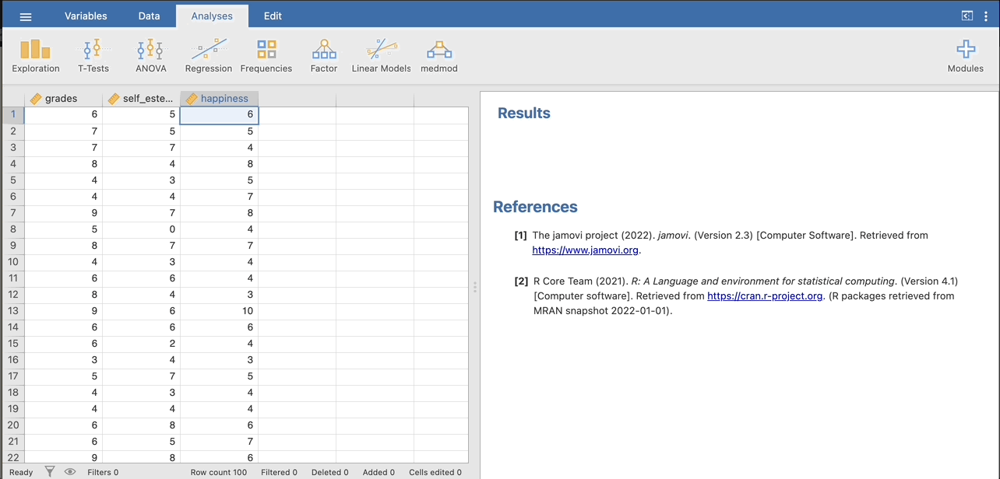
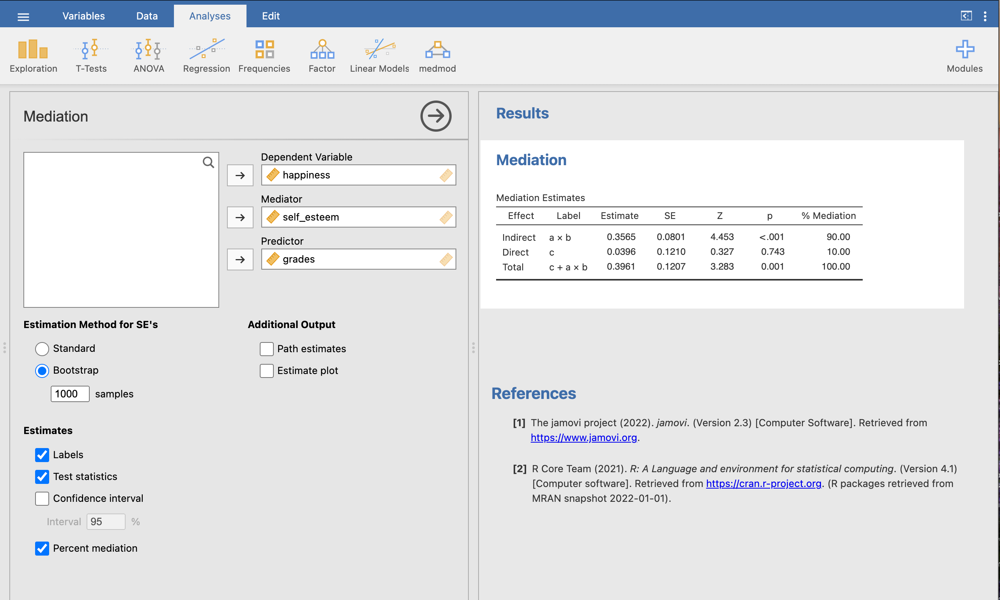
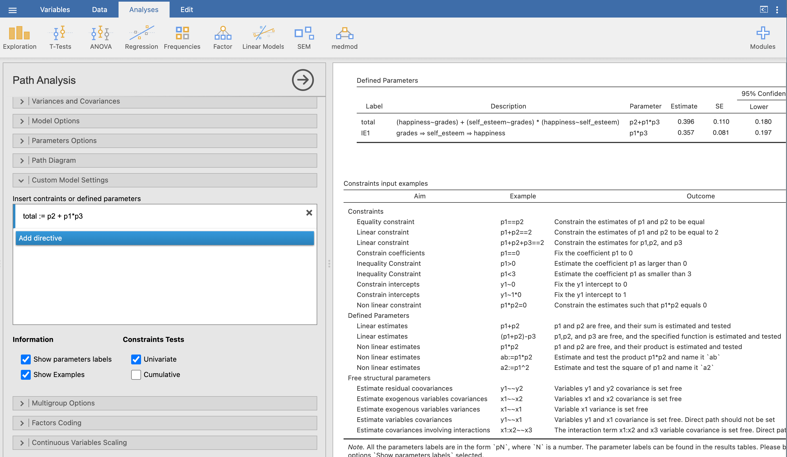

```{r setup, include = FALSE}
# libraries --------------------------------------------------------------------
library(anicon)
library(countdown)
library(emo)
library(fontawesome)
library(knitr)
library(tidyverse)
library(xaringanExtra)

# general options --------------------------------------------------------------
options(scipen = 999)
set.seed(99)
#use_freezeframe()

# chunk options ----------------------------------------------------------------
opts_chunk$set(
  cache.extra = rand_seed, 
  message = FALSE, 
  warning = FALSE, 
  error = FALSE, 
  echo = FALSE,
  cache = FALSE,
  comment = "", 
  fig.align = "center", 
  fig.retina = 3
  )
```

```{css, echo=FALSE}
.pre {
  white-space: pre !important;
  overflow-y: scroll !important;
  max-height: 100vh !important;
}
```

# Correlation and Causality

So far all the types of model tested are based on some sort of linear regression principles.

However, linear regression is showing the correlation between 2 or more variables, it doesn't show causation.

While identifying causality is possible, it an extremely complicated process.

```{r out.width="50%"}
include_graphics("https://media.makeameme.org/created/always-remember-correlation.jpg")
```

---

# Multivariate Models

Models with more than one outcome variables are a closer step toward causal models while not testing causality directly.

For example, a model using a 3 variables which demonstrate that an existing relationship may be explained by a third variable, is more explanatory than a classic linear model.

This model is called Mediation

> Mediation is a hypothesized causal model, whereby effect of a predictor to an outcome is transmitted through an intermediary variable M

It is a useful tool for understanding the underlying mechanisms of how variables are related to each other.

```{r}
DiagrammeR::grViz("
  digraph {
    graph [rankdir = LR]
    
    Predictor -> {Mediator Outcome}
    Mediator -> Outcome

  }", width = 800, height = 200)
```

---

# Mediation

In this example, room temperature predicts the amount that people drink; specifically, we'd expect that higher temperatures would increase drinking.

```{r}
DiagrammeR::grViz("
  digraph {
    graph [rankdir = LR]
  
    'Room temp' -> 'Amount drunk'

  }", width = 800, height = 200)
```

However, it's possible that higher temperatures increase drinking indirectly: higher temperatures make people feel more thirsty, which in turn makes them drink more.

```{r}
DiagrammeR::grViz("
  digraph {
    graph [rankdir = LR]
    
    'Room temp' -> {Thirst 'Amount drunk'}
    Thirst -> 'Amount drunk'

  }", width = 800, height = 200)
```

---
# Mediation Path Diagram

.pull-left[

```{r}
DiagrammeR::grViz("
  digraph {
    graph [rankdir = LR]
  
    Predictor -> Outcome [label=c]

  }", width = 400, height = 200)
```

]
.pull-right[

$c$ is the **total effect** of the Predictor on the Outcome

$$c = c' + a \times b$$
]

.pull-left[
```{r}
DiagrammeR::grViz("
  digraph {
    graph [rankdir = LR]
    
    Predictor -> Mediator [label=a]
    Mediator -> Outcome [label=b]
    Predictor -> Outcome [label=cʹ]
  
  }", width = 400, height = 200)
```
]

.pull-right[
$a$ - the estimate of the effect of the Predictor on the Mediator 

$b$ - the estimate of the effect of the Mediator on the Outcome

$c'$ - the **direct effect** of the Predictor on the Outcome

The path $ab$ is the **indirect effect** of the Predictor on the Outcome
]

---

# Paths

$c$ is the total effect of the Predictor on the Outcome and can be found using a simple regression:

```{r eval=FALSE, echo=TRUE}
lm(outcome ~ predictor, data = my_data)
```

$a$ is the effect of the Predictor on the Mediator and can also be found using a simple regression:

```{r eval=FALSE, echo=TRUE}
lm(mediator ~ predictor, data = my_data)
```

$b$ is the effect of the mediator on the outcome, controlling for the predictor.

$c'$ is the direct effect which checks whether the predictor predicts the outcome after controlling for the mediator.

They both can be found using a multiple linear regression:

```{r eval=FALSE, echo=TRUE}
lm(outcome ~ predictor + mediator, data = my_data)
```

---

# Is there mediation?

Now that we've fit all these models, how do we work out if there is mediation?

A mediation is obtained if:
- The estimate $c$, total effect, is significantly different to 0 (**requirement 1**)
- The estimate $a$ is significantly different to 0 (**requirement 2**)
- The estimate $b$ is significant while the value of the estimate $c'$ has been reduced compared to $c$
- The indirect effect $ab$ is significant

A mediation also assumes that:
- The Outcome does not affect the Mediator
- No 3rd variable explains the relationship between the Outcome and the Mediator
- The Mediator is measured without error
- The residuals of the Outcome and the Mediator are not correlated

---

class: inverse, mline, center, middle

# Application of a Mediation Analysis with Jamovi and R

---

# Grades and Happiness

Let's take the example from [University of Virginia](https://data.library.virginia.edu/introduction-to-mediation-analysis/): $self-esteem$ mediates the effect of $grades$ on $happiness$

Data analysis is also presented in the [Jamovi Advanced Mediation Model website](https://jamovi-amm.github.io/glm_example1.html) and the data can be downloaded [here](https://jamovi-amm.github.io/glm_example1.html)

```{r}
DiagrammeR::grViz("
  digraph {
    graph [rankdir = LR]
  
    node []
    'self-esteem'; 'grades'; happiness
    
    'grades' -> {happiness 'self-esteem'}
    'self-esteem' -> happiness

  }", width = 800, height = 300)
```

---

# Mediation Effect

Imagine that previous studies have suggested that higher grades predict higher happiness. This is the **Total Effect**.

```{r out.width="50%"}
# https://library.virginia.edu/data/articles/introduction-to-mediation-analysis
include_graphics("https://library.virginia.edu/sites/default/files/inline-images/mediation_ex1_0.png")
```

However, grades are not the real reason that happiness increases. Let's hypothesize that good grades boost one’s self-esteem and then high self-esteem boosts one’s happiness. This is the **Indirect Effect**.

```{r out.width="50%"}
include_graphics("https://library.virginia.edu/sites/default/files/inline-images/mediation_ex2.png")
```

Self-esteem is a mediator that explains the underlying mechanism of the relationship between grades (or $X$) and happiness (or $Y$).

A mediation analysis is comprised of **three sets of regression**: $X$ → $Y$, $X$ → $M$, and $X$ + $M$ → $Y$. They are just three regression analyses!

---

# Analyse Mediation Effects - Step 1

```{r out.width="70%"}
include_graphics("https://library.virginia.edu/sites/default/files/inline-images/mediation_step1.png")
```

$$Y = b_{0} + c\,X + e$$

Is $c$ significant? We want $X$ to affect $Y$ (Direct Effect). If there is no relationship between $X$ and $Y$, there is nothing to mediate.

---

# Analyse Mediation Effects - Step 2

```{r out.width = "70%"}
include_graphics("https://library.virginia.edu/sites/default/files/inline-images/mediation_step2.png")
```

$$M = b_{0} + a\,X + e$$

Is $a$ significant? We want $X$ to affect $M$. If $X$ and $M$ have no relationship, $M$ is just a third variable that may or may not be associated with $Y$. A mediation makes sense only if $X$ affects $M$.

---

# Analyse Mediation Effects - Step 3

```{r out.width = "70%"}
include_graphics("https://library.virginia.edu/sites/default/files/inline-images/mediation_step3.png")
```

$$Y = b_{0} + c'\,X + b\,M + e$$

Is $c'$ non-significant or smaller than before? We want $M$ to affect $Y$, but $X$ to no longer affect $Y$ (or $X$ to still affect $Y$ but in a smaller magnitude).

- If the effect of $X$ on $Y$ completely disappears, $M$ fully mediates between $X$ and $Y$. 

- If the effect of X on Y still exists, but in a smaller magnitude, M partially mediates between $X$ and $Y$.

---

# Analyse Mediation Effects - Step 4

In any case, we have to check that the Indirect effect $ab$ is significant. However, a regular regression cannot test the significance of product of two estimate, only a special test can:

- Sobel Test
- Bootstrap

> The main difference between the two methods lies in the assumptions they make about the distribution of the data and the approach they use to estimate the standard error of the mediation effect.

---

# Sobel vs. Bootstrap

The Sobel test:

- Parametric method that assumes that the sampling distribution of the mediation effect follows a normal distribution. 

- This test is easy to implement and interpret, but it may not be robust to violations of normality assumptions and may produce biased estimates when sample sizes are small.

Bootstrap:

- Non-parametric method that makes fewer assumptions about the distribution of the data. 

- It involves resampling the data to create multiple bootstrap samples, estimating the mediation effect for each sample, and then computing the standard error and confidence intervals of the effect based on the distribution of the bootstrap estimates. 

Bootstrap is generally considered more robust and reliable than Sobel when the sample size is small or the distribution of the data is non-normal.

---

# Cautions: Indistinguishable Models

```{r}
include_graphics("img/med versus confounding.png")
```

---

# Data

```{r echo=TRUE}
mediation_data <- 
  "http://static.lib.virginia.edu/statlab/materials/data/mediationData.csv" |> 
  read.csv() |> 
  rename(grades = X, happiness = Y, self_esteem = M)
```

Quick look at the first 10 rows:

```{r}
if (file.exists(here::here("data/mediation.csv"))) {
  message("File already exists.")
} else {
  write_csv(mediation_data, here::here("data/mediation.csv"))
}

head(mediation_data) |> 
  kable()
```

---
class: title-slide, middle

## Mediation with Jamovi

---

# Data in Jamovi

```{r}

```

---

# Check Requirements in JAMOVI

**Is Grades → Happiness significant?**

```{r}
include_graphics("img/med_1.png")
```

$p < 0.001$, i.e. lower than 0.05, so $Grades$ has a significant effect on $Happiness$.

---

# Check Requirements in JAMOVI

**Is Grades → Self-esteem significant?**

```{r}
include_graphics("img/med_2.png")
```

$p < 0.001$, i.e. lower than 0.05, so $Grades$ has a significant effect on $Self-esteem$.

---

# Mediation Effect Test in JAMOVI

**Is $c'$ lower than $c$?**

```{r out.width="80%"}
include_graphics("img/med_3.png")
```

$p = 0.719$ for $c'$ while $c$ was significant, therefore M (self-esteem) should mediate the relationship between X (grades) and Y (happiness).

However, only the test of the indirect effect $ab$ can confirm this assumption.

---

# Available Modules

To test of the indirect effect $ab$ and instead of running 3 linear regressions, some modules are available in Jamovi Desktop to do them all at once and to provide additional information.

- `medmod`: Is a very straight forward module designed for mediation and moderation analyses.
  - Only 1 mediator can be used
  - Only continuous variables
  - No advanced moderated mediation
  - Display percentage of mediation
  - See more information [here](https://blog.jamovi.org/2017/09/25/medmod.html)
  
- `jAMM`: Jamovi Advanced Mediation Model
  - 1 mediator or more can be used
  - Continuous variables or Categorical Ordinal variables
  - Possibility of moderated mediation
  - No percentage of mediation
  - See more information [here](https://jamovi-amm.github.io/)

---

# Mediation with medmod in JAMOVI

Install the `medmod` module by clicking on the cross "Modules" at top right corner > JAMOVI library.

```{r}

```

---

# Mediation with medmod in JAMOVI

```{r}

```

---

# Mediation with jAMM in JAMOVI

Install the `jAMM` module by clicking on the cross "Modules" at top right corner > JAMOVI library.

Then follow the example described here: https://jamovi-amm.github.io/glm_example1.html

```{r}
include_graphics("https://jamovi-amm.github.io/pics/logosm.png")
```

---

# Mediation with jAMM in JAMOVI

```{r}
include_graphics("img/mediation_jamovi_jamm.gif")
```

---
class: title-slide, middle

## Mediation with R

---

# mediate() from {psych}

We can use the `mediate()` function from the {psych} package to add a mediating variable. 

```{r echo=TRUE}
library(psych)
```

Importantly, we place `()` around the mediator.

```{r echo=TRUE}
med_model <- 
  mediate(
    happiness ~ grades + (self_esteem), # note the name of the argument is y
    data = mediation_data
  )
```

---

# mediate() from {psych}

```{r echo=TRUE, results='asis'}
med_model # use summary() for longer output
```

---

# med() from {medmod}

As Jamovi is using R, all Jamovi modules are R packages. However `medmod` is not currently on CRAN and has to be installed from github.

```{r eval=FALSE, echo=TRUE}
install.packages("remotes")
remotes::install_github("raviselker/medmod")
```

---

# med() from {medmod}

The `medmod` package can handle simple models, and has some nice, readable output.

```{r echo=TRUE}
library(medmod)
med_model <- 
  med(
    data = mediation_data, 
    dep = "happiness",
    pred = "grades", 
    med = "self_esteem"
  )
med_model
```

---

# New Data

In the **muller_mediation.csv** data, participants were primed with either “might” or “morality” primes and then engaged in a one-trial prisoner’s dilemma with a fictitious partner.

Additionally, participants’ social value orientation (from pro-self and pro-social) was measured. Social value orientation differentiates people in their tendency to cooperate. 

Because cooperative behavior is known to be linked to expectations about the other cooperation, participants were asked to report their expectations about other’s cooperation. 

The aim of the study is to show whether prime has an effect on cooperation, if social value orientation moderates the effect of prime, and if expectations have a mediating role in the experimental effects.
Variables

There are four main variables:
- **prime**: a two-group experimental condition
- **EXP**: expectations about the other cooperation
- **SVO**: continuous measure of social value orientation (higher levels mean more cooperative attitude)
- **BEH**: behavior, the amount of experimental tokens given to the public good by the participant.

---
class: title-slide, middle

## Exercise

Use the **muller_mediation.csv** data located in the module's Loop page under the tile "Lecture Data" (or use the R code provided here below).

Test the following mediation hypothesis: the variable *EXP* explains the relationship between the variable *BEH* (outcome) and *prime* (predictor).

- Test this hypothesis in Jamovi with the `medmod` and `jAMM` modules
- Test this hypothesis in R with the {psych} and {medmod} packages

```{r echo=TRUE}
muller_mediation <- haven::read_sav("https://github.com/mcfanda/jamm_docs/blob/master/data/muller_mediation.sav?raw=true")

```

```{r}
if (file.exists(here::here("data/muller_mediation.csv"))) {
  message("File already exists.")
} else {
  write_csv(muller_mediation, here::here("data/muller_mediation.csv"))
}
```

```{r}
countdown(minutes = 10, warn_when = 60)
```

---

class: inverse, mline, center, middle

# Multiple Mediation Analysis with Jamovi and R

---
class: title-slide, middle

## Exercise

Use the **muller_mediation.csv** data to test the following mediation hypothesis: the variables *EXP* and *SVO* explain the relationship between the variable *BEH* (outcome) and *prime* (predictor).

As `medmod` in Jamovi or in R is not suitable for more than 1 mediator variable:

- Test this hypothesis in Jamovi with the `jAMM` module
- Test this hypothesis in R with the {psych} packages

```{r}
countdown(minutes = 5, warn_when = 60)
```

---

# Multiple Mediation with jAMM

```{r}
include_graphics("img/multiple_mediation.gif")
```

---

# Multiple Mediation with {psych}

```{r echo=TRUE}
multi_med <- 
  mediate(
    BEH ~ prime + (EXP) + (SVO),
    data = muller_mediation
  )
```

---

# Multiple Mediation with {psych}

It's also possible to have multiple mediators!

Simply add additional predictors surrounded by brackets.

In this one, all the mediation is via EXP. SVO doesn't influence BEH

```{r echo=TRUE, results='asis'}
multi_med
```

---

class: inverse, mline, center, middle

# Moderated Mediation Analysis with Jamovi and R

---

# Moderated Mediation

It's also possible to do moderated mediation. Simply include interaction terms for moderators. 

See: https://jamovi-amm.github.io/glm_example2.html

```{r out.width="50%"}
include_graphics("https://jamovi-amm.github.io/examples/muller/moderator2.png")
```

Also called conditional mediation, the Moderated Mediation includes an additional variable that has both a main effect and an interaction effect on the Outcome, the Mediator or both.

---

# Moderated Mediation with Jamovi

As `medmod` is limited to a total of 3 variables, `jAMM` can take as many as you want.

- First, design your simple mediation model and observe from the figure that variables are correctly arranged.
- Then, to add a moderator, you need to define it as Predictor (e.g., Covariates if it is a continuous variable, Factors if it is a categorical variable).

Notice that jAMM automatically updates the diagram, but we still need to declare this Predictor as a moderator. To do that, we go to `Moderators` tab, and put variable in the moderator field.

For simplicity, the diagram does not show the moderator main effects (cf. the Model diagram notes in your output), but they are correctly inserted in the model. You can check out the model in the `Full model` tab.

By default, a moderator is interacting with all the variables. However, if your moderation is only about a specific variable, you can remove the interactions that are not relevant in the `Full model` tab.

---

# Moderated Mediation with Jamovi

```{r}
include_graphics("img/moderated_mediation_jamovi.gif")
```

---

# Moderated Mediation with Jamovi

In conditional mediation models, the first thing we want to check is whether the moderator actually has a moderating effect on the components of the mediated effect. We can check that in the results table Moderation effects (interactions).

```{r}
include_graphics("https://jamovi-amm.github.io/examples/muller/interactions.png")
```

In the table we see that `SVO` does not moderate the path from `PRIME` to `EXP` (at least not in a substantial way), because the interaction between PRIME and SVO in predicting `EXP` is not significant. 

However, SVO moderates the path from `EXP` to `BEH`, because the interaction between `EXP` and `SVO` in predicting `BEH` is clearly different from zero. This means that the conditional mediation is due to the fact that when `EXP` affects `BEH`, its effect depends on SVO.

---

# Moderated Mediation with Jamovi

After finding a significant interaction, we know that the mediated effect depends on the levels of the moderator. Thus, we should see how the mediated effects look when estimated at different levels of the moderators. We can call these simple mediated effects.

Simple mediated effects are in the Conditional Mediation results section. The results show the mediatated (indirect), direct, and total effects at different levels of the moderators. By default, the levels of the moderators are `SVO=mean-SD`, `SVO=mean`, and `SVO=mean+SD`. The levels of the moderator used to computed the conditional mediation parameters can be changed in the `Covariates Scaling` tab.

```{r out.width="60%"}
include_graphics("https://jamovi-amm.github.io/examples/muller/results0.png")
```

---

# Moderated Mediation Analysis with R

```{r echo=TRUE}
mod_medi <- 
  mediate(
    BEH ~ prime*SVO + (EXP),
    data = muller_mediation
  )
```

---

# Moderated Mediation Analysis with R

```{r echo=TRUE, results='asis'}
mod_medi
```

---

class: inverse, mline, center, middle

# Introduction to Advanced Path Analyses for Mediation Hypotheses

---

# Path Analyses for Mediations

Structural Equation Model (SEM) is a flexible method that allows researchers to incorporate both observed and latent variables, and to test complex models with many variables and paths.

Mediations are path analyses with specific constrain to analyse simultaneously the Total, Direct, and Indirect effects.

Therefore, mediations analyses can be done with SEM tools. However, while it is possible to specify Indirect Effects in SEM, it is not possible to assess the Total Effect simultaneously. 

---

# Terminology

Broadly, variables can be categorised as either exogenous or endogenous.

- **Exogenous:** are essentially predictor variables. 
 - Only have directed arrows going out.

- **Endogenous:** are outcome variables in at least one part of the model. 
 - They have directed arrows going in.
 - In a linear model there is only one endogenous variable, but in a path model we can have multiple.
 
Most commonly used for "explanation" why a relation between an exogenous and an endogenous construct exists
- e.g. one observes a relation between two constructs, but is unsure "why" this relation exist or if the relation is the only possible relation between the constructs

---

# Path Analysis in Jamovi

In Jamovi, two modules allow SEM analyses: `SEMLj` and `pathj`.

- The `SEMLj` module in Jamovi is split into 2 components. 
  - Syntax allow the SEM analyses using a coding syntax for its formula in the same way that it would be done in R
  - Interactive is made of a GUI with drag and drop variables in addition to clickable options

give the possibility to either use a R code or to use a GUI. 

- The `pathj` module in Jamovi is only using a GUI. However, contrary to `SEMLj`, only observed variables can be used in `pathj`. 

---

# Path Analysis in Jamovi

```{r}
include_graphics("img/jamovi_sem_med_1.gif")
```

The Indirect Effect is added by ticking a box but the Total Effect is still missing.

---

# Path Analysis in Jamovi

You need to add the Total Effect manually in addition to ticking the box for Indirect Effects (see previous slide):

```{r out.width="80%"}

```

Note: you could speficy the Indirect effect manually as well.

---

# Path Analysis in R

- The main package used for path analyses is called {lavaan}. This package is from far the most used but also the most complicated because it involves a specific syntax to define the model.

- An alternative package called {seminr} is offering a less complicated approach.

The [lavaan](https://lavaan.ugent.be/index.html) package for Structural Equation Modelling can be used to fit all sort of complicated models. 

```{r echo=TRUE}
#install.packages("lavaan")
library(lavaan)
```

For clarity reason, it is better to specify the model used in an object first and then to run the `sem()` function which runs the model.

Lavaan model can be very complicated but first, note the following:

- To specify a regression path, we use `~`

- To specify a covariance, we use `~~`

---

# General Linear Models with {lavaan}

```
lm_1 <- 'happiness ~ grades'

lm_2 <- 'happiness ~ self_esteem'

lm_3 <- 'happiness ~ grades + self_esteem'

lm_4 <- 'happiness ~ grades
         happiness ~ self_esteem'

lm_3_cov <- 'happiness ~ grades + self_esteem
             grades ~~ self_esteem'

lm_4_cov <- 'happiness ~ grades
             happiness ~ self_esteem
             grades ~~ self_esteem'
```

`r faa("exclamation-triangle", animate="flash", speed="slow", color="red")` Note: lm_3, lm_3_cov, lm_4 and lm_4_cov are the exact same models
- Lavaan automatically merge regressions using the same outcome
- Specifying covariance is not meaningfull when only 2 predictors are included

---

# Running a {lavaan} model

Once we have our model statement, we then need to run our model.

There are a number of functions to do this, we will only use `sem()`

```{r, eval=FALSE, echo=TRUE}
m1 <- 
  sem(
    model, # your model statement
    orderd = c(), # if variables are ordered categories list them
    estimator = "ml", # name of the estimation method you wish to use
    missing = "" , # name of the missing data method you wish to use
    data = tbl
  ) # your data set
```

- {lavaan} has sensible defaults, meaning most of the time you will only need to state you model and data.

```{r, eval=FALSE, echo=TRUE}
m1 <- sem(model, data = tbl)
```

- There is **lots** of information on using lavaan with lots of examples [online](https://lavaan.ugent.be/)

---

# Viewing the results

Lastly, we need to use a `summary()` function (like in `lm` and `glm`) to see results. 

```{r eval=FALSE, echo=TRUE}
summary(m1)
```

Or for even more information in your result output:

```{r eval=FALSE, echo=TRUE}
summary(
  m1, # name given to our results object
  fit.measures = TRUE, # model fit information
  standardized = TRUE # provides standardized coefficients
)
```

```{r include=FALSE}
# Does peer rejection mediate the association between aggression and depression?
library(lavaan)
agg_PR_dep <- '
  Dep ~ 0.3 * PR
  Dep ~ 0.2 * Agg
  PR ~ 0.5 * Agg
'

agg_data <- 
  simulateData(
    model = agg_PR_dep, 
    standardized = TRUE, 
    model.type = "sem"
  )

```

---

# Mediation Example

Specify the model:

```{r echo=TRUE}
med_model <- '
  happiness ~ grades
  happiness ~ self_esteem
  self_esteem ~ grades
'
```

Estimate the model:

```{r echo=TRUE}
results_lavaan <- sem(med_model, data = mediation_data)
```

Observe the results:

```{r echo=TRUE}
summary(results_lavaan)
```

However, once again we haven't specified the Indirect and the Total Effects. It has to be done manually.

---

# The model output

.pre[
```{r echo=TRUE}
summary(results_lavaan)
```
]

---

# Visualising the model

We can use `semPaths()` from the {semPlot} package to help us visualise the model

It shows the parameter estimates within an SEM diagram

```{r echo=TRUE, fig.height=6}
library(semPlot)
semPaths(results_lavaan, what = "std")
```

---

# Calculating the indirect effects 

To calculate the indirect effect of X on Y in path mediation, we need a new parameter $a*b$ made of:
  - $a$ = the regression coefficient for M~X
  - $b$ = the regression coefficient for Y~M

Then, use the `:=` operator to create a new parameter for example called `ind` or `indirect`, or `ab` which represents our indirect effect

```{r echo=TRUE}
med_model <- '
  happiness ~ grades
  happiness ~ b * self_esteem
  self_esteem ~ a * grades
  ind := a * b
'
```

---

# Significance of the indirect effects

Default method of assessing the statistical significance of indirect effects assume normal sampling distribution

May not hold for indirect effects which are the product of regression coefficients

Instead we can use **bootstrapping**
  - Allows 95% confidence intervals (CIs) to be computed
  - If 95% CI includes 0, the indirect effect is not significant at alpha = 0.05

```{r echo=TRUE}
med_model <- '
  happiness ~ grades
  happiness ~ b * self_esteem
  self_esteem ~ a * grades
  ind := a * b
'   
results_lavaan <- 
  sem(
    med_model, 
    data = mediation_data,
    se = "bootstrap"
  )
```

---

# Output for bootstrapped CIs 

.pre[
```{r echo=TRUE}
summary(med_model, ci = TRUE) # we add the argument ci=TRUE to see the confidence intervals in the output
```
]

---

# Total effects in path mediation

It is a requirement to know if the **total** effect of X on Y is significant

$$Total = Indirect + Direct$$

or

$$Total = a*b + c$$

Which in lavaan is:

```{r echo=TRUE}
med_model <- '
  happiness ~ c * grades
  happiness ~ b * self_esteem
  self_esteem ~ a * grades
  ind := a * b
  total := a * b + c
'   
results_lavaan <- 
  sem(
    med_model, 
    data = mediation_data,
    se = "bootstrap"
  )
```

---

# Total effect in lavaan output

.pre[
```{r echo=TRUE}
summary(results_lavaan, ci = TRUE)
```
]

---

# Total effects in path mediation

```{r echo=TRUE}
med_model <- '
  BEH ~ c * prime
  BEH ~ b * EXP
  EXP ~ a * prime
  ind := a * b
  total := a * b + c
'   
results_lavaan <- 
  sem(
    med_model, 
    data = muller_mediation,
    se = "bootstrap"
  )

summary(results_lavaan, ci = TRUE)
```

---

# Why code the total effect in lavaan?

We could have just added up the coefficients for the direct and indirect effects

By coding it in lavaan, however, we can assess the statistical significance of the total effect

Useful because the total effect has to be significant to have a mediation. Sometimes the indirect effect is significant but the total effect isn't.

---

# Standardised parameters

Standardised parameters can be obtained in the summary using `std = TRUE`:

```{r echo=TRUE, eval=FALSE}
summary(model1.est, ci = TRUE, std = TRUE)
```

standardized estimates (also known as standardized coefficients or beta coefficients) are the estimates of the regression coefficients after the predictor variables have been standardized. Standardizing the variables involves converting them to a common scale, typically by subtracting the mean and dividing by the standard deviation.

Standardized estimates have several advantages over unstandardized estimates. 
- First, they allow for direct comparison of the magnitude of the effects of different predictors, even when the predictors are measured on different scales.
- Second, they can help identify which predictors are most important in explaining the outcome variable, as the estimates reflect the size of the effect of each predictor after controlling for the other predictors in the model.

---

# Generic mediation with lavaan

Here is how to do a mediation with lavaan:

```{r eval=FALSE, echo=TRUE}
model <- ' 
  # direct effect
    Y ~ c*X
  # mediator
    M ~ a*X
    Y ~ b*M
  # indirect effect (a*b)
    ab := a*b
  # total effect
    total := c + (a*b)
'
fit <- sem(model, data = Data)
```

---

# Reporting path mediation models 

#### 1. Methods/ Analysis Strategy
  - The model being tested (e.g. 'Y was regressed on both X and M and M was regressed on X')
  - The estimator used (e.g., maximum likelihood estimation)
  - The method used to test the significance of indirect effects ('bootstrapped 95% confidence intervals')

#### 2. Results
  - Model fit (for over-identified models)
  - Can be useful to present these in a SEM diagram
  - The parameter estimates for the path mediation  and their statistical significance
  - The coefficient for the indirect effect and the bootstrapped 95% confidence intervals
  - Common to also report **proportion mediation**:
  
$$proportion\,mediation= \frac{indirect\,effect}{total\,effect}$$ 

---

# Reporting path mediation models 
  
`r faa("exclamation-triangle", animate="flash", speed="slow", color="red")` Important to be aware of limitations:
  - Big proportion mediation possible when total effect is small - makes effect seem more impressive
  - Small proportion mediation even when total effect is big - can underplay importance of effect
  - Should be interpreted in context of total effect

`r faa("exclamation-triangle", animate="flash", speed="slow", color="red")` Tricky interpretation if there are a mix of negative and positive effects involved

---

# Extensions of path mediation models

We can extend our path mediation model in various ways:
  - Several mediators in sequence or parallel
  - Multiple outcomes
  - Multiple predictors
  - Multiple groups (e.g., comparing direct and indirect effects across males and females)
  - Add covariates to adjust for potential confounders

Example: Multiple mediation model

```{r echo=TRUE}
model <- ' 
  # direct effect
    BEH ~ c*prime
  # mediator
    EXP ~ a1*prime
    BEH ~ b1*EXP
    SVO ~ a2*prime
    BEH ~ b2*SVO
  # indirect effect (a*b)
    ind1 := a1*b1
    ind2 := a2*b2
  # total effect
    total := c + a1*b1 + a2*b2
'
```

---

# Other path analysis models

Path mediation models are a common application of path models but they are just one example

Anything that can be expressed in terms of regressions between observed variables can be tested as a path model:
  - Can include ordinal or binary variables
  - Can include moderation

Other common path analysis models include:
  - Autoregressive models for longitudinal data
  - Cross-lagged panel models for longitudinal data

`r faa("exclamation-triangle", animate="flash", speed="slow", color="red")` Cautions regarding path analysis models: **Assumption** that the paths represent causal effects is only an assumption

Mediation models should ideally be estimated on longitudinal data (i.e., X time 1, M time 2, Y time 3).

---
class: inverse, mline, left, middle


# Thanks for your attention and don't hesitate if you have any questions!

[`r fontawesome::fa(name = "twitter")` @damien_dupre](http://twitter.com/damien_dupre)  
[`r fontawesome::fa(name = "github")` @damien-dupre](http://github.com/damien-dupre)  
[`r fontawesome::fa(name = "link")` damien-datasci-blog.netlify.app](https://damien-datasci-blog.netlify.app)  
[`r fontawesome::fa(name = "paper-plane")` damien.dupre@dcu.ie](mailto:damien.dupre@dcu.ie) 
