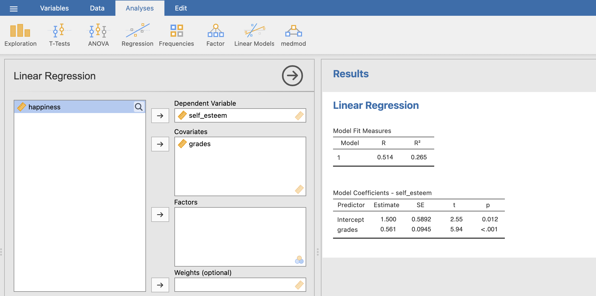
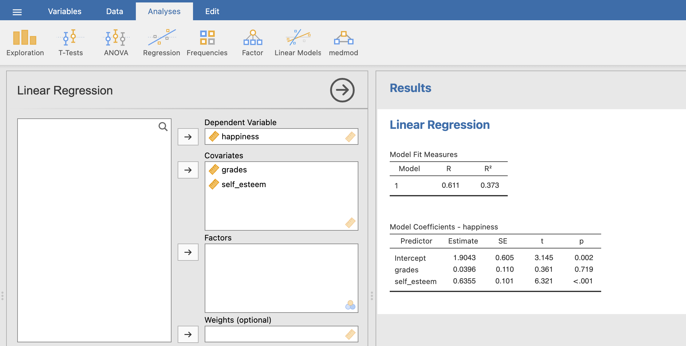

```{r setup, include = FALSE}
# libraries --------------------------------------------------------------------
library(anicon)
library(countdown)
library(emo)
library(fontawesome)
library(tidyverse)

# general options --------------------------------------------------------------
options(scipen = 999)
set.seed(99)

# chunk options ----------------------------------------------------------------
opts_chunk$set(
  cache.extra = rand_seed, 
  message = FALSE, 
  warning = FALSE, 
  error = FALSE, 
  echo = FALSE,
  cache = FALSE,
  comment = "", 
  fig.align = "center", 
  fig.retina = 3
  )
```

# Mediation Effect

The mediation model is a path analysis which involves 3 different linear models.

Let's take the example from [University of Virginia](https://data.library.virginia.edu/introduction-to-mediation-analysis/): $self-esteem$ mediates the effect of $grades$ on $happiness$

Data analysis is also presented in the [Jamovi Advanced Mediation Model website](https://jamovi-amm.github.io/glm_example1.html) and the data can be downloaded [here](https://jamovi-amm.github.io/glm_example1.html)

```{r}
DiagrammeR::grViz("
  digraph {
    graph [rankdir = LR]
  
    node []
    'self-esteem'; 'grades'; happiness
    
    'grades' -> {happiness 'self-esteem'}
    'self-esteem' -> happiness

  }", width = 800, height = 300)
```

---

# Mediation Effect

Imagine that previous studies have suggested that higher grades predict higher happiness. This is called **Direct Effect**.

```{r out.width="50%"}
include_graphics("https://data.library.virginia.edu/files/mediation_ex1.png")
```

However, grades are not the real reason that happiness increases. Let's hypothesize that good grades boost one’s self-esteem and then high self-esteem boosts one’s happiness. This is the **Indirect Effect**.

```{r out.width="50%"}
include_graphics("https://data.library.virginia.edu/files/mediation_ex2.png")
```

Self-esteem is a mediator that explains the underlying mechanism of the relationship between grades (or $X$) and happiness (or $Y$).

A mediation analysis is comprised of **three sets of regression**: $X$ → $Y$, $X$ → $M$, and $X$ + $M$ → $Y$. They are just three regression analyses!

---

# Analyse Mediation Effects - Step 1

```{r out.width = "70%"}
include_graphics("https://data.library.virginia.edu/files/mediation_step1.png")
```

$$Y = b_{0} + b_{1}.X + e$$

Is $b_{1}$ significant? We want $X$ to affect $Y$ (Direct Effect). If there is no relationship between $X$ and $Y$, there is nothing to mediate.

---

# Analyse Mediation Effects - Step 2

```{r out.width = "70%"}
include_graphics("https://data.library.virginia.edu/files/mediation_step2.png")
```

$$M = b_{0} + b_{2}.X + e$$

Is $b_{2}$ significant? We want $X$ to affect $M$. If $X$ and $M$ have no relationship, $M$ is just a third variable that may or may not be associated with $Y$. A mediation makes sense only if $X$ affects $M$.

---

# Analyse Mediation Effects - Step 3

```{r out.width = "70%"}
include_graphics("https://data.library.virginia.edu/files/mediation_step3.png")
```

$$Y = b_{0} + b_{4}.X + b_{3}.M + e$$

Is $b_{4}$ non-significant or smaller than before? We want $M$ to affect $Y$, but $X$ to no longer affect $Y$ (or $X$ to still affect $Y$ but in a smaller magnitude).

If the effect of $X$ on $Y$ completely disappears, $M$ fully mediates between $X$ and $Y$. If the effect of X on Y still exists, but in a smaller magnitude, M partially mediates between $X$ and $Y$.

To see if this mediation effect is statistically significant (different from zero or not). To do so, a specific test to compare $b_{1}$ and $b_{4}$ is performed (called Sobel or bootstrapping).

---

# Mediation Analysis in JAMOVI

In JAMOVI it is possible to do all steps at once using the jAMM module (jamovi Advanced Mediation Models)

To do it, install the jAMM module by clicking on the cross "Modules" at top right corner > JAMOVI library.

Then follow the example described here: https://jamovi-amm.github.io/glm_example1.html

```{r out.width="70%"}
include_graphics("https://jamovi-amm.github.io/pics/logosm.png")
```

---

# Check Requirements in JAMOVI

## Is X → Y significant?

```{r out.width='100%'}
include_graphics("img/med_1.png")
```

$p < 0.001$ i.e. lower than 0.05 so $X$ has a significant effect on $Y$.

---

# Check Requirements in JAMOVI

## Is X → M significant?

```{r out.width='100%'}

```

$p < 0.001$ i.e. lower than 0.05 so $X$ has a significant effect on $M$.

---

# Mediation Effect Test in JAMOVI

## Is $b_{4}$ non significant?

Module medmod > GLM Mediation Model

```{r out.width="70%"}

```

$p = 0.714$ for $b_{4}$ while $b_{1}$ was significant, therefore M (self-esteem) mediate the relationship between X (grades) and Y (happiness).

---

# More Advanced Mediation Models

See: https://jamovi-amm.github.io/glm_example2.html

```{r out.width="70%"}
include_graphics("https://jamovi-amm.github.io/examples/muller/moderator2.png")
```

---
class: title-slide, middle

## Live Demo

---
class: inverse, mline, left, middle


# Thanks for your attention and don't hesitate if you have any questions!

- [`r fa(name = "twitter")` @damien_dupre](http://twitter.com/damien_dupre)
- [`r fa(name = "github")` @damien-dupre](http://github.com/damien-dupre)
- [`r fa(name = "link")` damien-datasci-blog.netlify.app](https://damien-datasci-blog.netlify.app)
- [`r fa(name = "paper-plane")` damien.dupre@dcu.ie](mailto:damien.dupre@dcu.ie)