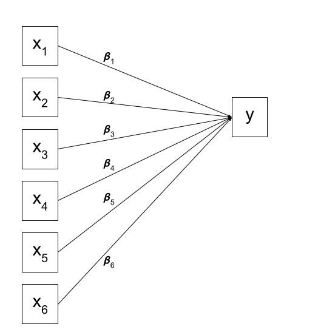
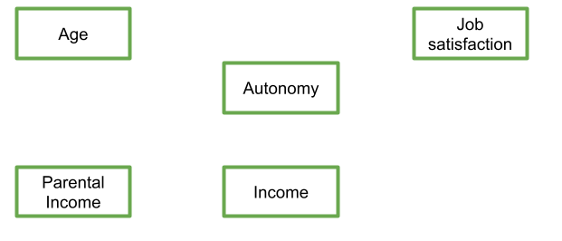
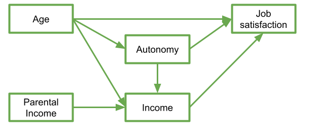
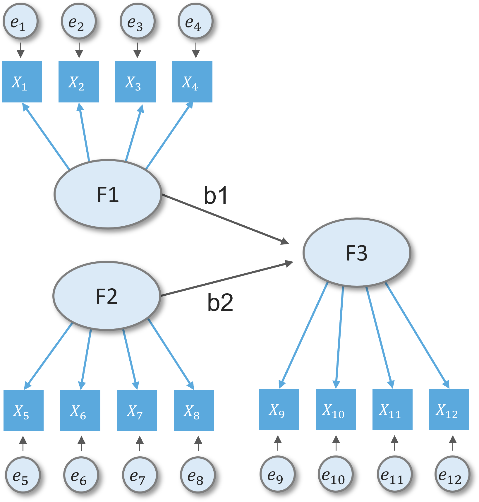

```{r setup, include = FALSE}
# libraries --------------------------------------------------------------------
library(anicon)
library(countdown)
library(dagitty)
library(fontawesome)
library(knitr)
library(lavaan)
library(tidyverse)

# general options --------------------------------------------------------------
options(scipen = 999)
set.seed(99)

# chunk options ----------------------------------------------------------------
opts_chunk$set(
  cache.extra = rand_seed, 
  message = FALSE, 
  warning = FALSE, 
  error = FALSE, 
  echo = FALSE,
  cache = FALSE,
  comment = "", 
  fig.align = "center", 
  fig.retina = 3
  )

# data -------------------------------------------------------------------------
# set.seed(42)
# model <- "
#   js_score ~ (-0.8)*age + .58*autonomy + .47*income
#   income ~ .22*autonomy + .57*age + 0.4*parentincome
#   autonomy ~ .28*age
# 
#   #js_score =~ js_q1 + js_q2 + js_q3
# "
# 
# df <- simulateData(model, sample.nobs = 50, standardized = TRUE)
# 
# model <- "
#   js_score ~ (-0.8)*age + .58*autonomy + .47*income
#   income ~ .22*autonomy + .57*age + 0.4*parentincome
#   autonomy ~ .28*age
# 
#   js_score =~ js_q1 + js_q2 + js_q3
# "
# 
# js_items <- simulateData(model, sample.nobs = 50, standardized = TRUE) |> 
#   select(js_q1, js_q2, js_q3)
# 
# df_full <- cbind(df, js_items)
#
# write_csv(df_full, here::here("data/sem_data.csv"))
df <- read_csv(here::here("data/sem_data.csv"))
```

# General Introduction

By now, we are getting more comfortable with the regression world, and we can see how it is **extended to lots of different types of outcome and data structures**. However, we are still restricted to thinking about **one single outcome variable**.

--

.pull-left[
We have few choices in the model we construct beyond specifying which is our outcome variable.

We can visualise our multiple regression model like this: 

```{r}

```
]

--

.pull-right[
Of course, there are a few other things that are included (an intercept term, the residual error, and the fact that our predictors can be correlated with one another), but the idea remains pretty much the same:

```{r}

```
]

---

# General Introduction

What if I my theoretical model of the world doesn’t fit this structure?

--

.pull-left[
Let’s suppose I have 5 variables: Age, Parental Income, Income, Autonomy, and Job Satisfaction.

```{r}

```
]

--

.pull-right[
My theoretical understanding of how these things fit together leads me to link my variables to end up with something like that: 

```{r}

```
]

--

In this diagram, a persons **income is influenced by their age, their parental income, and their level of autonomy**, and in turn their **income predicts their job satisfaction**. **Job satisfaction is also predicted by a persons age directly, and by their level of autonomy**, which is **also predicted by age**. It's complicated to look at, but in isolation each bit of this makes theoretical sense. 

---

# General Introduction

Take each arrow in turn and think about what it represents:

```{r path1pathdesc, out.width="550px", echo=FALSE}
include_graphics("img/paths1desc.png")
```

--

If we think about trying to fit this "model" with the tools that we have, then we might end up wanting to fit three separate regression models, which between them specify all the different arrows in the diagram:

$$
\begin{align}
\textrm{Job Satisfaction}_i & = b_0 + b_1\,\textrm{Age}_i + b_2\,\textrm{Autonomy}_i + b_3\,\textrm{income}_i + e \\
\textrm{income} & = b_0 + b_1\,\textrm{Age} + b_2\,\textrm{Autonomy} + b_3\,\textrm{Parental income} + e \\
\textrm{Autonomy} & = b_0 + b_1\,\textrm{Age} + e \\
\end{align}
$$

Does my entire model fit the data we observed? 

---

# General Introduction

Path models
  - Sometimes we have more than one variable that needs to be treated as an outcome/dependent variable
  - We cant do this in a linear model.
  - **A path model allows us to test several linear models together as a set**
  - Good way to learn basics of *structural equation modelling*
  
Data reduction
  - Surveys and psychometric tools use latent variables
  - Here we asked lots of questions we believe relate to some construct
  - We need a way to:
    - Check the relationships between each question
    - Produce plausible scores that represent this construct

---

# Terminology refresher

Broadly, variables can be categorised as either exogenous or endogenous.

- **Exogenous variables** are a bit like what we have been describing with words like "independent variable" or "predictor". In a path diagram, they have no paths coming from other variables in the system, but have paths *going to* other variables.

> *Exogenous variables are essentially predictors and only have directed arrows going out.*

- **Endogenous variables** are more like the "outcome"/"dependent"/"response" variables we are used to. They have some path coming from another variable in the system (and may also - but not necessarily - have paths going out from them).

> *Endogenous variables are outcome variables in at least one part of the model. They have directed arrows going in.*

---
class: inverse, mline, center, middle

# 1. Path Analysis

---

# Path Analysis

The starting point for Path Analysis is to think about our theories in terms of the connections between variables drawn on a whiteboard.

There are a few conventions to help us understand this sort of diagrammatical way of thinking. By using combinations of rectangles, ovals, single- and double-headed arrows, we can draw all sorts of model structures. In Path Diagrams, we use specific shapes and arrows to represent different things in our model.

---

# Path Analysis

Shapes and Arrows in Path Diagrams:

- **Observed variables** are represented by squares or rectangles. These are the named variables of interest which exist in our dataset - i.e. the ones which we have measured directly. 
- **Variances/Covariances** are represented by double-headed arrows. In many diagrams these are curved. 
- **Regressions** are shown by single headed arrows (e.g., an arrow from $x$ to $y$ for the path $y~x$).  
- **Latent variables** are represented by ovals, and we will return to these in the next section

```{r}

```

---

# Path Analysis

The logic behind path analysis is to estimate a system of equations that can reproduce the covariance structure that we see in the data. 

1. We specify our theoretical model of the world as a system of paths between variables
2. We collect data on the relevant variables and we observe a correlation matrix (i.e. how each variable correlates with all others)
3. We fit our model to the data, and evaluate how well our theoretical model (a system of paths) can reproduce the correlation matrix we observed. 

---

# Path Analysis

Thanks to [Sewal Wright](https://www.jstor.org/stable/pdf/2527551.pdf?casa_token=3QF0ad2ZoBcAAAAA:MbEkDNNdoLZr1SXE4LrnK--qrhhsTXLgsRtcWre1UvWxiQiGNUl5vWytGp34XIxhAYMZJe-MbIcBnEwXSfX6MAONevz04-sMXpEDI3IaYKk6mMX46QvX), we can express the correlation between any two variables in the system as the sum of all *compound paths* between the two variables (i.e., any paths you can trace between A and B). 

Let's consider the example below, for which the paths are all labelled with lower case letters $a, b, c, \text{and } d$. 

```{r}

```

According to Wright's tracing rules above, write out the equations corresponding to the 3 correlations between our observed variables (remember that $r_{a,b} = r_{b,a}$, so it doesn't matter at which variable we start the paths). 

- $r_{x1,x2} = c$  
- $r_{x1,y} = a + bc$  
- $r_{x2,y} =  b + ac$  

---

# Path Analysis

Now let's suppose we observed the following correlation matrix:

```{r}
egdat <- read_csv("https://uoepsy.github.io/data/patheg.csv")
round(cor(egdat),2)
```

We can plug these into our system of equations:

- $r_{x1,x2} = c = 0.36$  
- $r_{x1,y} = a + bc = 0.75$   
- $r_{x2,y} = b + ac = 0.60$

And with some substituting and rearranging, we can work out the values of $a$, $b$ and $c$.

---

# Model Estimation

After we have specified our model (& checked it is identified) we proceed to **estimation**

Model estimation refers to finding the 'best' values for the unknown parameters

The **Maximum likelihood** estimation is most commonly used
- Finds the parameters that maximise the likelihood of the data 
- Begins with a set of starting values
- Iterative process of improving these values (i.e. to minimise the difference between the sample covariance matrix and the covariance matrix implied by the parameter values)
- Terminates when the values are no longer substantially improved across iterations
- At this point **convergence** is said to have been reached

---

# Model Estimation

Maximum likelihood estimation assumptions:

1. Large sample size
2. Multivariate normality
3. Variables are on a continuous scale

If we believe these are not met, there are alternatives:
- Robust maximum likelihood estimation for non-normal data
- Weighted least squares, unweighted least squares or diagonally weighted least squares for ordinal data

Estimation is quite a complex topic, for now, working with ML will suffice.

---

# Model Fit 

In things like multiple regression, we have been using "model fit" to be the measure of "how much variance can we explain in $y$ with our set of predictors?". For a path model, examining "model fit" is more like asking **"how well does our model reproduce the characteristics of the data that we observed?"**.  
  
We can represent the "characteristics of our data" in a covariance matrix, so one way of thinking of "model fit" is as **"how well can our model reproduce our observed covariance matrix?"**.  

```{r}
df |> 
 select(-js_q1, -js_q2, -js_q3) |> 
 cov()
```

---

# Model Fit 

For these kind of models, a $\chi^2$ value is obtained which reflects reflects the discrepancy between the _model-implied covariance matrix_ and the _observed covariance matrix_. We can then calculate a p-value for this $\chi^2$ statistic by using the $\chi^2$ distribution with the degrees of freedom equivalent to that of the model.  

If we denote the sample covariance matrix as $S$ and the model-implied covariance matrix as $\Sigma(\theta)$, then we can think of the null hypothesis here as $H_0: S - \Sigma(\hat\theta) = 0$. 

__In this way our null hypothesis is sort of like saying that our theoretical model is correct__ (and can therefore perfectly reproduce the covariance matrix).

- If the $\chi^2$ statistic is not significant, we have no evidence to support rejecting our null hypothesis that our model provides a reasonable fit to the data.

- A significant $\chi^2$ value indicates that there is a discrepancy between the observed data and the model's predicted values, suggesting that the model does not fit the data well.

---

# Model Fit

In summary, when we use maximum likelihood estimation we obtain a $\chi^2$ value for the model

A statistically significant $\chi^2$ suggests the model does not do a good job of reproducing the observed variance-covariance matrix  

However, $\chi^2$ does not work well in practice, it leads to the rejection of models that are only trivially mis-specified.

The $\chi^2$ statistic is known to be sensitive to sample size, meaning that larger sample sizes will tend to produce significant $\chi^2$ values even if the differences between the observed and predicted values are small. 

---

# Model Fit

There are alternatives to $\chi^2$ measuring the Absolute fit:
- Standardised root mean square residual (**SRMR**) which measures the discrepancy between the observed correlation matrix and model-implied correlation matrix
  - ranges from 0 to 1 with 0=perfect fit
  - values <.05 considered good

- Root mean square square error of approximation (**RMSEA**) is a parsimony-corrected index which corrects for the complexity of the model. It adds a penalty for having more degrees of freedom
  - 0=perfect fit
  - values <.05 considered good

---

# Model Fit

There are also Incremental fit indices which compares the model to a more restricted baseline model. Usually an 'independence' model where all observed variable covariances fixed to 0.

- Comparative fit index (**CFI**)
  - ranges between 0 and 1 with 1=perfect fit
  - values > .95 considered good

- Tucker-Lewis index (**TLI**)
  - includes a parsimony penalty
  - values >.95 considered good

---
class: title-slide, middle

## Path Analysis with Jamovi

---

# PATHj in Jamovi

The `PATHj` module is a jamovi interface to {lavaan} R package (Rosseel 2012). It implements path analysis, so SEM models with observed variables (no latent variables). The module handles **continuous dependent (endogenous) variables**, **continuous and categorical independent (exogenous) variables**, **linear and interaction effects**.

See https://pathj.github.io/index.html for more details

---

# PATHj in Jamovi

.pull-left[
To run a model, we first select the variables and their role. `Endogenous Variables are the ones that will receive a path in the final model. Exogenous Variables are specified depending on their measurement level. Categorical exogenous variables go in Exogenous Factors, continuous variables in Exogenous Covariates.
]

.pull-right[
A model with two endogenous variables, one continuous and one factor as exogenous predictors is set as follows:

```{r}
include_graphics("https://pathj.github.io/pics/help/input_variables_filled.png")
```
]

---

# PATHj in Jamovi

Factors are handled by decomposing the variable in K-1 contrast variables and insert them in the model in place of the categorical variable. The type of contrast used, for each factor, can be seen and changed in the Factors Coding tab.

Continuous variables are left unchanged, but their scale can be changed in the Continuous Variables Scaling tab, for easily centering, or standardizing the variables.

Multigroup Analysis Factor is used to run multigroup analyses.

---

# PATHj in Jamovi

Then we specify the predictors of each endogenous variable. First we select on the right panel the endogenous model that needs to be set, then select the predictor(s) and fill the `Models for Endogenous Vars` field clicking the arrow. 

Interactions among predictors are included by selecting more then one term on the left, and bring them in the right panel with the arrow

```{r}
include_graphics("https://pathj.github.io/pics/help/input_endogenous.png")
```

In this example, $y1$ is predicted by $y2$, $x3$ and $groups_a$ variables, whereas $y2$ is predicted by $x3$ and $groups_a$.

---
class: title-slide, middle

## Path Analysis with R

---

# Path Analysis with R

R package {lavaan} (**LA**tent **VA**riable **AN**alysis) (Rosseel, 2012)
- Free and open-source
- Easy and intuitive to use
- Reliable and advanced with commercial-quality
- Extensible
- Constantly upgrading

```{r echo=TRUE, eval=FALSE}
install.packages("lavaan")
library(lavaan)
```
  
This is the main package in R for fitting path diagrams (as well as more cool models like factor analysis structures and structural equation models). There is a huge scope of what this package can do.  
The first thing to get to grips with is the various new operators which it allows us to use.   

Our old multiple regression formula in R was specified as `y ~ x1 + x2 + x3 + ... `.  
In __lavaan__, we continue to fit regressions using the `~` symbol, but we can also specify the construction of latent variables using `=~` and residual variances & covariances using `~~`.  

---

# Path Analysis with R

Formula type | Operator | Example | Description | Diagram
:----------- | :-------: | :------| :----------| :------:
.aqua[regression] | `~` | `y ~ x`|.aqua[y is .aqua[regressed] on x ]|  
.moss[latent variable definition] | `=~` | `f =~ y1 + y2 + y3` | .moss[f is .moss[measured] by y1, y2, y3] | 
.sea_green[(co)variance] |`~~` | `y1 ~~ y1` <br> `y2 ~~ y3` |.sea_green[Variance of y1 <br> Covariance between y2 and y3] |  
.dark_coral[intercept] | `~1` | `y1 ~ 1` | .dark_coral[The intercept (mean) of y1] |  

---

# Path Analysis with R

Formula type | Operator | Example | Description | Diagram
:----------- | :-------: | :------| :----------| :----:
fixed parameter | `*`| `1*y1` | Fix the parameter (factor loading) of y1 to 1 | 
free parameter | `NA*` |`NA*y1`| The parameter (factor loading) of y1 is freely estimated  | 

In practice, fitting models in __lavaan__ tends to be a little different from things like `lm()`.

Instead of including the model formula *inside* the fit function (e.g., `lm(y ~ x1 + x2, data = df)`), we tend to do it in a step-by-step process. 

This is because as our models become more complex, our formulas can pretty long!   

We write the model as a character string (e.g. `model <- "y ~ x1 + x2"`) and then we pass that formula along with the data to the relevant __lavaan__ function, which for our purposes will be the `sem()` function, `sem(model, data = mydata)`. 

---

# Path Analysis with R

Here is a a multiple regression fitted with __lavaan__ below. 

- the `lm()` way:

```{r echo=TRUE, eval=FALSE}
result_lm <- lm(outcome_1 ~ predictor_1 + predictor_2, data = my_data)
```

- the {lavaan} way:

```{r echo=TRUE, eval=FALSE}
model <- "
# regression
    outcome_1 ~ predictor_1 + predictor_2
"
result_sem <- sem(model, data = my_data)
```

The coefficients from the `lm()` model and the estimated parameters from the `sem()` model are the exact same:

```{r echo=TRUE, eval=FALSE}
summary(result_lm)

summary(result_sem)
```

---

# Path Analysis with R

Obviously, a more complicated path analysis involving more than one multiple linear regression is possible

.pull-left[
```{r}

```
]

.pull-right[
```{r echo=TRUE, eval=FALSE}
reg_model <- '
# path analysis with 3 outcome variables
    u1 ~ x1 + x2 + x3
    u2 ~ x1 + x2 + x3
    u3 ~ u1 + u2 + x2 
'

reg_sem <- sem(
    model = reg_model, 
    data = my_data
  )
```
]

Notes: 
- The covariance of the Exogenous variables is set by default
- See how the SEM model is included between simple or double quotation marks. within this quotation marks it is possible to include some comments with `#`

---

# Path Analysis with R

Regarding interaction effects, there is a big difference between PATHj and {lavaan}:
- PATHj in Jamovi provides an easy solution by creating an interaction effect when selecting two variables and bringing them in the model
- {lavaan} in R doesn't have a natural syntax to specify interaction effects.

---

# Path Analysis with R

We cannot do:

```{r echo=TRUE, eval=FALSE}
model <-'
  Outcome ~ Predictor1 * Predictor2
'
sem(model, data = my_data)
```

The symbol `*` is dedicated to the assignment of a coefficient label like $b_0$, $b_1$, or like $a$, $b$, $c$ and $c'$ in the case of mediation path analysis.

--

We cannot do either:

```{r echo=TRUE, eval=FALSE}
model <-'
  Outcome ~ Predictor1 + Predictor2 + Predictor1:Predictor2
'
sem(model, data = my_data)
```

The symbol `:` doesn't exist in {lavaan} syntax.

---

# Path Analysis with R

Prior testing the model, we need to manually create a new variable that codes the interaction:

```{r echo=TRUE, eval=FALSE}
my_data <- mutate(
  my_data,
  Predictor1_Predictor2 = Predictor1 * Predictor2
  )

model <-'
  Outcome ~ Predictor1 + Predictor2 + Predictor1_Predictor2
'
sem(model, data = my_data)
```

---

# Path Analysis with R

- `summary()`: outputs an overview of the fitted model
- `parameterEstimates()`: returns estimated model parameters
- `standardizedSolution()`: returns standardized parameter estimates
- `fitted()` and `fitted.values()`: return the model-implied covariance matrix (and mean vector)
- `resid()` and `residuals()`: returns (unstandardized) residuals]
- `vcov()`: returns the estimated covariance matrix of the parameter estimates
- `AIC()` and `BIC()`: return the AIC and BIC values
- `fitMeasures()`: returns various fit measures such as CFI/TLI

---
class: title-slide, middle

## Exercise

With the `sem_data.csv` data, test the following model involving Age, Parental Income, Income, Autonomy, and Job Satisfaction with Jamovi or with R.

```{r out.width='150%'}

```

```{r}
countdown(minutes = 10, warn_when = 60)
```

---

# Solution

The first part of estimating a path model involves specifying the model. This means basically writing down the paths that are included in your theoretical model. 

Let's start by looking at the example about job satisfaction, income, autonomy and age.  

And now let's suppose that we collected data on these variables: 

```{r}
df |> 
  select(-js_q1, -js_q2, -js_q3) |>
  head() |> 
  kable()
```

---

# Solution

Remember we said that we could specify all these paths using three regression models? Well, to specify our path model, we simply write these out like we would do in `lm()`, but this time we do so all in one character string. We still have to make sure that we use the correct variable names, as when we make R estimate the model, it will look in the data for things like "js_score". 

```{r echo=TRUE}
model <- "
  js_score ~ age + autonomy + income
  income ~ autonomy + age + parentincome
  autonomy ~ age
"
```

There are some other things which we will automatically be estimated here: all our exogenous variables (the ones with arrows only going _from_ them) will be free to correlate with one another. We can write this explicitly in the model if we like, using the two tildes `~~` between our two exogenous variables `age` and `parentincome`. We will also get the variances of all our variables. 

---

# Solution

.pull-left[
We can see all the paths here:
```{r eval=FALSE}
lavaanify(model)
```

```{r}
lavaanify(model)[,2:4] %>% head(13L)
```
]

.pull-right[
and even make a nice diagram:

```{r}
library(semPlot)
semPaths(lavaanify(model))
```
]

---

# Solution

Estimating the model is relatively straightforward. We pass the formula we have written to the `sem()` function, along with the data set in which we want it to look for the variables:

```{r echo=TRUE, eval=FALSE}
model.fit <- sem(model, data = df)
```

We can then examine the parameter estimates: 

```{r echo=TRUE, eval=FALSE}
summary(model.fit)
```

We can now, to "visualise" our model, add the estimates to the diagram:

```{r}

```

---
class: inverse, mline, center, middle

# 3. Latent Variables

---

# Latent Variables

.pull-left[
- We can't just ask: "How much job satisfaction do you experience on a scale of 1-10?" and expect a good measure.
- We **operationalise** the concept into distinct questions, e.g.:

  * How do you like your income?
  * Are your colleagues friendly?
  * How is your boss?
  
- All of these questions capture *something* about job satisfaction, but none of them capture it exactly.
]

.pull-right[
```{r, echo = FALSE, out.width="90%"}
include_graphics("img/cfa.jpg")
```
]

---

# Latent Variables

**We shouldn't**
* Chuck all of these similar questions into a single regression model (because of multicollinearity)
* Sum up all of the responses uncritically:
  * What if they are all on different scales and need to be weighted differently?
  * What if some of the questions are worse measures of the concept than others?
  * What if some questions are more salient for some groups of people than others?
  
**We can**
* Use factor analysis/construct a latent variable to try and capture the 'underlying' concept.

```{r, echo=FALSE, fig.width=3, fig.height=3}
library(ggVennDiagram)

# List of items
x <- list(Q1 = 1:6, Q2 = 2:8, Q3 = 4:10, Q4 = 7:13, Q5 = 9:15)

venn <- Venn(x)
venn_dat <- process_data(venn)

ggplot() +
  geom_sf(fill = "transparent", data = venn_region(venn_dat)) +
  geom_sf(size = 2, color = "black", data = venn_setedge(venn_dat), show.legend = F) +
  theme_void()
```

---

# Latent Variables

.pull-left[
Confirmatory Factor Analysis (CFA) constructs a latent variable that simultaneously predicts multiple indicator (or observed) variables.

Its scale is arbitrary but is commonly fixed to either a) a marker variable or b) a standardised distribution (mean = 0, sd = 1).
]

.pull-right[
```{r include = FALSE}
model <- "
  jobsatisfaction =~ NA*js_q1 + js_q2 + js_q3
  jobsatisfaction ~~ 1*jobsatisfaction
"

model_cfa_out <- cfa(model, data = df)
model_lv <- lavPredict(model_cfa_out)

library(lavaanPlot)
```

```{r echo = FALSE}
lavaanPlot(model = model_cfa_out, coefs = TRUE, stand = TRUE)
```
]

---
class: title-slide, middle

## Confirmatory Factor Analysis with Jamovi

---

# Confirmatory Factor Analysis with Jamovi

Confirmatory Factor Analysis can be done with the default Jamovi library

```{r}
include_graphics("https://mblogthumb-phinf.pstatic.net/MjAyMDA1MDlfMjAg/MDAxNTg5MDExMjMxMDY1._yJ9YvPo_Zi77MDqCk5wa7-4SNyQF20R8csO-y8NFOEg.T-Ji0dV10rc6qch5N5vJ7WqMaTaeVxhBLFZmkpnrDJQg.PNG.shoutjoy/image.png?type=w800")
```

---

# Confirmatory Factor Analysis with Jamovi

Outputs from Jamovi include the factor loadings, factor covariance, $\chi^2$, and fit measures.

```{r}

```


---
class: title-slide, middle

## Confirmatory Factor Analysis with R

---

# Confirmatory Factor Analysis with R

In the same way as we have done path analyses, we will use {lavaan} to run our CFA.

.pull-left[
First, define a reflective latent variable in the model
```{r echo=TRUE, eval=FALSE}
model <- "
  F1 =~ x1 + x2 + x3 + x4
"
```

```{r out.width='40%'}
include_graphics("img/sample_syntax1.png")
```
]

.pull-right[
Multiple factors can be estimated as well as their covariance
```{r echo=TRUE, eval=FALSE}
model <- "
  F1 =~ x1 + x2 + x3 + x4
  F2 =~ x5 + X6 + x6 + x8
  F1 ~~ F2
"
```

```{r out.width='60%'}
include_graphics("img/sample_syntax2.png")
```
]

---

# Confirmatory Factor Analysis with R

Then run the `cfa()` function with this model and your data:

```{r echo=TRUE, eval=FALSE}
cfa_results <- cfa(model, data = my_data)
```

Results are printed with the function `summary()`:

```{r echo=TRUE, eval=FALSE}
summary(cfa_results)
```

---
class: title-slide, middle

## Exercise

With the `sem_data.csv` data, calculate the latent variable Job Satisfaction from the items q1, q2, and q3 with Jamovi or with R.

```{r}
countdown(minutes = 5, warn_when = 60)
```

---
class: inverse, mline, center, middle

# 4. Structural Equation Model

---

# Structural Equation Model

A Structural Equation Model (SEM) is a complex path analysis between multiple variables including multiple Outcomes and using factor analysis for latent variable estimation.

If I want to learn Structural Equation Modelling I should already have...

* A very good understanding of **multiple linear regression**
* Good familiarity with terms like **variance, covariance, correlation** 
* Formal understanding of **causal diagrams**/Directed Acyclic Graphs can be helpful

---

# Structural Equation Model

.pull-left[
The confirmatory factor analysis part is called **measurement model**

The path model analysis is called **structural model** and evaluate the  relationship between constructs

A full SEM model is combination of measurement and structural component
]

.pull-right[
```{r}
include_graphics("img/structural_part_2.jpg")
```
]

---

# Structural Equation Model

```{r}
include_graphics("img/sem_convention_2.jpg")
```

---
class: title-slide, middle

## Structural Equation Model with Jamovi

---

# Structural Equation Model with Jamovi

Structural Equation Model with Jamovi are done with the `SEMLj` module. See its website: https://semlj.github.io/

`SEMLj` installs two options: syntax and interactive.

```{r out.width='80%'}
include_graphics("https://semlj.github.io/pics/menu.png")
```

- The syntax panel accepts {lavaan} syntax as describe in the {lavaan} website and used with the R package
- The interface panel allows to define a set of endogenous and exogenous variables, measured by one or more observed variables just by drag and drop

---

# Structural Equation Model with Jamovi

`SEMLj` syntax

```{r out.width='50%'}
include_graphics("https://semlj.github.io/pics/syntax/panel_syntax.png")
```

---

# Structural Equation Model with Jamovi

`SEMLj` interface

```{r out.width='30%'}
include_graphics("https://semlj.github.io/pics/gui/panel_vars.png")
```

Note:
- The observed variable that are not used to create a latent factor have to be added alone in `Add New Latent` (as Endogenous or Exogenous Variable depending on their role).
- The factor can be renamed from the interface by double-click on their default name (i.e., Endogenous or Exogenous).

---

# Structural Equation Model with Jamovi

The regressions between latent variables created by one or multiple observed variable can be defined in the option `Endogenous models`

```{r}
include_graphics("https://semlj.github.io/pics/gui/panel_endo.png")
```

---
class: title-slide, middle

## Structural Equation Model with R

---

# Structural Equation Model with R

Once again the package {lavaan} will be used with the function `sem()` exactly like with path analyses. However, the model will now include factor loadings, covariance, and regressions (see https://lavaan.ugent.be/ for more details).

.pull-left[
```
   # latent variables
     ind60 =~ x1 + x2 + x3
     dem60 =~ y1 + y2 + y3 + y4
     dem65 =~ y5 + y6 + y7 + y8
   # regressions
     dem60 ~ ind60
     dem65 ~ ind60 + dem60
   # residual covariances
     y1 ~~ y5
     y2 ~~ y4 + y6
     y3 ~~ y7
     y4 ~~ y8
     y6 ~~ y8
```
]

.pull-right[
```{r out.width='100%'}
include_graphics("https://lavaan.ugent.be/tutorial/figure/sem.png")
```
]

---

# Structural Equation Model with R

.pull-left[
Estimate factors, covariance, and regressions: 

```{r echo=TRUE}
model <- "
  F1 =~ x1 + x2 + x3 + x4
  F2 =~ x5 + X6 + x7 + x8
  F3 =~ x9 + X10 + x11 + x12
  F1 ~~ F2
  F3 ~ F1 + F2
"
```
]

.pull-right[
```{r}
include_graphics("img/sample_syntax3.png")
```
]

---

# Structural Equation Model with R

.pull-left[
Insert comments in the syntax:

```{r echo=TRUE}
model <- "
  F1 =~ x1 + x2 + x3 + x4
  F2 =~ x5 + X6 + x7 + x8
  F3 =~ x9 + X10 + x11 + x12
  
  # covariance
  F1 ~~ F2
  
  # F3 is regressed on F1 and F2
  F3 ~ F1 + F2
"
```
]

.pull-right[
```{r}
include_graphics("img/sample_syntax3.png")
```
]

---

# Structural Equation Model with R

.pull-left[
Label parameters if you need to:

```{r echo=TRUE}
model <- "
  F1 =~ x1 + x2 + x3 + x4
  F2 =~ x5 + X6 + x7 + x8
  F3 =~ x9 + X10 + x11 + x12
  
  # covariance
  F1 ~~ F2
  
  # F3 is regressed on F1 and F2
  F3 ~ b1*F1 + b2*F2
"
```
]

.pull-right[
```{r}

```
]

---
class: title-slide, middle

## Exercise

With the `sem_data.csv` data, **test the following model** involving Age, Parental Income, Income, Autonomy, and Job Satisfaction with Jamovi or with R. 

**Job Satisfaction has to be estimated from js_q1, js_q2, and js_q3** but do not use "js_score" as a name because it already exists in the dataset.

```{r out.width='150%'}

```

```{r}
countdown(minutes = 10, warn_when = 60)
```

---
class: inverse, mline, left, middle


# Thanks for your attention and don't hesitate if you have any questions!

- [`r fa(name = "twitter")` @damien_dupre](http://twitter.com/damien_dupre)
- [`r fa(name = "github")` @damien-dupre](http://github.com/damien-dupre)
- [`r fa(name = "link")` damien-datasci-blog.netlify.app](https://damien-datasci-blog.netlify.app)
- [`r fa(name = "paper-plane")` damien.dupre@dcu.ie](mailto:damien.dupre@dcu.ie)