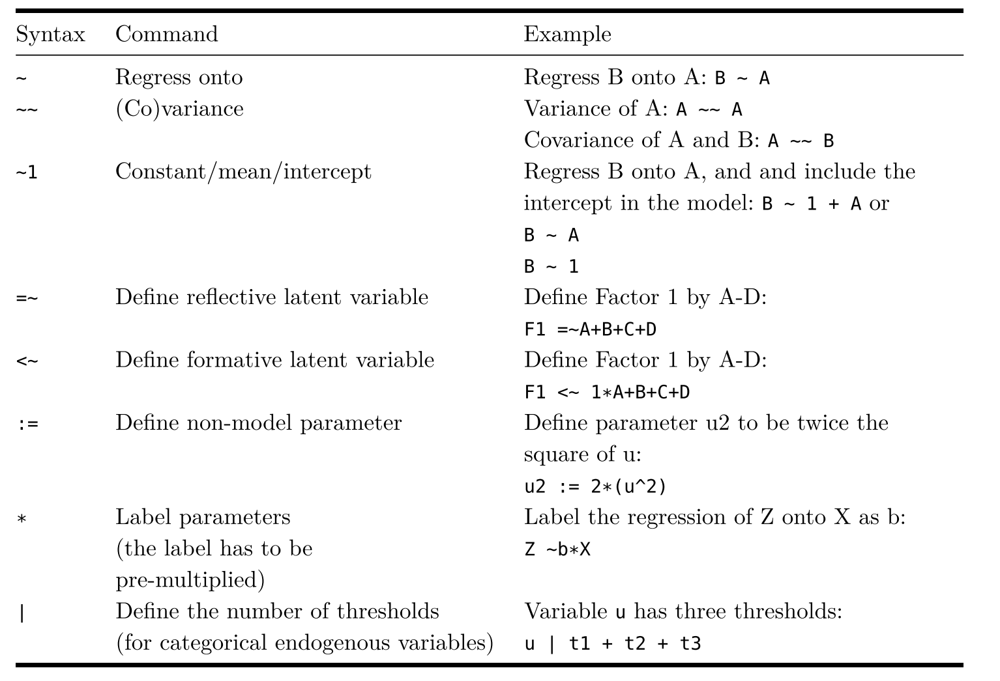
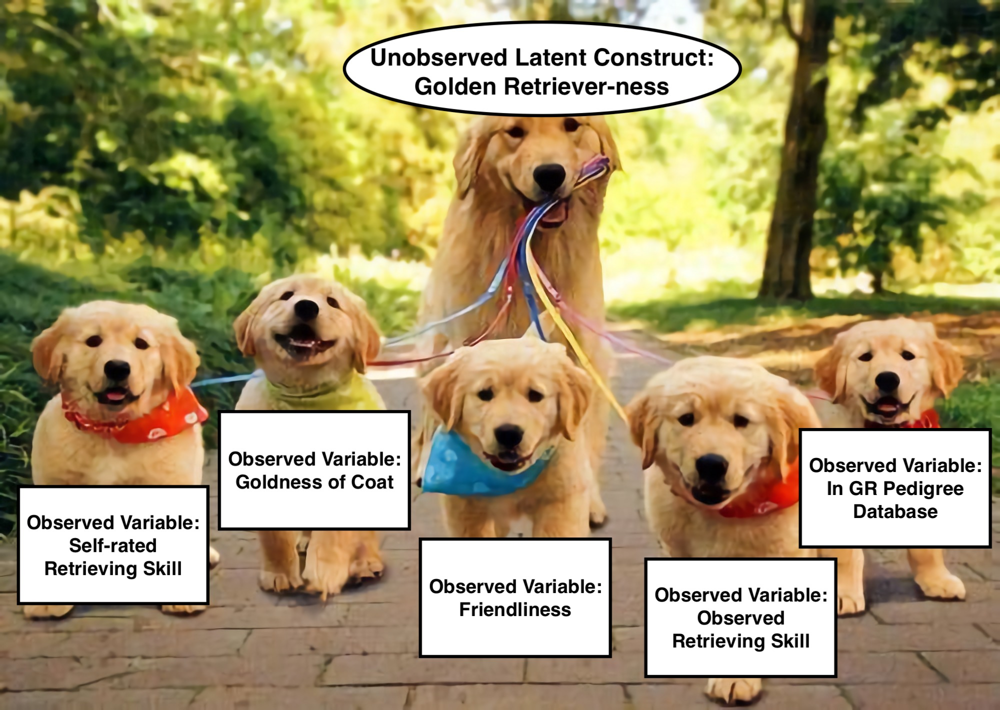
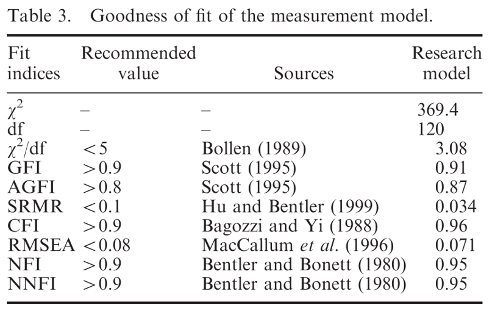
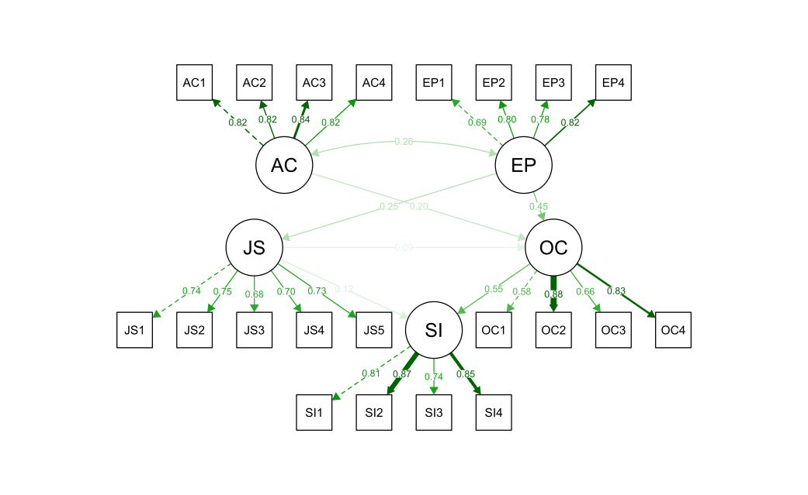
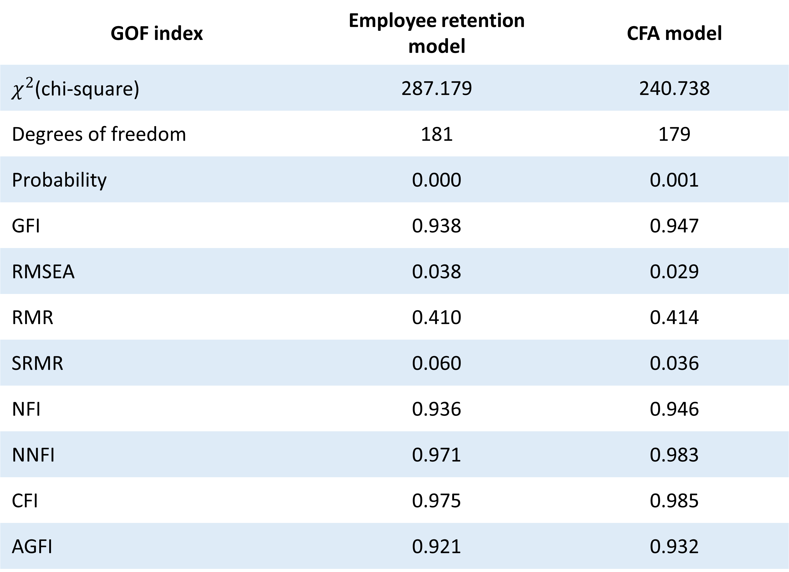

```{r setup, include = FALSE}
# libraries --------------------------------------------------------------------
library(anicon)
library(countdown)
library(dagitty)
library(emo)
library(fontawesome)
library(knitr)
library(lavaan)
library(tidyverse)

# general options --------------------------------------------------------------
options(scipen = 999)
set.seed(99)

# chunk options ----------------------------------------------------------------
opts_chunk$set(
  cache.extra = rand_seed, 
  message = FALSE, 
  warning = FALSE, 
  error = FALSE, 
  echo = FALSE,
  cache = TRUE,
  comment = "", 
  fig.align = "center", 
  fig.retina = 3
  )
```

# Pre-requisites

If I want to learn Structural Equation Modelling I should already have...

* A very good understanding of **multiple linear regression**
* Good familiarity with terms like **variance, covariance, correlation** 
* It can help to have some familiarity with **data tidying** (i.e. in R), especially for converting between **long and wide data formats**
* Formal understanding of **causal diagrams**/Directed Acyclic Graphs can be helpful

---

# Structural Equation Model

General framework that uses various models to test relationships among variables

Include different facets of statistical analyses:

 - Regression model (Legendre or Gauss, 1805)
 - Confirmatory factor analysis (Howe, 1955; Anderson & Rubin, 1956; Karl Joreskog, 1963)
 - Latent factor structure (Spearman, 1904, 1927)
 - Path model (Wrigh, 1918, 1921)
 
A Structural Equation Model is a confirmatory factor analysis + a path model analysis.

---

# Structural Equation Model

.pull-left[
The confirmatory factor analysis part is called **measurement model**

The path model analysis is called **structural model** and evaluate the  relationship between constructs

A full SEM model is combination of measurement and structural component
]

.pull-right[
```{r}
include_graphics("img/structural_part_2.jpg")
```
]

---

# Basic SEM Conventions

```{r}
include_graphics("img/sem_convention_2.jpg")
```

<!-- --- -->

<!-- # Structural Equation Model -->

<!-- **A Confirmatory Factorial Analysis is performed for each latent variable** -->

<!-- Example: -->

<!-- $Perceived\,Usefulness = \alpha_1.PU1 + \alpha_2.PU2 + \alpha_3.PU3 + \alpha_4.PU4 + \alpha_5.PU5 + e$ -->
<!-- $Perceived\,Ease\,of\,use = \alpha_1.PEOU1 + \alpha_2.PEOU2 + \alpha_3.PEOU3 + \alpha_4.PEOU4 + e$ -->
<!-- $Intention\,to\,Use = \alpha_1.BI1 + \alpha_2.BI2 + e$ -->

<!-- **A Linear Regression is performed for each outcome variable** -->

<!-- Example: -->

<!-- $Perceived\,Usefulness = b_0 + b_1.Perceived\,Ease\,of\,use + e$ -->
<!-- $Intention\,to\,Use = b_0 + b_1.Perceived\,Usefulness + b_2.Perceived\,Ease\,of\,use + e$ -->
<!-- $Actual\,Use = b_0 + b_1.Intention\,to\,Use + e$ -->

---

# Performing SEM

While there are several licensed software (not free, including AMOS the extension of SPSS) that can perform SEM

Only a few free software can perform SEM (JASP, R, Python) and Jamovi is not one of them

All of them are using the package "Lavaan" which provides a specific coding structure to define the SEM, see https://lavaan.ugent.be/

.pull-left[
```
   # latent variables
     ind60 =~ x1 + x2 + x3
     dem60 =~ y1 + y2 + y3 + y4
     dem65 =~ y5 + y6 + y7 + y8
   # regressions
     dem60 ~ ind60
     dem65 ~ ind60 + dem60
   # residual covariances
     y1 ~~ y5
     y2 ~~ y4 + y6
     y3 ~~ y7
     y4 ~~ y8
     y6 ~~ y8
```
]

.pull-right[
```{r out.width='100%'}
include_graphics("https://lavaan.ugent.be/tutorial/figure/sem.png")
```
]

---

# Lavaan

- R pacakge `Lavaan` (**LA**tent **VA**riable **AN**alysis) (Rosseel, 2012)

  - Free and open-source
  - Easy and intuitive to use
  - Reliable and advanced with commercial-quality
  - Extensible
  - Constantly upgrading

---
# Lavaan Syntax

Formula type | Operator | Example | Description | Diagram
:----------- | :-------: | :------| :----------| :------:
.aqua[regression] | `~` | `y ~ x`|.aqua[y is .aqua[regressed] on x ]|  
.moss[latent variable definition] | `=~` | `f =~ y1 + y2 + y3` | .moss[f is .moss[measured] by y1, y2, y3] | 
.sea_green[(co)variance] |`~~` | `y1 ~~ y1` <br> `y2 ~~ y3` |.sea_green[Variance of y1 <br> Covariance between y2 and y3] |  
.dark_coral[intercept] | `~1` | `y1 ~ 1` | .dark_coral[The intercept (mean) of y1] |  

---

# Lavaan Syntax 

Formula type | Operator | Example | Description | Diagram
:----------- | :-------: | :------| :----------| :----:
fixed parameter | `*`| `1*y1` | Fix the parameter (factor loading) of y1 to 1 | 
free parameter | `NA*` |`NA*y1`| The parameter (factor loading) of y1 is freely estimated  | 

<!-- --- -->

<!-- # Lavaan Syntax  -->

<!--  -->

<!-- --- -->

<!-- #  Graphical representation of the model -->

<!--  -->


---
class: inverse, mline, center, middle

# 1. Path Analysis

---

# Example of Research Question

### Is it more effective to increase family income and spending on their children to improve child wellbeing, or is it more effective to reduce family stress?

**Variables**

* `income` = Family income (in £1000s)
* `investment` = Amount spent on child (in £1000s)
* `stress_q1` = Approximately how many times over the last year have you gotten into a disagreement with a co-parent or family member about the parenting of your child(ren)? (10 point scale, centered at 5)
* `scws` = Child wellbeing (Stirling Child Wellbeing Scale, range 12-60, higher = better wellbeing)

---

# Example of Research Question

.pull-left[
### Is it more effective to increase family income and spending on their children to improve child wellbeing, or is it more effective to reduce family stress?
]

.pull-right[
```{r, echo = FALSE, results='asis'}
dat <- read_csv(here::here("data/example-data-sem.csv"))

mod1 <- lm(
  data = dat, 
  formula = scale(scws) ~ scale(income) + scale(investment) + scale(stress_q1)
  )

stargazer::stargazer(mod1, type = "html", single.row = TRUE)
```
]

---

# Example of Research Question

```{r echo=FALSE, fig.height=4, fig.width=8}

dag <- dagitty(
  "dag{
  
  Income -> Investment -> Stress -> Wellbeing
  Income -> Stress
  Income -> Wellbeing
  Investment -> Wellbeing
  
  }"
)

dag_coords <- list(
  x = c(Income = 1, Investment = 1.7, Stress = 2.3, Wellbeing = 3),
  y = c(Income = 0.3, Investment = -0.7, Stress = 1, Wellbeing = -0.3)
  )

coordinates(dag) <- dag_coords

plot(dag, cex = 1.2)
```

* Can't have investment without income...
* Income and investment probably both impact family stress, which then impacts wellbeing...

---

# Example of Research Question

```{r echo=FALSE, fig.height=5, fig.width=8}
sem_mod <- "
Investment ~ Income
Stress ~ Investment + Income
Wellbeing ~ Investment + Income + Stress
"

dat <- dat %>% mutate(
  Investment = scale(investment),
  Income = scale(income),
  Stress = scale(stress_q1),
  Wellbeing = scale(scws)
)

sem_out <- sem(sem_mod, data = dat)

dag_coef <- lavaanToGraph(sem_out)

coordinates(dag_coef) <- dag_coords

plot(dag_coef, cex = 1.2, show.coefficients = TRUE)
```

---

# Example of Research Question

.pull-left[
`Wellbeing ~ Income + Investment + Stress`

`Stress ~ Income + Investment`

`Investment ~ Income`

```{r, echo = FALSE}

```
]

.pull-right[
```{r, echo = FALSE, out.width="70%"}
include_graphics("img/trenchcoat.jpg")
```
]

<!-- --- -->
<!-- class: title-slide, middle -->

<!-- ## Another Path Analysis Example -->

<!-- --- -->

<!-- # Example: Path Model -->

<!-- .pull-left[ -->

<!-- Here is an example with the data contained in this [data set](http://www.statmodel.com/usersguide/chap3/ex3.12.dat)  -->

<!-- These are the first 5 rows of the data: -->

<!-- ```{r echo=FALSE} -->
<!-- pa.df <- read.table( -->
<!--   "http://www.statmodel.com/usersguide/chap3/ex3.12.dat", -->
<!--   col.names = c(paste0("u", 1:3), paste0("x", 1:3)) -->
<!-- ) -->
<!-- pa.df[c("u1", "u2", "u3")] <- lapply(pa.df[c("u1", "u2", "u3")], ordered) -->

<!-- pa.df |>  -->
<!--   head(5) |>  -->
<!--   kable(digits = 2) -->
<!-- ``` -->
<!-- ] -->

<!-- .pull-right[ -->
<!-- - Three binary/ordinal dependent variables `u1-u3`  -->
<!-- - Three continuous covariates `x1-x3` -->
<!-- - `u1` is regressed on `x1`, `x2`, and `x3` -->
<!-- - `u2` is regressed on `x1`, `x2`, and `x3` -->
<!-- - `u3` is regressed on the mediating variables `u1` and `u2` and the covariate `x2` -->

<!-- ```{r, echo=FALSE, out.width="80%", fig.align='center'} -->
<!-- include_graphics("img/example2.png") -->
<!-- ``` -->
<!-- ] -->

<!-- --- -->

<!-- # R Code -->

<!-- .left-column[ -->
<!-- ```{r, echo=FALSE, out.width="100%", fig.align='left'} -->
<!-- include_graphics("img/example2.png") -->
<!-- ``` -->
<!-- ] -->

<!-- .right-column[ -->
<!-- ```{r echo=TRUE} -->
<!-- pa.model <- ' -->
<!-- # a path analysis with ordered dependent variables -->
<!--   # define the paths -->
<!--     u1 ~ x1 + x2 + x3 -->
<!--     u2 ~ x1 + x2 + x3 -->
<!--     u3 ~ u1 + u2 + x2 ' -->

<!-- pa.fit <- sem( -->
<!--   pa.model,  -->
<!--   data = pa.df, -->
<!--   estimator = "WLSMV")  #<< -->
<!-- ``` -->
<!-- ] -->

<!-- Note: WLSMV is for diagonally weighted least squares with mean- and variance-adjusted.   -->
<!-- Other estimators for ordinal endogenous variables are DWLS (Diagonally Weighted Least Squares), ULSMV (Unweighted Least Squares with Mean- and Variance-adjusted), PML (Pairwise Maximum Likelihood) and [etc](https://lavaan.ugent.be/tutorial/est.html). -->

<!-- --- -->

<!-- # Results: Parameters -->

<!-- Lavaan results -->

<!-- ```{r echo=TRUE, eval=FALSE} -->
<!-- summary(pa.fit, fit.measures = TRUE) -->
<!-- ``` -->

<!-- ```{r echo=FALSE} -->
<!-- capture.output( -->
<!--   summary(pa.fit, fit.measures = TRUE),  -->
<!--   file = "pa_res.txt") -->
<!-- pa.res <- readLines("pa_res.txt") -->
<!-- cat(pa.res[c(54:67, 74,75, 77:82)], sep = "\n") -->
<!-- ``` -->

<!-- --- -->

<!-- # Tip: Ordinal Variables in Lavaan -->

<!-- .pull-left[ -->
<!-- Method *1*: Declare variables as ordered in the data frame -->

<!-- ```{r echo=TRUE, eval=FALSE} -->
<!-- pa.df[c("u1", "u2", "u3")] <- #<< -->
<!--   lapply(pa.df[c("u1", "u2", "u3")], ordered) #<< -->

<!-- pa.model <- '# define the paths -->
<!--              u1 ~ x1 + x2 + x3 -->
<!--              u2 ~ x1 + x2 + x3 -->
<!--              u3 ~ u1 + u2 + x2 ' -->

<!-- pa.fit <- sem( -->
<!--   pa.model,  -->
<!--   data = pa.df, -->
<!--   estimator = "WLSMV") -->
<!-- ``` -->
<!-- ] -->

<!-- -- -->

<!-- .pull-right[ -->

<!-- Method *2*: Declare variables as ordered in the fitting function -->

<!-- ```{r echo=TRUE, eval=FALSE} -->
<!-- pa.model <- '# define the paths -->
<!--              u1 ~ x1 + x2 + x3 -->
<!--              u2 ~ x1 + x2 + x3 -->
<!--              u3 ~ u1 + u2 + x2 ' -->

<!-- pa.fit <- sem( -->
<!--   pa.model,  -->
<!--   data = pa.df, -->
<!--   estimator = "WLSMV", -->
<!--   ordered = c("u1", "u2", "u3")) #<< -->
<!-- ``` -->
<!-- ] -->

---

# Interactions 1

```{r, echo=FALSE, echo=FALSE}
set.seed(456)
Babies=data.frame(Age=round(runif(100,1,30)), Weight=rnorm(100,4000,500))
Babies$Height=rnorm(100,40+0.2*Babies$Age+0.004*Babies$Weight, 5)
Babies$Gender=rbinom(100,1,0.5)
Babies$Crawl=rbinom(100,1,0.031*Babies$Age+0.00001*Babies$Weight-0.06*Babies$Gender)
Babies$TummySleep=rbinom(100,1,0.5)
Babies$PhysicalSt=rnorm(100,10+0.3*Babies$Height+0.1*Babies$Age-0.06*Babies$Gender+0.15*Babies$TummySleep,5)
Babies$Gender=as.factor(Babies$Gender)
levels(Babies$Gender)=c('Girls','Boys')
```

```{r, warning=FALSE, message=FALSE, echo=FALSE}
#install.packages('faux')
require(faux)
set.seed(456)

cmat <- c(1, .4,.4, .1, .1, .1,
          .4, 1,.3, .1, .1, .1,
          .4,.2, 1, .1, .1, .1,
          .1,.1,.1,  1, .4, .4,
          .1,.1,.1, .4,  1, .2,
          .1,.1,.1, .4, .2,  1)

vars<-rnorm_multi(n=100, 6,30,5,cmat)

names(vars)=c('TimeOnTummy','PreciseLegMoves','PreciseHandMoves','Babbling','Screeching','VocalImitation')

Babies=cbind(Babies,vars)
```

We cannot add an interaction using _*_ sign as we would have in normal regression 

```{r}
model2<-'
Height~1+Age*Weight
'
fit2<-sem(model2, data=Babies)
summary(fit2)
```

---

# Interactions 2

We cannot add an interaction using _*_ sign as we would have in normal regression 

We need to create a new variable that codes the interaction

```{r}
Babies$AgeWeight = Babies$Age * Babies$Weight
Babies$AgeGender = Babies$Age * ifelse(Babies$Gender=='Girls',0,1) 
head(Babies)
```

---

# Interactions 3

We cannot add an interaction using __*__ sign as we would have in normal regression 

We need to create a new variable that codes the interaction

```{r}
model2<-'
Height~1+Age+Weight + AgeWeight
'
fit2<-sem(model2, data=Babies)
summary(fit2)
```

---
class: inverse, mline, center, middle

# 2. Confirmatory Factor Analysis (CFA)

---

## What is Lavaan?

.leftcol30[
+ *"developed to provide useRs, researchers, and teachers a free open-source, but commercial quality"*, Yves Rosseel (2012)

+ Check-out their [lavaan tutorial](https://lavaan.ugent.be/tutorial/index.html)
]

.rightcol70[
```{r eval=FALSE}
install.packages("lavaan")
library(lavaan)
example(cfa)
```
.code-output-scroll[
```{r echo=FALSE}
library(lavaan)
example(cfa)
```
]
]

---

## Major operators of lavaan syntax

.leftcol40[
#### Defining a reflective latent variable
```{r eval=FALSE}
model <- "F1 =~ x1 + x2 + x3 + x4"
```
<br>
```{r echo=FALSE, out.width="40%", fig.align='center'}
include_graphics("img/sample_syntax1.png")
```
]

.rightcol[
#### Estimate factor covariance
```{r eval=FALSE}
model <- "F1 =~ x1 + x2 + x3 + x4
          F2 =~ x5 + X6 + x6 + x8
          F1 ~~ F2"
```
<br>
```{r echo=FALSE, out.width="60%", fig.align='center'}
include_graphics("img/sample_syntax2.png")
```
]

---

## Major operators of lavaan syntax

.leftcol[
#### Estimate regression
```{r}
model <- "F1 =~ x1 + x2 + x3 + x4
          F2 =~ x5 + X6 + x7 + x8
          F3 =~ x9 + X10 + x11 + x12
          F1 ~~ F2
          F3 ~ F1 + F2"
```
]

.rightcol[
```{r echo=FALSE, fig.align='center', out.width="70%"}
include_graphics("img/sample_syntax3.png")
```
]

---

## Major operators of lavaan syntax

.leftcol[
#### Insert a comment in the syntax
```{r}
model <- "F1 =~ x1 + x2 + x3 + x4
          F2 =~ x5 + X6 + x7 + x8
          F3 =~ x9 + X10 + x11 + x12
          
          # covariance
          F1 ~~ F2
          
          # F3 is regressed on F1 and F2
          F3 ~ F1 + F2"
```
]

.rightcol[
```{r echo=FALSE, fig.align='center', out.width="70%"}
include_graphics("img/sample_syntax3.png")
```
]

---

## Major operators of lavaan syntax

.leftcol[
#### Label a parameter
```{r}
model <- "F1 =~ x1 + x2 + x3 + x4
          F2 =~ x5 + X6 + x7 + x8
          F3 =~ x9 + X10 + x11 + x12
          
          # covariance
          F1 ~~ F2
          
          # F3 is regressed on F1 and F2
          F3 ~ b1*F1 + b2*F2"
```
]

.rightcol[
```{r echo=FALSE, fig.align='center', out.width="70%"}
include_graphics("img/sample_syntax4.png")
```
]

# Latent Variables (Factor Analysis)

## But what is family stress? And is this question the best measure of it?

---

# Latent Variables (Factor Analysis)

.pull-left[
- We can't just ask: "How much family stress do you experience on a scale of 1-10?" and expect a good measure.
- We **operationalise** the concept into distinct questions, e.g.:

  * How frequently do you have disagreements about parenting?
  * Do you sometimes regret having children?
  * How often do you feel like you go to bed angry at your partner?
  
- All of these questions capture *something* about family stress, but none of them capture it exactly.
]

.pull-right[
```{r, echo = FALSE, out.width="90%"}

```
]

---

# Latent Variables (Factor Analysis)

.pull-left[
**We shouldn't**
* Chuck all of these similar questions into a single regression model (because of multicollinearity)
* Sum up all of the responses uncritically:
  * What if they are all on different scales and need to be weighted differently?
  * What if some of the questions are worse measures of the concept than others?
  * What if some questions are more salient for some groups of people than others?
  
**We can**
* Use factor analysis/construct a latent variable to try and capture the 'underlying' concept.
]

.pull-right[
```{r, echo=FALSE, warning = FALSE, message = FALSE, fig.width=5, fig.height=5, out.height=500, out.width=500, dpi=400}

library(ggVennDiagram)

# List of items
x <- list(Q1 = 1:6, Q2 = 2:8, Q3 = 4:10, Q4 = 7:13, Q5 = 9:15)

venn <- Venn(x)
venn_dat <- process_data(venn)

ggplot() +
  geom_sf(fill = "transparent", data = venn_region(venn_dat)) +
  geom_sf(size = 2, color = "black", data = venn_setedge(venn_dat), show.legend = F) +
  theme_void()
```
]

---

# Latent Variables (Factor Analysis)

.pull-left[
Factor analysis constructs a latent variable that simultaneously predicts multiple indicator (or manifest) variables.

Its scale is arbitrary but is commonly fixed to either a) a marker variable or b) a standardised distribution (mean = 0, sd = 1).
]

```{r, include = FALSE}
stress_cfa <- "
stress =~ NA*stress_q1 + stress_q2 + stress_q3 + stress_q4 + stress_q5
stress ~~ 1*stress
"

stress_cfa_out <- cfa(stress_cfa, data = dat)
stress_lv <- lavPredict(stress_cfa_out)

library(lavaanPlot)
```

.pull-right[
```{r echo = FALSE}
lavaanPlot(model = stress_cfa_out, coefs = TRUE, stand = TRUE)
```
]

---

# Example: Two-Factor CFA Model

.pull-left[
Here is an example with the data contained in this [data set](http://www.statmodel.com/usersguide/chap5/ex5.1.dat) 

These are the first 5 rows of the data:

```{r echo=FALSE}
cfa.df <- read.table(
  "http://www.statmodel.com/usersguide/chap5/ex5.1.dat", 
  col.names = paste0("y", 1:6)
)
cfa.df |> 
  head(5) |> 
  kable(digits = 2)
```

- Six continuous indicators `y1-y6`
- Two factors `f1` & `f2` 
- `f1` is measured by `y1`, `y2`, and `y3`
- `f2` is measured by `y4`, `y5`, and `y6`
- `f1` is correlated with `f2`
]

--

.pull-right[
Here is the representation of the model:

```{r, echo=FALSE, out.width="50%", fig.align='center'}

```
]

---

# R Code

.left-column[
```{r, echo=FALSE, out.width="100%", fig.align='left'}

```
]

.right-column[
```{r echo=TRUE}
cfa.model <- '
# a two-factor CFA with continuous factor indicators

  # define the latent variables (factors)
    f1 =~ y1 + y2 + y3
    f2 =~ y4 + y5 + y6 
              
 # covariance (Optional; included by default)
    f1 ~~ f2 
              
  # intercepts 
    y1 ~ 1 
    y2 ~ 1 
    y3 ~ 1 
    y4 ~ 1 
    y5 ~ 1 
    y6 ~ 1
'

cfa.fit <- cfa(cfa.model, data = cfa.df)
```
]


---

# Results

Lavaan results:

```{r echo=TRUE}
summary(
  cfa.fit, 
  fit.measures = TRUE # print fit indices #<<
)
```

---

# Tip: Intercepts (Mean Structures)  

.pull-left[
Method *1*: Add intercepts explicitly in model specification

```{r echo=TRUE, eval=FALSE}
# specify the model
cfa.model <- '# factors
              f1 =~ y1 + y2 + y3
              f2 =~ y4 + y5 + y6 
              
              # intercepts  #<<
              y1 ~ 1 #<<
              y2 ~ 1 #<<
              y3 ~ 1 #<<
              y4 ~ 1 #<<
              y5 ~ 1 #<<
              y6 ~ 1 #<<
              '
# fit the model
cfa.fit <- cfa(cfa.model, data=cfa.df)
```
]

--

.pull-right[

Method *2*: Add intercepts implicitly in fitting function

```{r echo=TRUE, eval=FALSE}
# specify the model
cfa.model <- '# factors
              f1 =~ y1 + y2 + y3
              f2 =~ y4 + y5 + y6 
              '

# fit the model
cfa.fit <- cfa(cfa.model, data=cfa.df, 
               # include intercepts #<<
               meanstructure=TRUE) #<<
```

Note: The default intercept is 1. Use explicit method if you want something like `y1 ~ 0.5`.
]

---

# Parameter Constraints

.pull-left[
Method *1* (Default): Fix the factor loading of the first indicator to 1

.small[
```{r echo=TRUE, highlight.output=c(2,5,8,9)}
# specify the model
cfa.model.1 <- ' # factors
                 f1 =~ y1 + y2 + y3   #<<
                 f2 =~ y4 + y5 + y6 ' #<<

# fit the model
cfa.fit.1 <- cfa(cfa.model.1, data = cfa.df)

# obtain the parameter estimates
parameterEstimates(cfa.fit.1)[c(1:6,13:14),]
```
]
]

--

.pull-right[
Method *2*: Fix the variance of the factor to 1

.small[
```{r echo=TRUE, highlight.output=c(2,5,8,9)}
# specify the model
cfa.model.2 <- ' # factors
                 f1 =~ NA*y1 + y2 + y3   #<<
                 f2 =~ NA*y4 + y5 + y6   #<<
                 # factor variances set to 1
                 f1 ~~ 1*f1   #<<
                 f2 ~~ 1*f2 ' #<<

# fit the model 
cfa.fit.2 <- cfa(cfa.model.2, data = cfa.df)

# obtain the parameter estimates
parameterEstimates(cfa.fit.2)[1:8,]
```
]
]

--

Method *3*: use `cfa.fit.1 <- cfa(cfa.model.1, data=cfa.df, **std.lv=TRUE**)` when fitting the model.

---

# Standardized Solution - 1

Method *1*: Use the argument `standardized = TRUE` in the functions

.pull-left[
.small[
```{r echo=TRUE}
cfa.res.1 <- parameterEstimates(
  cfa.fit.1, 
  standardized = TRUE #<<
  )
cfa.res.1[c(1:6,13:14), c(1:6, 10:11)]
```
]
]

.pull-right[
.small[
```{r echo=TRUE}
cfa.res.2 <- parameterEstimates(
  cfa.fit.2, 
  standardized = TRUE #<<
  )
cfa.res.2[1:8, c(1:6, 10:11)]
```
]
]

---

# Standardized Solution - 2

Method *2*: Call the function `standardizedSolution()` directly 

.pull-left[
.small[
```{r echo=TRUE}
cfa.res.3 <- standardizedSolution(cfa.fit.1)  #<<
cfa.res.3[c(1:6,13:14),-c(8:9)]
```
]
]

.pull-right[
.small[
```{r echo=TRUE}
cfa.res.4 <- standardizedSolution(cfa.fit.2) #<<
cfa.res.4[c(1:8),-c(8:9)]
```
]
]

Note: `standardizedSolution()` only shows the standardized parameter estimates regardless of model specification and parameter constraints.

---

# Commonly Used Functions

- `summary()`: outputs an overview of the fitted model
- `parameterEstimates()`: returns estimated model parameters
- `standardizedSolution()`: returns standardized parameter estimates
- `fitted()` and `fitted.values()`: return the model-implied covariance matrix (and mean vector)
- `resid()` and `residuals()`: returns (unstandardized) residuals]
- `vcov()`: returns the estimated covariance matrix of the parameter estimates
- `AIC()` and `BIC()`: return the AIC and BIC values
- `fitMeasures()`: returns various fit measures such as CFI/TLI


---
class: inverse, mline, center, middle

# 3. Structural Equation Modeling (SEM)

---

# Structural Equation Model

A Structural Equation Model (SEM) is a complex path analysis between multiple variables including multiple Outcomes and using factor analysis for latent variable estimation.

```{r eval=TRUE}
DiagrammeR::grViz("
digraph rmarkdown {
  graph [rankdir = LR]
  
  node [shape = oval]
  'Perceived Ease-of-use'; 'Perceived Usefulness'; 'Intention to Use'; 'Actual Use'
  
  node [shape = box]
  PU1; PU2; PU3; PU4; PU5; PEOU1; PEOU2; PEOU3; PEOU4; BI1; BI2; AU
  
  {PU1 PU2 PU3 PU4 PU5} -> 'Perceived Usefulness' [arrowhead = none]
  {PEOU1 PEOU2 PEOU3 PEOU4} -> 'Perceived Ease-of-use' [arrowhead = none]
  {BI1 BI2} -> 'Intention to Use' [arrowhead = none]
  {AU} -> 'Actual Use' [arrowhead = none]
  
  'Perceived Usefulness' -> 'Intention to Use'
  'Perceived Ease-of-use' -> {'Perceived Usefulness' 'Intention to Use'}
  'Intention to Use' -> 'Actual Use'
  
  subgraph {
      rank = same; 'Perceived Usefulness'; 'Perceived Ease-of-use';
  }
  
  subgraph {
      rank = same; PU1; PU2; PU3; PU4; PU5; PEOU1; PEOU2; PEOU3; PEOU4; BI1; BI2;
  }

}
", height = 400)
```

---

# Main steps in SEM

1. Defining constructs

2. Developing the overall measurement model

3. Assessing measurement model validity

4. Specifying the structural model

5. Assessing structural model validity

---

class: center middle

# 1. Defining Constructs

---

## Defining individual constructs

+ Based on literature and preliminary interviews, a study was designed focusing on five key constructs.

  + *Job satisfaction (JS)* : reactions resulting from an appraisal of one's job situation.
  
  + *Organizational commitment (OC)*: extent to which an employees indentifies and feels part of HBAT.
  
  + *Staying intention (SI)*: extent to which an employee intends to continue working for HBAT.
  
  + *Environmental perceptions (EP)*: beliefs an employee has about day-to-day, physical working conditions.
  
  + *Attitudes towards cowrokers (AC)*: attitudes an employee has toward the coworkers he/she interacts with on a regular basis.
  
---

## Developing overall measurement model

.leftcol30[
+ Measurement theory model (CFA) for HBAT employees

+ Direction of the relationship between factors is not yet defined.


+ Focus on confirming the specified model with empirical model (using empirical data), hence confirmatory. 
]

.rightcol70[
```{r echo=FALSE, fig.align='right', out.width="75%"}
include_graphics("img/hbat_measurement.png")
```
<center>
.font70[*Source: JF Hair et al. (2019): Multivariate data analysis*]
</center>
]

---
class: center middle

# Step 3. Assessing measurement model validity

---

## Basic principles

```{r}
hbat_data <- haven::read_sav(here::here("data/HBAT_SEM_NOMISSING.sav")) %>% 
  select(JS1:SI4) %>% mutate_all(as.numeric)
```


.leftcol40[
+ Compare covariance matrix of the research data $\text{S}$ and reproduced covariance $\Sigma$

+ Hypothesis:
  + Null: $\text{S} = \Sigma$
  + Atternative: $\text{S} \ne \Sigma$

+ Idea is to arrived with a parameter that minimizes the difference of $\text{S}$ and  $\Sigma$

]

.rightcol60[
```{r echo=FALSE}
cfa_model <- "SI =~ SI1 + SI2 + SI3 + SI4
              JS =~ JS1 + JS2 + JS3 + JS4 + JS5
              AC =~ AC1 + AC2 + AC3 + AC4
              EP =~ EP1 + EP2 + EP3 + EP4
              OC =~ OC1 + OC2 + OC3 + OC4"
```

```{r eval=FALSE}
cfa_fit <- cfa(cfa_model, data = hbat_data)
cfa_fit %>% summary()
```

.code-output-scroll[
```{r echo=FALSE}
cfa_fit <- cfa(cfa_model, data = hbat_data)
cfa_fit %>% summary()
```
]
]

---

## Basic principles

.leftcol40[

+ To understand the SEM process, consider the Table on the right.

+ e.g., iterative procedure using least square method.

<br>

```{r echo=FALSE, fig.align='center', out.width="80%"}
include_graphics("img/ols_sem_sample.png")
```

]

.rightcol60[
```{r echo=FALSE, out.width="80%", fig.align='right'}
include_graphics("img/ols_calc.png")
```
]

---

## Summary output

.leftcol20[

+ Overall results

+ Loadings

+ Variances

]

.rightcol80[
```{r eval=FALSE}
cfa_fit <- cfa(cfa_model, data = hbat_data)
summary(cfa_fit)
```
.code-output-scroll[
```{r echo=FALSE}
cfa_fit <- cfa(cfa_model, data = hbat_data)
summary(cfa_fit)
```
]
]

---

## Summary output

#### Overall results

+ Degrees of freedom (df)

  + $df = \frac{1}{2} p (p + 1) - k$
  + $p$ = total observed variables
  + $k$ = total estimated parameters

+ Identification

  + Include at least three manifest variables
  + Create models with $df > 0$

#### Loadings

+ Measures the strength of the relationship between items and factor.

#### Variances

Refer to unique variance that the factor unable to account for. Similar to error term in OLS, hence it is also term as error variance.

#### Goodness of fit indices

+ Goodness-of-fit index (GFI)
+ Adjusted goodness-fit-index (AGFI)
+ Comparative fit index (CFI)
+ Normed fit index (NFI)
+ Non-normed fit index (NNF)

#### Badness of fit indices

+ Standard root mean square of the residuals (SRMR)
+ Root mean square error of approximation (RMSEA)

```{r echo=FALSE, out.width="80%", fig.align='center'}

```

---

## Fit indices

.leftcol40[
#### Goodness of fit indices

+ Goodness-of-fit index (GFI)
+ Adjusted goodness-fit-index (AGFI)
+ Comparative fit index (CFI)
+ Normed fit index (NFI)
+ Non-normed fit index (NNF)
]

.rightcol60[
```{r}
fitMeasures(cfa_fit,  fit.measures = c("gfi", "agfi", "cfi", "nfi", "nnfi"))
```
]

---

## Fit indices

.leftcol40[
#### Badness of fit indices

+ Standard root mean squrare residual (SRMR)
+ Root mean square error of approximation (RMSEA)
]

.rightcol60[
```{r}
fitMeasures(cfa_fit,  fit.measures = c("srmr", "rmsea"))
```
]

---

## Reliability and validity test

.leftcol30[
#### Reliability test
+ Composite reliability

#### Validity test
+ Convergent validity
+ Discriminant validity
]

.rightcol70[
```{r echo=FALSE, out.width="95%"}
include_graphics("img/reliability_validity.png")
```

---

## Reliability and validity test

.leftcol[
+ Composite reliability: `alpha` > `0.70`

+ Convergent validity: AVE (`avevar`) > `0.50`

+ Discriminant validity: `omega` > `0.7`
]


.rightcol[
```{r eval=FALSE}
library(semTools)
reliability(cfa_fit) %>% round(3)
```

```{r echo=FALSE}
semTools::reliability(cfa_fit) %>% round(3)
```

]

  
---
class: center middle

# Step 2. Developing overall measurement model


---

# Example: SEM

Here is an example with the data contained in this [data set](http://www.statmodel.com/usersguide/chap5/ex5.11.dat) 

These are the first 5 rows of the data:

```{r echo=FALSE}
sem.df <- read.table(
  "http://www.statmodel.com/usersguide/chap5/ex5.11.dat",
  col.names = c(paste0("y", 1:12))
)
sem.df |> 
  head(5) |> 
  kable(digits = 2)
```

---

# Example: SEM

.pull-left[
- Twelve continuous indicator variables `y1-y12`
- Four continuous latent variables `f1-f4`
- `f1` is measured by `y1`, `y2`, and `y3`
- `f2` is measured by `y4`, `y5`, and `y6`
- `f3` is measured by `y7`, `y8`, and `y9`
- `f4` is measured by `y10`, `y11`, and `y12`
- `f1` is measured by `y1`, `y2`, and `y3`
- `f2` is measured by `y4`, `y5`, and `y6`
- `f3` is regressed by `f1`, `f2`
- `f4` is regressed by `f3`
- `f1` is correlated with `f2`
]

.pull-right[
```{r, echo=FALSE, out.width="100%", fig.align='center'}

```
]

---
# R Code 

.left-column[
```{r, echo=FALSE, out.width="100%", fig.align='left'}

```
]

.right-column[
```{r echo=TRUE}
sem.model <- '
# a SEM with continuous factor indicators
  # measurement model
    f1 =~ y1 + y2 + y3
    f2 =~ y4 + y5 + y6
    f3 =~ y7 + y8 + y9
    f4 =~ y10+ y11+ y12
    
  # regressions
    f4 ~ f3
    f3 ~ f1 + f2
    
  # covariance
    f1 ~~ f2
'

sem.fit <- sem(
  sem.model, 
  data = sem.df, 
  meanstructure = TRUE
  )
```

]

---

# Results and Comparison: Parameters

Lavaan results

```{r echo=TRUE, eval=FALSE}
summary(sem.fit, fit.measures = TRUE)
```

```{r echo=FALSE}
capture.output(
  summary(sem.fit, fit.measures = TRUE),
  file = "sem_res.txt"
  )
sem.res <- readLines("sem_res.txt")
cat(sem.res[c(53,52,54:82)[-(c(70,72,78,80) - 51)]], sep = "\n")
```

---

# Results and Comparison: Fit Indices

```{r echo=FALSE}
cat(sem.res[c(26,28:30,30:34, 9,11:14, 35,37:41, 21,23:25, 15,17:20, 42,44)], sep = "\n")
```

---

# Modification Index

```{r echo=TRUE, eval=FALSE}
modindices(sem.fit, sort = TRUE)
```

```{r}
mi <- modindices(
  sem.fit, 
  sort = TRUE, # modification index in descending order #<<
  maximum.number=20  # number of rows from the top #<<
  )
mi[mi$op == "=~", ]  # only the modification indices for the factor loadings  #<<
```

- `lhs`: left-hand side of the equation
- `op`: operator
- `rhs`: right-hand side of the equation
- `mi`: the modification index which is a 1-degree chi-square statistic
- `epc`: expected parameter change (EPC) represents how much the parameter is expected to change
- `sepec.lv`: standardized EPC by the latent variable
- `sepec.all`: standardized EPC by all variables
- `sepc.nox`: standardized EPC by all but exogenous observed variables

Another way to get modification indices is by using the argument `modindices=TRUE` in the `summary()` function. 

---

# Tip: Data Frame vs Covariance Matrix

Data Frame as the input

.small[
```{r echo=TRUE}
sem.fit.1 <- sem(
  sem.model, 
  meanstructure = TRUE,
  data = sem.df)

# parameter table
parameterEstimates(sem.fit.1)[1:12,]
```
]

---

# Tip: Data Frame vs Covariance Matrix

Covariance Matrix as the input

.small[
```{r echo=TRUE}
sem.fit.2 <- sem(
  sem.model, 
  meanstructure = TRUE,
  sample.cov = cov(sem.df),
  sample.mean = colMeans(sem.df),
  sample.nobs = nrow(sem.df))

# parameter table
parameterEstimates(sem.fit.2)[1:12,]
```
]

---
class: middle center

# Let's practice

---

class: center middle

# Step 4: Specifying the structural model
----

---
## CFA model to structural model
```{r echo=FALSE, out.width="60%", fig.align='center'}
include_graphics("img/cfa_sem.png")
```

---

## Defining structural model

#### Hypothesis:

+ H1: Environmental perceptions are positively related to job satisfaction.
+ H2: Environmental perceptions are positively related to organizational commitment.
+ H3: Attitudes toward coworkers are positively related to job satisfaction.
+ H4: Attitudes toward coworkers are positively related to organizational commitment.
+ H5: Job satisfaction is related positively to organizational commitment.
+ H6: Job satisfaction is related  positively to staying intentions.
+ H7: Organizational commitment is related positively to staying intention.

---

## Defining structural model

```{r echo=FALSE, fig.align='center', out.width="60%"}
include_graphics("img/structural_model.png")
```


---

class: center middle

# Let's practice

---

## Defining structural model

.leftcol30[

```{r echo=FALSE}
sem_model <- "SI =~ SI1 + SI2 + SI3 + SI4
              JS =~ JS1 + JS2 + JS3 + JS4 + JS5
              AC =~ AC1 + AC2 + AC3 + AC4
              EP =~ EP1 + EP2 + EP3 + EP4
              OC =~ OC1 + OC2 + OC3 + OC4
              EP ~~ AC
              JS ~ H1*EP + H3*AC
              OC ~ H2*EP + H4*AC + H5*JS
              SI ~ H6*JS + H7*OC"

sem_fit <- sem(model = sem_model, data = hbat_data)
```

```{r eval=FALSE}
library(semPlot)
semPaths(object = sem_fit,
         what = "std",
         layout = "tree2",
         intercepts = FALSE,
         residuals = FALSE)
```
]

.rightcol70[
```{r echo=FALSE, out.width="180%", fig.align='center'}

```
]

---

## Defining structural model

```{r echo=FALSE, out.width="70%", fig.align='center'}
include_graphics("img/structural_result.svg")
```

---

## GOF measures between structural and CFA model

.leftcol40[
```{r eval=FALSE}
gof_indices <- c('chisq', 'df','pvalue', "gfi", 
                 'rmsea', 'rmr', 'srmr', 'nfi', 
                 'nnfi', 'cfi', 'agfi')
fitmeasures(sem_fit, fit.measures = gof_indices)
fitmeasures(cfa_fit, fit.measures = gof_indices)
```

```{r echo=FALSE}
gof_indices <- c('chisq', 'df','pvalue', "gfi", 
                 'rmsea', 'rmr', 'srmr', 'nfi', 
                 'nnfi', 'cfi', 'agfi')
fitmeasures(sem_fit, fit.measures = gof_indices)
fitmeasures(cfa_fit, fit.measures = gof_indices)
```
]

.rightcol60[
```{r echo=FALSE, out.width="90%", fig.align='right'}

```
]

---
class: inverse, mline, center, middle

# 3. Special Case: Temporal Path Analysis

---

# Autoregressive Path Analysis

Autoregressive models to examine the stability of a construct over time

```{r}

```

Here would be the code to analyse this model:

```{r echo=TRUE}
Autoregressive <- '
  AggT3 ~ AggT2
  AggT2 ~ AggT1
'
```

---

# Autoregressive Path Analysis

Cross-lagged panel models (CLPM) to examine the relations between constructs over time

- autoregressive paths  control for previous levels of each construct
- cross-lagged paths capture the relations between the two constructs

```{r out.width='60%'}

```

Here would be the code to analyse this model:

```{r echo=TRUE}
CLPM <- '
  AggT3 ~ AggT2 + DepT2
  AggT2 ~ AggT1 + DepT1
  DepT3 ~ DepT2 + AggT2
  DepT2 ~ DepT1 + AggT1
'
```


---
class: inverse, mline, center, middle

# 4. Linear Growth Model 

---

# A Linear Growth Model 

Here is an example with the data contained in this [data set](http://www.statmodel.com/usersguide/chap6/ex6.1.dat) 

These are the first 5 rows of the data:

.pull-left[
```{r echo=FALSE}
lgm.df <- read.table(
  "http://www.statmodel.com/usersguide/chap6/ex6.1.dat", 
  col.names = c(paste0("y", 11:14))
  )

lgm.df |> 
  head(5) |> 
  kable(digits = 2)
```
]

.pull-right[
```{r, echo=FALSE, out.width="70%", fig.align='center'}

```
]

- Four continuous outcome variables `y11-y14`
- `i` is the intercept growth factor
- `s` is the slope growth factor
- Coefficients of the intercept factor are fixed at 1
- Coefficients of the slope factor are fixed at 0, 1, 2, 3

---

# R Code 

.left-column[
```{r out.width="100%", fig.align='left'}

```
]

.right-column[
```{r echo=TRUE}
lgm.model <- '
# a linear growth model for continuous outcomes
  # intercept with fixed coefficients
  i =~ 1*y11 + 1*y12 + 1*y13 + 1*y14
              
  # slope with fixed coefficients
  s =~ 0*y11 + 1*y12 + 2*y13 + 3*y14
'

lgm.fit <- growth(lgm.model, data = lgm.df)
```
]

---

# Results and Comparison: Parameters

Lavaan results:

```{r echo=TRUE}
summary(lgm.fit, fit.measures = TRUE)
```

.small[
```{r echo=FALSE, highlight.output=c(15,16,19,20,24)}
capture.output(
  summary(lgm.fit, fit.measures = TRUE), 
  file = "lgm_res.txt"
)
lgm.res <- readLines("lgm_res.txt")
cat(lgm.res[c(52:64, 70,76:79,85:87,65,67:68)], sep = "\n")
```
]

---

class: middle

### Latent Growth Modelling

```{r, echo = FALSE}


```

---

### Latent Growth Modelling

.pull-left-small[


Constraints on latent variables can also be used in clever ways to capture change over time.


]

.pull-right-big[

.center[

<br><br><br>

```{r, echo = FALSE, out.width="100%"}
circle_points <- function(points_to_circle, g, cex = 4) {
    #few regexs to extract the points and the positions from "g"
    #can surely be optimized, made nicer and more robust but it works for now
    fsplit <- strsplit(g[1], "\\]")[[1]]
    fsplit <- fsplit[-length(fsplit)]
    fsplit <- substr(fsplit, 1, nchar(fsplit)-1)
    fsplit[1] <- substr(fsplit[1], 6, nchar(fsplit))
    vars <- sapply(regmatches(fsplit,
                              regexec("\\\n(.*?)\\s*\\[", fsplit)), "[", 2)
    pos <- sub(".*pos=\\\"", "", fsplit)
    
    #build dataframe with extracted information
    res_df <- data.frame(vars = vars, 
                         posx = sapply(strsplit(pos, ","), "[",1), 
                         posy = sapply(strsplit(pos, ","), "[",2))
    df_to_circle <- res_df[res_df$vars %in% points_to_circle,]
    
    #y-position seems to be inverted and has to be multiplied by -1
    points(c(as.numeric(df_to_circle$posx)), 
           c(as.numeric(df_to_circle$posy) * -1), 
           cex = cex)
}

long_dat <- read_csv(here::here("data/margarines_divorce.csv"))

{divorce_margarine_pp_cr_mod <- "

  i_div =~ 1*divorce_1 + 1*divorce_2 + 1*divorce_3 + 1*divorce_4 + 
           1*divorce_5 + 1*divorce_6 + 1*divorce_7 + 1*divorce_8 + 
           1*divorce_9 + 1*divorce_10
  s_div =~ 0*divorce_1 + 1*divorce_2 + 2*divorce_3 + 3*divorce_4 + 
           4*divorce_5 + 5*divorce_6 + 6*divorce_7 + 7*divorce_8 + 
           8*divorce_9 + 9*divorce_10
  
  i_marg =~ 1*margarine_1 + 1*margarine_2 + 1*margarine_3 + 1*margarine_4 + 
           1*margarine_5 + 1*margarine_6 + 1*margarine_7 + 1*margarine_8 + 
           1*margarine_9 + 1*margarine_10
  s_marg =~ 0*margarine_1 + 1*margarine_2 + 2*margarine_3 + 3*margarine_4 + 
           4*margarine_5 + 5*margarine_6 + 6*margarine_7 + 7*margarine_8 + 
           8*margarine_9 + 9*margarine_10
  
  # Estimate covariance between all latent variables
  i_div ~~ s_div + i_marg + s_marg
  s_div ~~ i_marg + s_marg
  i_marg ~~ s_marg
  
  
  # Fix all of the residual variance for the indicator
  # variables to be the same (maybe too strong an assumption
  # to make, but can be tested)
  divorce_1 ~~ resd*divorce_1
  divorce_2 ~~ resd*divorce_2
  divorce_3 ~~ resd*divorce_3
  divorce_4 ~~ resd*divorce_4
  divorce_5 ~~ resd*divorce_5
  divorce_6 ~~ resd*divorce_6
  divorce_7 ~~ resd*divorce_7
  divorce_8 ~~ resd*divorce_8
  divorce_9 ~~ resd*divorce_9
  divorce_10 ~~ resd*divorce_10
  
  margarine_1 ~~ resd*margarine_1
  margarine_2 ~~ resd*margarine_2
  margarine_3 ~~ resd*margarine_3
  margarine_4 ~~ resd*margarine_4
  margarine_5 ~~ resd*margarine_5
  margarine_6 ~~ resd*margarine_6
  margarine_7 ~~ resd*margarine_7
  margarine_8 ~~ resd*margarine_8
  margarine_9 ~~ resd*margarine_9
  margarine_10 ~~ resd*margarine_10


"}

ppcrmod_out <- growth(divorce_margarine_pp_cr_mod, data = long_dat)

lgm_graph <- lavaanToGraph(ppcrmod_out, digits = 2)

{lgm_graph <- '
dag {
divorce_1
divorce_10
divorce_2
divorce_3
divorce_4
divorce_5
divorce_6
divorce_7
divorce_8
divorce_9
i_div [latent]
i_marg [latent]
margarine_1
margarine_10
margarine_2
margarine_3
margarine_4
margarine_5
margarine_6
margarine_7
margarine_8
margarine_9
s_div [latent]
s_marg [latent]
i_div -> divorce_1 [beta="1"]
i_div -> divorce_10 [beta="1"]
i_div -> divorce_2 [beta="1"]
i_div -> divorce_3 [beta="1"]
i_div -> divorce_4 [beta="1"]
i_div -> divorce_5 [beta="1"]
i_div -> divorce_6 [beta="1"]
i_div -> divorce_7 [beta="1"]
i_div -> divorce_8 [beta="1"]
i_div -> divorce_9 [beta="1"]
i_div <-> i_marg [beta="0.218"]
i_div <-> s_div [beta="0.200"]
i_div <-> s_marg [beta="0.471"]
i_marg -> margarine_1 [beta="1"]
i_marg -> margarine_10 [beta="1"]
i_marg -> margarine_2 [beta="1"]
i_marg -> margarine_3 [beta="1"]
i_marg -> margarine_4 [beta="1"]
i_marg -> margarine_5 [beta="1"]
i_marg -> margarine_6 [beta="1"]
i_marg -> margarine_7 [beta="1"]
i_marg -> margarine_8 [beta="1"]
i_marg -> margarine_9 [beta="1"]
i_marg <-> s_div [beta="0.395"]
i_marg <-> s_marg [beta="0.458"]
s_div -> divorce_1 [beta="0"]
s_div -> divorce_10 [beta="9"]
s_div -> divorce_2 [beta="1"]
s_div -> divorce_3 [beta="2"]
s_div -> divorce_4 [beta="3"]
s_div -> divorce_5 [beta="4"]
s_div -> divorce_6 [beta="5"]
s_div -> divorce_7 [beta="6"]
s_div -> divorce_8 [beta="7"]
s_div -> divorce_9 [beta="8"]
s_div <-> s_marg [beta="0.417"]
s_marg -> margarine_1 [beta="0"]
s_marg -> margarine_10 [beta="9"]
s_marg -> margarine_2 [beta="1"]
s_marg -> margarine_3 [beta="2"]
s_marg -> margarine_4 [beta="3"]
s_marg -> margarine_5 [beta="4"]
s_marg -> margarine_6 [beta="5"]
s_marg -> margarine_7 [beta="6"]
s_marg -> margarine_8 [beta="7"]
s_marg -> margarine_9 [beta="8"]
}'}

lgm_graph <- dagitty(lgm_graph)

lgm_coords <- list(x = c(i_div = 0, s_div = 1, 
                         divorce_1 = 3, divorce_2 = 4, divorce_3 = 5, divorce_4 = 6, divorce_5 = 7, 
                         divorce_6 = 8, divorce_7 = 9, divorce_8 = 10, divorce_9 = 11, 
                         divorce_10 = 12,
                         i_marg = 0.5, s_marg = -1, 
                         margarine_1 = 3, margarine_2 = 4, margarine_3 = 5, 
                         margarine_4 = 6, margarine_5 = 7, 
                         margarine_6 = 8, margarine_7 = 9, margarine_8 = 10, 
                         margarine_9 = 11, margarine_10 = 12),
                   y = c(i_div = 2, s_div = 0.3, 
                         divorce_1 = 1, divorce_2 = 1, divorce_3 = 1, divorce_4 = 1, divorce_5 = 1, 
                         divorce_6 = 1, divorce_7 = 1, divorce_8 = 1, divorce_9 = 1, divorce_10 = 1,
                         i_marg = -2, s_marg = -0.3, 
                         margarine_1 = -1, margarine_2 = -1, margarine_3 = -1, 
                         margarine_4 = -1, margarine_5 = -1, 
                         margarine_6 = -1, margarine_7 = -1, margarine_8 = -1, 
                         margarine_9 = -1, margarine_10 = -1))

coordinates(lgm_graph) <- lgm_coords

plot(lgm_graph, show.coefficients = TRUE, abbreviate.names = TRUE, 
     xlim = c(-2, 13), attrs=list(node=list(fontsize=50)))
circle_points(c("i_marg", "s_marg", "i_div", "s_div"), lgm_graph, cex = 7)

```

]

]

---

### Latent Growth Modelling

.pull-left-small[


Constraints on latent variables can also be used in clever ways to capture change over time.

  * The mean linear slope for divorce rates was -0.203 per year
  * The mean linear slope for margarine consumption was -0.215 per year, explaining much of why the two are correlated.
  
**But**, a positive correlation between state-level slopes in divorce rate and state-level slopes in margarine consumption (0.417) suggests that divorce rates were falling faster in states where margarine consumption was falling faster (and vice-versa)


]

.pull-right-big[

.center[

<br><br><br>

```{r, echo = FALSE, out.width="100%"}

plot(lgm_graph, show.coefficients = TRUE, abbreviate.names = TRUE, 
     xlim = c(-2, 13), attrs=list(node=list(fontsize=50)))
circle_points(c("i_marg", "s_marg", "i_div", "s_div"), lgm_graph, cex = 7)

```

]

]


---

### Latent Growth Modelling

.pull-left-small[


The fact that latent growth models use wide rather than long data means that there are a few more nuanced options for examining associations between trends as well as residuals between trends:

* What are the associations between latent traits/individuals: intercepts
* What are the associations between latent trends: slopes
* What are the associations between time varying residuals: indicator variable residuals


]

.pull-right-big[

.center[

```{r, echo = FALSE, out.width="80%"}


```

]

]


---

# Resources 

- [Home page](https://lavaan.ugent.be/)
- [Github](https://github.com/yrosseel/lavaan/)
- [Resources (e.g., books (chapters), video, teaching materials, code snippets, and tutorials)](https://lavaan.ugent.be/resources/index.html)
- [Future development plan](https://lavaan.ugent.be/development.html), e.g.,
  - two-level SEM with random slopes
  - multilevel SEM with categorical data (using adaptive quadrature)
- [Extensions and add-ons](https://lavaan.ugent.be/resources/related.html), e.g., `lavaan.survey`, `Onyx`, `semPlot`, `semTools`, `simsem`

---
class: inverse, mline, left, middle


# Thanks for your attention and don't hesitate if you have any questions!

- [`r fa(name = "twitter")` @damien_dupre](http://twitter.com/damien_dupre)
- [`r fa(name = "github")` @damien-dupre](http://github.com/damien-dupre)
- [`r fa(name = "link")` damien-datasci-blog.netlify.app](https://damien-datasci-blog.netlify.app)
- [`r fa(name = "paper-plane")` damien.dupre@dcu.ie](mailto:damien.dupre@dcu.ie)