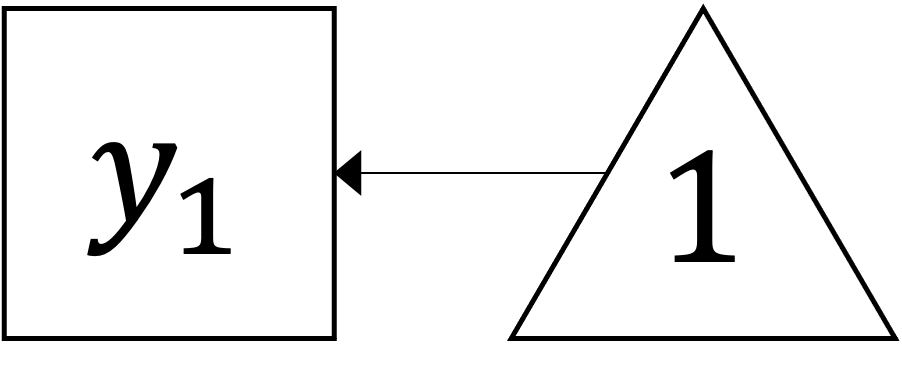

```{r setup, include = FALSE}
# libraries --------------------------------------------------------------------
library(anicon)
library(countdown)
library(emo)
library(fontawesome)
library(tidyverse)

# general options --------------------------------------------------------------
options(scipen = 999)
set.seed(99)

# chunk options ----------------------------------------------------------------
opts_chunk$set(
  cache.extra = rand_seed, 
  message = FALSE, 
  warning = FALSE, 
  error = FALSE, 
  echo = FALSE,
  cache = FALSE,
  comment = "", 
  fig.align = "center", 
  fig.retina = 3
  )
```

# Pre-requisites

If I want to learn Structural Equation Modelling I should already have...

* A very good understanding of **multiple linear regression**
* Good familiarity with terms like **variance, covariance, correlation** 
* It can help to have some familiarity with **data tidying** (i.e. in R), especially for converting between **long and wide data formats**
* Formal understanding of **causal diagrams**/Directed Acyclic Graphs can be helpful

---

# Structural Equation Model

General framework that uses various models to test relationships among variables

Include different facets of statistical analyses:

 - Regression model (Legendre or Gauss, 1805)
 - Confirmatory factor analysis (Howe, 1955; Anderson & Rubin, 1956; Karl Joreskog, 1963)
 - Latent factor structure (Spearman, 1904, 1927)
 - Path model (Wrigh, 1918, 1921)
 
A Structural Equation Model is a confirmatory factor analysis + a path model analysis.

---

# Structural Equation Model

.pull-left[
The confirmatory factor analysis part is called **measurement model**

The path model analysis is called **structural model** and evaluate the  relationship between constructs

A full SEM model is combination of measurement and structural component
]

.pull-right[
```{r}
include_graphics("img/structural_part_2.jpg")
```
]

---

# Basic SEM Conventions

```{r}
include_graphics("img/sem_convention_2.jpg")
```

---
class: title-slide, middle

## SEM with R

---

# SEM with R

As we have seen with Path Analysis and CFA, the package {lavaan} provides a specific coding structure to define the SEM, see https://lavaan.ugent.be/

.pull-left[
```
   # latent variables
     ind60 =~ x1 + x2 + x3
     dem60 =~ y1 + y2 + y3 + y4
     dem65 =~ y5 + y6 + y7 + y8
   # regressions
     dem60 ~ ind60
     dem65 ~ ind60 + dem60
   # residual covariances
     y1 ~~ y5
     y2 ~~ y4 + y6
     y3 ~~ y7
     y4 ~~ y8
     y6 ~~ y8
```
]

.pull-right[
```{r out.width='100%'}
include_graphics("https://lavaan.ugent.be/tutorial/figure/sem.png")
```
]

---

# Lavaan

- R package {lavaan} (**LA**tent **VA**riable **AN**alysis) (Rosseel, 2012)

  - Free and open-source
  - Easy and intuitive to use
  - Reliable and advanced with commercial-quality
  - Extensible
  - Constantly upgrading

---

# Lavaan Syntax

Formula type | Operator | Example | Description | Diagram
:----------- | :-------: | :------| :----------| :------:
.aqua[regression] | `~` | `y ~ x`|.aqua[y is .aqua[regressed] on x ]|  
.moss[latent variable definition] | `=~` | `f =~ y1 + y2 + y3` | .moss[f is .moss[measured] by y1, y2, y3] | 
.sea_green[(co)variance] |`~~` | `y1 ~~ y1` <br> `y2 ~~ y3` |.sea_green[Variance of y1 <br> Covariance between y2 and y3] |  
.dark_coral[intercept] | `~1` | `y1 ~ 1` | .dark_coral[The intercept (mean) of y1] |  

---

# Lavaan Syntax 

Formula type | Operator | Example | Description | Diagram
:----------- | :-------: | :------| :----------| :----:
fixed parameter | `*`| `1*y1` | Fix the parameter (factor loading) of y1 to 1 | 
free parameter | `NA*` |`NA*y1`| The parameter (factor loading) of y1 is freely estimated  | 

---
class: inverse, mline, left, middle


# Thanks for your attention and don't hesitate if you have any questions!

- [`r fa(name = "twitter")` @damien_dupre](http://twitter.com/damien_dupre)
- [`r fa(name = "github")` @damien-dupre](http://github.com/damien-dupre)
- [`r fa(name = "link")` damien-datasci-blog.netlify.app](https://damien-datasci-blog.netlify.app)
- [`r fa(name = "paper-plane")` damien.dupre@dcu.ie](mailto:damien.dupre@dcu.ie)